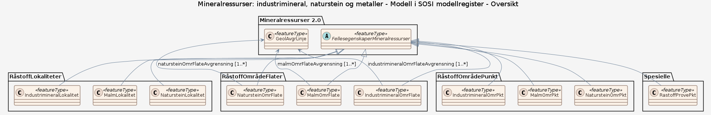

# Produktspesifikasjon: Mineralressurser: industrimineral, naturstein og metaller

*Dataene gir en oversikt over registrerte oppføringer av industrimineral, naturstein og metallressurser. 
Mineralressursdataene inneholder både areal- og punktoppføringer for alle tre grupper. Datasettet gir en oversikt over dokumenterte forekomster (verdivurderte arealer; forekomst/deposit), prospektive områder (arealer med høy sannsynlighet for funn av økonomisk interessante mineraler; prospekt/prospect), registreringer hvor det er observert og/eller analysert forhøyede verdier av økonomisk interessante mineraler (registrering/occurence) og provinser (arealer med muligheter for funn av gitte mineraler; provins/province). Registreringene kan inneholde lite eller mye informasjon. 
De dokumenterte forekomstene inneholder en vurdering av offentlig betydning; internasjonal, nasjonal, regional, lokal, liten eller ingen eller ikke vurdert.
Dataene er innsamlet over lang tid og oppdateres fortløpende etter prioriteringer.*

**Nøkkelord:** Prospektering, Mineralske ressurser, Mineraler, Industrimineraler, Naturstein, Metaller, Råstoff, Arealplanlegging, Offentlig betydning, Verdivurdering, Norge, Geologi, Mineralressurser, dataNorgeNo, Det offentlige kartgrunnlaget, geodataloven, Norge digitalt, modellbaserteVegprosjekter, fellesDatakatalog

**Emnekategorier:** Geovitenskapelig informasjon

**Geografisk utstrekning**:

- **Vest**: 2.0
- **Øst**: 33.0
- **Sør**: 57.0
- **Nord**: 72.0

**Tidsmessig utstrekning**:

- **Tidsperiode**:
  - **Fra**: 2019-08-28
  - **Til**: 2026-03-30

## Om spesifikasjonen

> **Denne versjonen av produktspesifikasjonen:**  
> **Opprettet dato:** 2019-08-28 
> **Endret dato:** 2026-03-30 
> **Språk:** nor 
> **Kontaktinformasjon:** Norges geologiske undersøkelse, [ressursdatabaser@ngu.no](mailto:ressursdatabaser@ngu.no)

## Om produktet Mineralressurser: industrimineral, naturstein og metaller

> **Romlig representasjonstype:** Vektor 
> **Unik identifikator:** <https://data.geonorge.no/sosi/geologi/mineralressurser_industrimineral_naturstein_metaller> 
> **Kontaktinformasjon:** Norges geologiske undersøkelse, [ressursdatabaser@ngu.no](mailto:ressursdatabaser@ngu.no)
>
> **Romlig oppløsning:**
>
> **Ekvivalent målestokk**: varierer
>
> **Begrensninger:**
>
> **Juridiske begrensninger**:
>
> - **Tilgangsbegrensninger**: Åpne data
> - **Bruksbegrensninger**: Lisens
> - **Lisens**: Norsk lisens for offentlige data (NLOD)
> - **Lisenslenke**: <http://data.norge.no/nlod/no/1.0>
>
> **Sikkerhetsbegrensninger**:
>
> - **Klassifisering**: Ugradert

### Formål

En av nytteverdiene med dette datasettet er å sikre at områder for eksisterende og fremtidig uttak av minralressurser blir tatt med i areal- og reguleringsplanene i kommuner og fylker.

### Bruksområde

Dataene gir en oversikt over landets oppføringer av industrimineral, naturstein og metaller (malmer), og derigjennom steder i Norge som på kort og lang sikt kan utnyttes som råstoff.  En av nytteverdiene er å sikre at områder for eksisterende og fremtidig uttak blir tatt med i areal- og reguleringsplanene i kommuner og fylker.      Arealer for dokumenterte forekomster og prospekter kan brukes som grunnlag for hensynssoner i kommunenes arealplaner (jf. PBL §11-8, punkt c).

## Omfang

### Hele datasettet

**Nivå**: dataset

**Nivåbeskrivelse**: Gjelder hele datasettet. Hvis omfang ikke er oppgitt under en overskrift, gjelder teksten for hele datasettet og alle leveranser

### Modell i SOSI modellregister

**Nivå**: dataset

**Nivåbeskrivelse**: Datamodell

## Datainnhold og struktur

### Datamodell - Modell i SOSI modellregister

➡️ [Se full datamodell for omfang "Modell i SOSI modellregister" (diagram per pakke og objektkatalog)](modell-i-sosi-modellregister/objektkatalog.html)

## Referansesystem

| EPSG-kode | Navn på referansesystem |
| --- | --- |
| [EPSG:4258](https://epsg.io/4258) | [EUREF 89 Geografisk (ETRS 89) 2d](https://register.geonorge.no/epsg-koder) |
| [EPSG:25832](https://epsg.io/25832) | [EUREF89 UTM sone 32, 2d](https://register.geonorge.no/epsg-koder) |
| [EPSG:25833](https://epsg.io/25833) | [EUREF89 UTM sone 33, 2d](https://register.geonorge.no/epsg-koder) |
| [EPSG:25835](https://epsg.io/25835) | [EUREF89 UTM sone 35, 2d](https://register.geonorge.no/epsg-koder) |

## Datakvalitet

**Nivå**: dataset

**Kvalitetsmål**: SOSI produktspesifikasjon: Mineralressurser; industrimineral, naturstein og metaller

- **Beskrivende resultat**: Dataene er i henhold til produktspesifikasjonen

**Kvalitetsmål**: Sosi applikasjonsskjema

- **Beskrivende resultat**: SOSI-filer er i henhold til applikasjonsskjema

**Kvalitetsmål**: Prosentvis oppfyllelse av FAIR-prinsipper

- **Målebeskrivelse**: Angir fullstendighet i forhold til krav fra FAIR-prinsippene (The FAIR Guiding Principles for scientific data management and stewardship)
- **Resultat**: 93

## Datafangst og produksjon

**Datainnsamling og prosessering**:

- **Prosesstrinn**:
  - **Beskrivelse**: Datasettet kommer fra NGUs database over mineralforekomster. Databasen er under kontinuerlig oppdatering, og oppdatering av data foregår ved befaringer og detaljerte undersøkelser i felt, samt ved innsamling av data fra rapporter og publikasjoner. Merk at samme fysiske forekomst/registrering/prospekt kan være registrert med ulikt navn, koordinater og ulik detaljeringsgrad avhengig om man har sett på den med tanke på industrimineral‐, naturstein‐ eller malmperspektiv.

## Vedlikehold

**Vedlikeholdsfrekvens**: Kontinuerlig

**Status**: Kontinuerlig oppdatert

## Presentasjon

**navn**: Tegneregler

**Lenke**:
<https://register.geonorge.no/register/versjoner/tegneregler/norges-geologiske-undersøkelse/mineralressurser-industrimineral-naturstein-og-metaller>

## Leveranse

| Tjeneste | Endepunkt | Type | Format | Leveranseenheter |
| --- | --- | --- | --- | --- |
| Geonorge nedlastning | [Lenke](https://nedlasting.ngu.no/api/capabilities/) | GEONORGE:DOWNLOAD | FGDB, Shape, SOSI | landsfiler, fylkesvis |
| Egen nedlastningsside | [Lenke](https://geo.ngu.no/download/ShoppingServlet) | WWW:DOWNLOAD-1.0-http--download | FGDB, Shape, SOSI | landsfiler, kommunevis |
| Atom Feed | [Lenke](https://nedlasting.ngu.no/api/atom/5a887d78-07ef-44c6-8941-cb8017c6328c) | W3C:AtomFeed | FGDB, Shape, SOSI | landsfiler, fylkesvis |
| Naturstein WMS | [Lenke](https://geo.ngu.no/mapserver/NatursteinWMS3?request=GetCapabilities&service=WMS) | WMS-tjeneste | png |  |
| Metaller WMS | [Lenke](https://geo.ngu.no/mapserver/MetallerWMS2?request=GetCapabilities&service=WMS) | WMS-tjeneste | WMS-tjeneste |  |
| Industrimineraler WMS | [Lenke](https://geo.ngu.no/mapserver/IndustrimineralerWMS3?request=GetCapabilities&service=WMS) | WMS-tjeneste | WMS-tjeneste |  |
| GeoPackage: modell-i-sosi-modellregister | [Lenke](https://raw.githubusercontent.com/aatjora/produktspesifikasjon_gjennomgang/main/produktspesifikasjon/mineralressurser-industrimineral-naturstein-og-metaller/modell-i-sosi-modellregister/modell-i-sosi-modellregister.gpkg) | Nedlasting | GPKG |  |
| GML/XSD-skjema: modell-i-sosi-modellregister | [Lenke](https://raw.githubusercontent.com/aatjora/produktspesifikasjon_gjennomgang/main/produktspesifikasjon/mineralressurser-industrimineral-naturstein-og-metaller/modell-i-sosi-modellregister/schema/xsd/INPUT/modell-i-sosi-modellregister.xsd) | Nedlasting | XSD |  |
| JSON Schema: modell-i-sosi-modellregister | [Lenke](https://raw.githubusercontent.com/aatjora/produktspesifikasjon_gjennomgang/main/produktspesifikasjon/mineralressurser-industrimineral-naturstein-og-metaller/modell-i-sosi-modellregister/schema/jsonschema/INPUT/modellisosimodellregister/modell-i-sosi-modellregister.json) | Nedlasting | JSON Schema |  |

## Metadata

**Metadatastandard**: ISO19115

**Metadatastandardversjon**: 2003

**Metadatadato**: 2026-09-21

**språk**: nor

**Kontakt**:

- **Organisasjon**: Norges geologiske undersøkelse
- **Logo**: <https://register.geonorge.no/data/organizations/970188290_NGU_hovedlogo_svart.svg> thumbnail.png
- **Epost**: metadataansvarlig@ngu.no
- **rolle**: pointOfContact

**Metadataidentifikator**:

- **Utsteder**: Geonorge
- **kode**: 5a887d78-07ef-44c6-8941-cb8017c6328c
- **koderom**: <https://kartkatalog.geonorge.no/metadata/>
- **Metadatalenke**: <https://kartkatalog.geonorge.no/metadata/5a887d78-07ef-44c6-8941-cb8017c6328c>

## Tilleggsinformasjon

Du kan gjøre oppslag i Mineralressursdatabasen hos NGU og få fram detalj-informasjon i faktaark for hver oppføring ved å søke sortert på fylker og kommuner eller via kart i NGUs karttjeneste 'Mineralressurser - industrimineraler, naturstein og metaller'.

- **Produktark:** [https://register.geonorge.no/register/versjoner/produktark/norges-geologiske-undersøkelse/mineralressurser-industrimineral-naturstein-og-metaller](https://register.geonorge.no/register/versjoner/produktark/norges-geologiske-undersøkelse/mineralressurser-industrimineral-naturstein-og-metaller)
- **Produktside:** [https://www.ngu.no/emne/mineralressurser](https://www.ngu.no/emne/mineralressurser)
