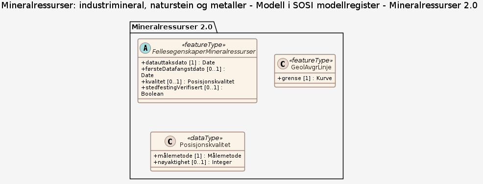
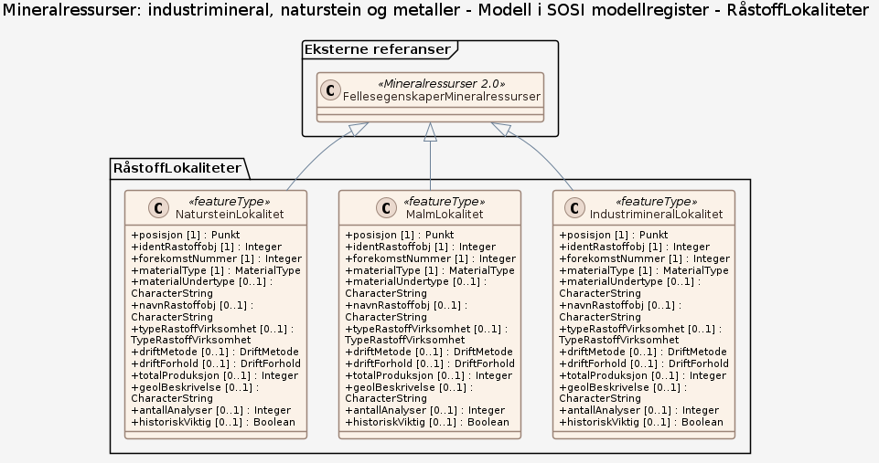
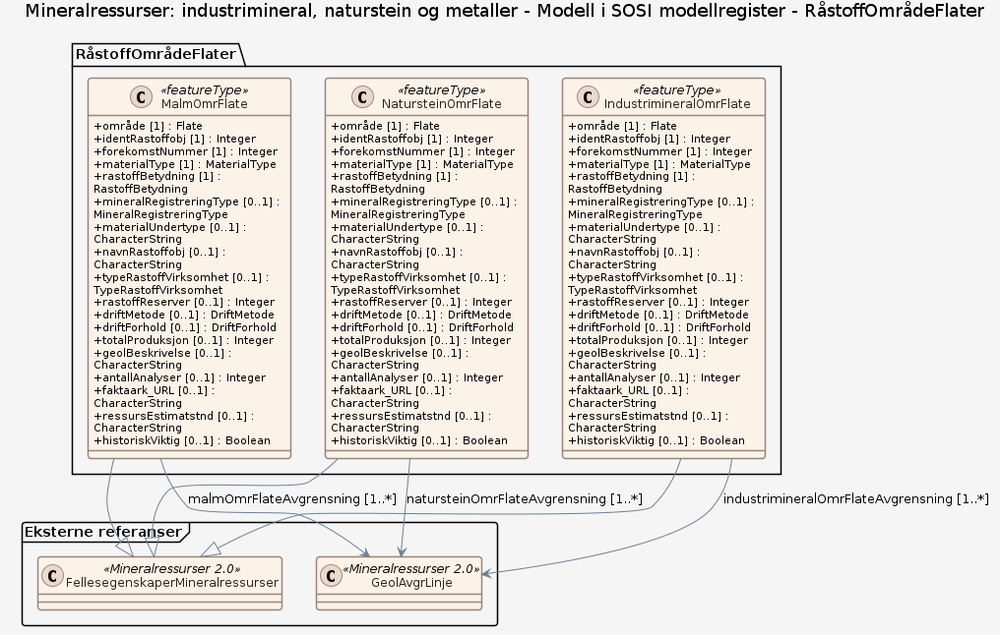
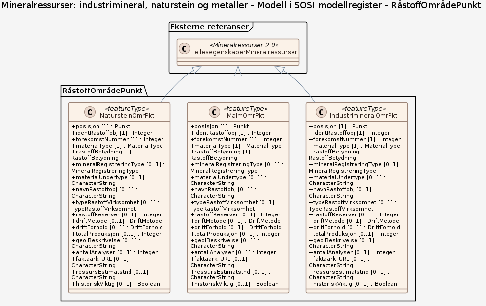
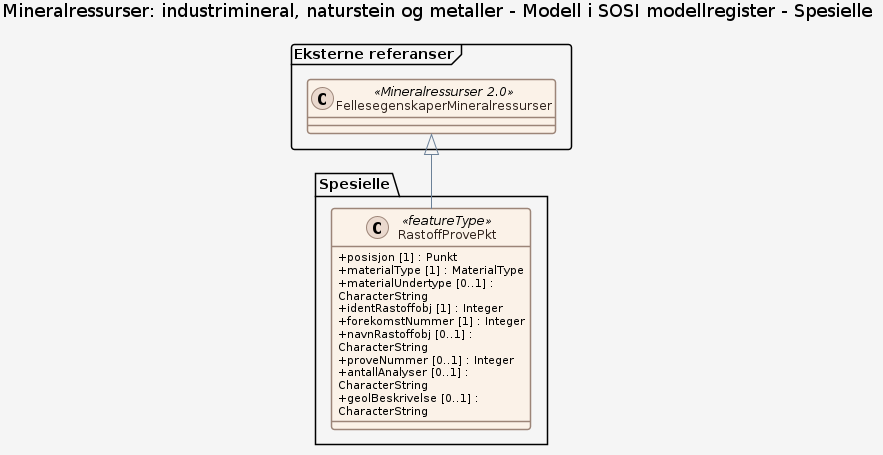
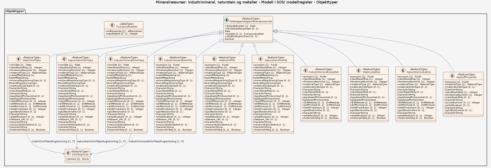

### Datamodell

**Kilde:** [SOSI UML XMI-fil](https://sosi.geonorge.no/svn/SOSI/SOSI%20Del%203/NGU/Mineralressurser%202.0.xml)

#### Oversikt

#### Pakke: Mineralressurser 2.0

#### Pakke: RåstoffLokaliteter

#### Pakke: RåstoffOmrådeFlater

#### Pakke: RåstoffOmrådePunkt

#### Pakke: Spesielle

#### Komplett diagram

#### FellesegenskaperMineralressurser (abstrakt)

abstrakt objekt som bærer en rekke egenskaper som er fagområde-uavhengige og kan benyttes for alle objekttyper  Merknad: Spesielt i produktspesifikasjonsarbeid vil en velge egenskaper og av grensningslinjer fra denne klassen.

Egenskaper

<table class="feature-attribute-table">
  <colgroup>
    <col style="width: 35%;" />
    <col style="width: 65%;" />
  </colgroup>
  <tbody>
    <tr>
      <th scope="row">Navn:</th>
      <td><strong>datauttaksdato</strong></td>
    </tr>
    <tr>
      <th scope="row">Definisjon:</th>
      <td>dato for uttak fra en database  Merknad: Skiller seg fra Kopidato ved at en ikke skiller på om det er uttak fra en originaldatabase eller en kopidatabase.</td>
    </tr>
    <tr>
      <th scope="row">Multiplisitet:</th>
      <td>1</td>
    </tr>
    <tr>
      <th scope="row">Type:</th>
      <td>DateTime</td>
    </tr>
  </tbody>
</table>

<table class="feature-attribute-table">
  <colgroup>
    <col style="width: 35%;" />
    <col style="width: 65%;" />
  </colgroup>
  <tbody>
    <tr>
      <th scope="row">Navn:</th>
      <td><strong>førsteDatafangstdato</strong></td>
    </tr>
    <tr>
      <th scope="row">Definisjon:</th>
      <td>dato når data ble registrert/observert/målt første gang, som utgangspunkt for første digitalisering  Merknad: førsteDatafangstdato brukes hvis det er av interesse å forvalte informasjon om når en ble klar over objektet. Dette kan for eksempel gjelde datoen for første flybilde som var utgangspunkt for registrering i en database.</td>
    </tr>
    <tr>
      <th scope="row">Multiplisitet:</th>
      <td>0..1</td>
    </tr>
    <tr>
      <th scope="row">Type:</th>
      <td>DateTime</td>
    </tr>
  </tbody>
</table>

<table class="feature-attribute-table">
  <colgroup>
    <col style="width: 35%;" />
    <col style="width: 65%;" />
  </colgroup>
  <tbody>
    <tr>
      <th scope="row">Navn:</th>
      <td><strong>kvalitet</strong></td>
    </tr>
    <tr>
      <th scope="row">Definisjon:</th>
      <td>beskrivelse av kvaliteten på stedfestingen  Merknad: Denne er identisk med ..KVALITET i tidligere versjoner av SOSI.</td>
    </tr>
    <tr>
      <th scope="row">Multiplisitet:</th>
      <td>0..1</td>
    </tr>
    <tr>
      <th scope="row">Type:</th>
      <td>Posisjonskvalitet</td>
    </tr>
  </tbody>
</table>

<table class="feature-attribute-table">
  <colgroup>
    <col style="width: 35%;" />
    <col style="width: 65%;" />
  </colgroup>
  <tbody>
    <tr>
      <th scope="row">Navn:</th>
      <td><strong>kvalitet.målemetode</strong></td>
    </tr>
    <tr>
      <th scope="row">Definisjon:</th>
      <td>metode for måling i grunnriss (x,y), og høyde (z) når metoden er den samme som ved måling i grunnriss</td>
    </tr>
    <tr>
      <th scope="row">Multiplisitet:</th>
      <td>1</td>
    </tr>
    <tr>
      <th scope="row">Type:</th>
      <td>Målemetode</td>
    </tr>
    <tr>
      <th scope="row">Tillatte verdier:</th>
      <td>- Terrengmålt: Uspesifisert måleinstrument – Målt i terrenget , uspesifisert metode/måleinstrument - Terrengmålt: Totalstasjon – Målt i terrenget med totalstasjon - Terrengmålt: Teodolitt og el avstandsmåler – Målt i terrenget med teodolitt og elektronisk avstandsmåler - Terrengmålt: Teodolitt og målebånd – Målt i terrenget med teodolitt og målebånd - Terrengmålt: Ortogonalmetoden – Målt i terrenget, ortogonalmetoden - Utmål – Punkt beregnet på bakgrunn av måling mot andre punkter, slik som to avstander eller avstand og retning

-- Definition --
Point calculated on the basis of other items, such as two distances or distance + direction. - Tatt fra plan – Tatt fra plan eller godkjent tiltak - Annet  (denne har ingen mening, bør fjernes?) – Annet - Stereoinstrument – Målt i stereoinstrument, uspesifisert instrument - Aerotriangulert – Punkt beregnet ved aerotriangulering

-- Definition --
Point calculated by aerotriangulation - Stereoinstrument: Analytisk plotter – Målt i stereoinstrument, analytisk plotter - Stereoinstrument: Autograf – Målt i stereoinstrument, autograf, analogt instrument - Stereoinstrument: Digitalt – Målt i stereoinstrument, digitalt instrument - Scannet fra kart – Geometri overført fra kart maskinelt ved hjelp av skanner, uspesifisert kartmedium - Skannet fra kart: Blyantoriginal – Geometri overført fra kart maskinelt ved hjelp av skanner. Kartmedium er blyantoriginal - Skannet fra kart: Rissefolie – Geometri overført fra kart maskinelt ved hjelp av skanner. Kartmedium er rissefolie - Skannet fra kart: Transparent folie, god kvalitet – Geometri overført fra kart maskinelt ved hjelp av skanner. Kartmedium er transparent folie av  god kvalitet. - Skannet fra kart: Transparent folie, mindre god kvalitet – Geometri overført fra kart maskinelt ved hjelp av skanner. Kartmedium er transparent folie av mindre god kvalitet - Skannet fra kart: Papirkopi – Geometri overført fra kart maskinelt ved hjelp av skanner. Kartmedium er papirkopi. - Flybåren laserscanner – Målt med laserskanner fra fly - Bilbåren laser – Målt med laserskanner plassert i kjøretøy - Lineær referanse – brukes for objekter som er stedfestet med lineær referanse, enten disse leveres med stedfesting kun som lineære referanser, eller med koordinatgeometri avledet fra lineære referanser - Digitaliseringbord: Ortofoto eller flybilde – Geometri overført fra ortofoto eller flybilde ved hjelp av manuell registrering på et digitaliseringsbord, uspesifisert bildemedium - Digitaliseringbord: Ortofoto, film – Geometri overført fra ortofoto ved hjelp av manuell registrering på et digitaliseringsbord. Bildemedium er film - Digitaliseringbord: Ortofoto, fotokopi – Geometri overført fra ortofoto ved hjelp av manuell registrering på et digitaliseringsbord. Bildemedium er fotokopi - Digitaliseringbord: Flybilde, film – Geometri overført fra flybilde ved hjelp av manuell registrering på et digitaliseringsbord. Bildemedium er film - Digitaliseringbord: Flybilde, fotokopi – Geometri overført fra flybilde ved hjelp av manuell registrering på et digitaliseringsbord. Bildemedium er fotokopi - Digitalisert på skjerm fra ortofoto – Geometri overført fra ortofoto ved hjelp av manuell registrering på skjerm - Digitalisert på skjerm fra satellittbilde – Geometri overført fra satellittbilde ved hjelp av manuell registrering på skjerm - Digitalisert på skjerm fra andre digitale rasterdata - Digitalisert på skjerm fra tolkning av seismikk - Vektorisering av laserdata – Vektorisering fra laserdata, brukes også der vektoriseringen støttes av ortofoto - Digitaliseringsbord: Kart – Geometri overført fra kart ved hjelp av manuell registrering på et digitaliseringsbord, medium uspesifisert - Digitaliseringsbord: Kart, blyantoriginal – Geometri overført fra kart ved hjelp av manuell registrering på et digitaliseringsbord. Kartmedium er blyantoriginal - Digitaliseringsbord: Kart, rissefoile – Geometri overført fra kart ved hjelp av manuell registrering på et digitaliseringsbord. Kartmedium er rissefolie - Digitaliseringsbord: Kart, transparent foile, god kvalitet – Geometri overført fra kart ved hjelp av manuell registrering på et digitaliseringsbord. Kartmedium er transparent folie av god kvalitet, samkopi - Digitaliseringsbord: Kart, transparent foile, mindre god kvalitet – Geometri overført fra kart ved hjelp av manuell registrering på et digitaliseringsbord. Kartmedium er transparent folie av mindre god kvalitet, samkopi - Digitaliseringsbord: Kart, papirkopi – Geometri overført fra kart ved hjelp av manuell registrering på et digitaliseringsbord. Kartmedium er papirkopi - Digitalisert på skjerm fra skannet kart – Geometri overført fra kart ved hjelp av manuell registrering på skjerm, medium skannet kart (raster), samkopi - Genererte data (interpolasjon) – Genererte data, interpolasjonsmetode. Ikke nærmere spesifisert - Genererte data (interpolasjon): Terrengmodell – Genererte data, interpolasjonsmetode, fra terrengmodell - Genererte data (interpolasjon): Vektet middel – Genererte data, interpolasjonsmetode, vektet middel - Genererte data: Fra annen geometri – Genererte data: Sirkelgeometri, korridor eller annen geometri generert ut fra f.eks et punkt eller en linje (f.eks midtlinje veg) - Genererte data: Generalisering - Genererte data: Sentralpunkt - Genererte data: Sammenknytningspunkt, randpunkt – Genererte data: Sammenknytningspunkt (f.eks mellom ulike kartlegginger), randpunkt (f.eks mellom ulike kilder til kart) - Koordinater hentet fra GAB – Koordinater hentet fra GAB, forløperen til registerdelen av matrikkelen - Koordinater hentet fra JREG – Koordinater hentet fra JREG, jordregisteret - Beregnet – Beregnet, uspesifisert hvordan - Spesielle metoder – Spesielle metoder, uspesifisert - Spesielle metoder: Målt med stikkstang - Spesielle metoder: Målt med waterstang - Spesielle metoder: Målt med målehjul - Spesielle metoder: Målt med stigningsmåler - Fastsatt punkt – Punkt fastsatt ut fra et grunnlag (kart, bilde), f.eks ved partenes enighet ved en oppmålingsforretning - Fastsatt ved dom eller kongelig resolusjon – Geometri fastsatt ved dom, lov, traktat eller kongelig resolusjon - Annet (spesifiseres i filhode) ( bør vel fjernes, blir borte ved overføring mellom systemer) – Annet (spesifiseres i filhode) - Frihåndstegning – Digitalisert ut fra frihåndstegning.  Frihåndstegning er basert på svært grovt grunnlag eller ikke noe grunnlag - Frihåndstegning på kart – Digitalisert fra krokering på kart, dvs grovt skissert på kart - Frihåndstegning på skjerm – Digitalisert ut fra frihåndstegning (direkte på skjerm). Frihåndstegning er basert på svært grovt grunnlag eller ikke noe grunnlag - Treghetsstedfesting - GNSS: Kodemåling, relative målinger – Innmålt med satellittbaserte systemer for navigasjon og posisjonering med global dekning (f.eks GPS, GLONASS, GALILEO): Kodemåling, relative målinger. - GNSS: Kodemåling, enkle målinger – Innmålt med satellittbaserte systemer for navigasjon og posisjonering med global dekning (f.eks GPS, GLONASS, GALILEO): Kodemåling, enkle målinger. - GNSS: Fasemåling, statisk måling – Innmålt med satellittbaserte systemer for navigasjon og posisjonering med global dekning (f.eks GPS, GLONASS, GALILEO): Fasemåling statisk måling. - GNSS: Fasemåling, andre metoder – Innmålt med satellittbaserte systemer for navigasjon og posisjonering med global dekning (f.eks GPS, GLONASS, GALILEO): Fasemåling andre metoder. - Kombinasjon av GNSS/Treghet – Kombinasjon av GPS/Treghet - GNSS: Fasemåling RTK – Innmålt med satellittbaserte systemer for navigasjon og posisjonering med global dekning (f.eks GPS, GLONASS, GALILEO).: Fasemåling RTK (realtids kinematisk måling) - GNSS: Fasemåling , float-løsning – Innmålt med satellittbaserte systemer for navigasjon og posisjonering med global dekning (f.eks GPS, GLONASS, GALILEO). Fasemåling float-løsning - Ukjent målemetode – Målemetode er ukjent</td>
    </tr>
  </tbody>
</table>

<table class="feature-attribute-table">
  <colgroup>
    <col style="width: 35%;" />
    <col style="width: 65%;" />
  </colgroup>
  <tbody>
    <tr>
      <th scope="row">Navn:</th>
      <td><strong>kvalitet.nøyaktighet</strong></td>
    </tr>
    <tr>
      <th scope="row">Definisjon:</th>
      <td>punktstandardavviket i grunnriss for punkter samt tverravvik for linjer  Merknad: Oppgitt i cm</td>
    </tr>
    <tr>
      <th scope="row">Multiplisitet:</th>
      <td>0..1</td>
    </tr>
    <tr>
      <th scope="row">Type:</th>
      <td>Integer</td>
    </tr>
  </tbody>
</table>

<table class="feature-attribute-table">
  <colgroup>
    <col style="width: 35%;" />
    <col style="width: 65%;" />
  </colgroup>
  <tbody>
    <tr>
      <th scope="row">Navn:</th>
      <td><strong>stedfestingVerifisert</strong></td>
    </tr>
    <tr>
      <th scope="row">Definisjon:</th>
      <td>angivelse om stedfestingen (koordinatene) er  kontrollert  og funnet i orden (verifisert)</td>
    </tr>
    <tr>
      <th scope="row">Multiplisitet:</th>
      <td>0..1</td>
    </tr>
    <tr>
      <th scope="row">Type:</th>
      <td>Boolean</td>
    </tr>
  </tbody>
</table>

#### GeolAvgrLinje

generell avgrensning av geologisk objekt   -- Definition -- general delimitation of geological object

Egenskaper

<table class="feature-attribute-table">
  <colgroup>
    <col style="width: 35%;" />
    <col style="width: 65%;" />
  </colgroup>
  <tbody>
    <tr>
      <th scope="row">Navn:</th>
      <td><strong>grense</strong></td>
    </tr>
    <tr>
      <th scope="row">Definisjon:</th>
      <td>forløp som følger overgang mellom ulike fenomener  -- Definition -- course follwing the transition between different real world phenomena</td>
    </tr>
    <tr>
      <th scope="row">Multiplisitet:</th>
      <td>1</td>
    </tr>
    <tr>
      <th scope="row">Type:</th>
      <td>Kurve</td>
    </tr>
  </tbody>
</table>

#### MalmOmrFlate

flaterepresentasjon av område som antas å inneholde malmressurser. Finnes for noen (viktige) forekomster

Egenskaper

<table class="feature-attribute-table">
  <colgroup>
    <col style="width: 35%;" />
    <col style="width: 65%;" />
  </colgroup>
  <tbody>
    <tr>
      <th scope="row">Navn:</th>
      <td><strong>område</strong></td>
    </tr>
    <tr>
      <th scope="row">Definisjon:</th>
      <td>objektets utstrekning</td>
    </tr>
    <tr>
      <th scope="row">Multiplisitet:</th>
      <td>1</td>
    </tr>
    <tr>
      <th scope="row">Type:</th>
      <td>Flate</td>
    </tr>
  </tbody>
</table>

<table class="feature-attribute-table">
  <colgroup>
    <col style="width: 35%;" />
    <col style="width: 65%;" />
  </colgroup>
  <tbody>
    <tr>
      <th scope="row">Navn:</th>
      <td><strong>identRastoffobj</strong></td>
    </tr>
    <tr>
      <th scope="row">Definisjon:</th>
      <td>forekomstobjektets identifikasjonskode  Merknad: Består av kommunenummer (4 siffer), og et løpenummer (7 siffer). Ideelt sett består løpenummeret av et område nummer (3 siffer), lokalitetsnummer (2 siffer) og prøvenummer (2 siffer).  Eksempel: 17290010101</td>
    </tr>
    <tr>
      <th scope="row">Multiplisitet:</th>
      <td>1</td>
    </tr>
    <tr>
      <th scope="row">Type:</th>
      <td>Integer</td>
    </tr>
  </tbody>
</table>

<table class="feature-attribute-table">
  <colgroup>
    <col style="width: 35%;" />
    <col style="width: 65%;" />
  </colgroup>
  <tbody>
    <tr>
      <th scope="row">Navn:</th>
      <td><strong>forekomstNummer</strong></td>
    </tr>
    <tr>
      <th scope="row">Definisjon:</th>
      <td>unik nummerering av forekomsten som råstoffobjektet tilhører  Merknad: Benyttes som koplingsnøkkel mellom de ulike objektene i forekomsten. Mange viktige egenskaper finnes kun på områdeobjektet som er hovedobjektet til forekomsten  Eks. 1729001</td>
    </tr>
    <tr>
      <th scope="row">Multiplisitet:</th>
      <td>1</td>
    </tr>
    <tr>
      <th scope="row">Type:</th>
      <td>Integer</td>
    </tr>
  </tbody>
</table>

<table class="feature-attribute-table">
  <colgroup>
    <col style="width: 35%;" />
    <col style="width: 65%;" />
  </colgroup>
  <tbody>
    <tr>
      <th scope="row">Navn:</th>
      <td><strong>materialType</strong></td>
    </tr>
    <tr>
      <th scope="row">Definisjon:</th>
      <td>hvilken type råstoff som kan være/er gjenstand for utvinning</td>
    </tr>
    <tr>
      <th scope="row">Multiplisitet:</th>
      <td>1</td>
    </tr>
    <tr>
      <th scope="row">Type:</th>
      <td>MaterialType</td>
    </tr>
    <tr>
      <th scope="row">Tillatte verdier:</th>
      <td>- Kodeliste: <a href="http://skjema.geonorge.no/legg_inn_riktig_url">http://skjema.geonorge.no/legg_inn_riktig_url</a> - Edelmetaller(Au,Ag,PGE) - Jernmetaller (Fe, Mn, Ti) - Jernlegeringsmetaller (Cr, Ni, Co, V, Mo, W) - Basemetaller (Cu, Zn, Pbinkl. Fe-sulfider, As, Sb, Bi, Sn) - Energimetaller (U, Th) - Spesialmetaller (Nb, Ta, Be, Li, Sc, REE) - Andre metaller - Karbonatmineraler - Silika - Talk - Feltspat - Olivin - Grafitt - Fossilt brensel - Nefelinsyenitt - Magnesium mineraler - Zirkon - Beryllium mineraler - Andre industrimineraler - Blokkstein - Skifer - Kvernstein - Brynestein - Murestein - Pukk/knust fjell - Sand og grus - Grus og andre løsmasser - Skred og forvitring - Skjellsand - Steintipp - Leire - Torv - Grunnvann i fjell - Grunnvann i fjell og løsmasser - Uspesifisert</td>
    </tr>
  </tbody>
</table>

<table class="feature-attribute-table">
  <colgroup>
    <col style="width: 35%;" />
    <col style="width: 65%;" />
  </colgroup>
  <tbody>
    <tr>
      <th scope="row">Navn:</th>
      <td><strong>rastoffBetydning</strong></td>
    </tr>
    <tr>
      <th scope="row">Definisjon:</th>
      <td>hvor stor betydning en mineralregistrering har med tanke på mulig økonomisk utnyttelse nå eller for framtiden.  Skal dokumenteres</td>
    </tr>
    <tr>
      <th scope="row">Multiplisitet:</th>
      <td>1</td>
    </tr>
    <tr>
      <th scope="row">Type:</th>
      <td>RastoffBetydning</td>
    </tr>
    <tr>
      <th scope="row">Tillatte verdier:</th>
      <td>- Kodeliste: <a href="http://skjema.geonorge.no/legg_inn_riktig_url">http://skjema.geonorge.no/legg_inn_riktig_url</a> - Internasjonal betydning – 1.  Metall- og industrimineralforekomster med dokumenterte ressurser som kan gi et signifikant bidrag til internasjonale behov
&lt;i&gt;- herunder forekomster med meget høy dokumentert in situ-verdi basert på kvalitet og tonnasje&lt;/i&gt;
&lt;i&gt;- herunder forekomster med potensial for årsproduksjon som dekker signifikant andel av behov i EU/EØS&lt;/i&gt;

2.  Forekomster av strategisk viktige eller ”kritiske” råstoff
&lt;i&gt;- herunder dokumenterte forekomster av mineraler på EU liste over kritiske råstoffer som utnyttes eller har potensial for framtidig utnyttelse&lt;/i&gt;

3.  Forekomster av byggeråstoffer med verdi eller potensial for eksport på minst 1 millioner tonn årlig - Nasjonal betydning – 1.  Mineralforekomster som har et bekreftet eller sannsynlig, betydelig fremtidig verdiskapingspotensial
&lt;i&gt;- herunder forekomster med betydelig in-situ verdi&lt;/i&gt;
&lt;i&gt;- herunder byggeråstoffer med betydelig potensial for eksport&lt;/i&gt;

2.  Mineralforekomster som har unike kvaliteter som gjør dem særlig egnet til foredlende industri
&lt;i&gt;- herunder industrimineraler og spesialmetaller av særlig høy kvalitet&lt;/i&gt;

3.  Mineralforekomster som har unike kvaliteter som byggeråstoff
&lt;i&gt;- herunder pukk- og grusforekomster med unike fysiske egenskaper &lt;/i&gt;
&lt;i&gt;- herunder natursteinsforekomster med unike egenskaper og attraktivitet i det internasjonale markedet&lt;/i&gt;
&lt;i&gt;- herunder forekomster av metaller og industrimineraler som har dokumentert eller sannsynlig framtidig betydning som råstoff til andre viktige samfunnsområder&lt;/i&gt;

4.  Forekomster av strategisk viktige eller ”kritiske” råstoff
&lt;i&gt;- herunder forekomster av metaller og industrimineraler som har dokumentert eller sannsynlig framtidig betydning som råstoff til viktige norske samfunnsområder&lt;/i&gt;

5.  Forekomster som er særdeles viktig for Norges nasjonale infrastruktur
&lt;i&gt;- herunder grus- og pukkforekomster som er særlig viktig for forsyninger til større befolkningssentra i Norge&lt;/i&gt; - Regional betydning – 1.  Mineralforekomster som har et bekreftet eller sannsynlig fremtidig verdiskapingspotensial med in situ-verdi på mellom 100 og 1000 millioner kroner

2.  Mineralforekomster som er særdeles viktig for regional infrastruktur
&lt;i&gt;- herunder industrimineral-, naturstein-, grus- og pukkforekomster som er særlig viktig for forsyninger innen en region&lt;/i&gt;
&lt;i&gt;- herunder natursteinsforekomster som har eller har hatt særlig betydning for byggeskikk og arkitektur i en region&lt;/i&gt; - Lokal betydning – Mineralforekomster som er viktig for lokal infrastruktur
&lt;i&gt;- herunder industrimineral-, naturstein-, grus- og pukkforekomster som kan være viktig for forsyninger innen en kommune&lt;/i&gt; - Liten lokal betydning – Forekomsten har liten eller ingen økonomisk betydning - Ikke vurdert – Forekomstens økonomiske betydning er ikke vurdert</td>
    </tr>
  </tbody>
</table>

<table class="feature-attribute-table">
  <colgroup>
    <col style="width: 35%;" />
    <col style="width: 65%;" />
  </colgroup>
  <tbody>
    <tr>
      <th scope="row">Navn:</th>
      <td><strong>mineralRegistreringType</strong></td>
    </tr>
    <tr>
      <th scope="row">Definisjon:</th>
      <td>hvilken type mineralforekomst dette er i en økonomisk betraktning -- Definition -- The type of mineral occurrence.  -- Description -- EXAMPLE: prospect, occurrence, mineral deposit, ore deposit.</td>
    </tr>
    <tr>
      <th scope="row">Multiplisitet:</th>
      <td>0..1</td>
    </tr>
    <tr>
      <th scope="row">Type:</th>
      <td>MineralRegistreringType</td>
    </tr>
    <tr>
      <th scope="row">Tillatte verdier:</th>
      <td>- forekomst – en mineralkonsentrasjon i jordskorpen, en anrikning eller en akkumulasjon. Kan brukes om alle typer mineralforekomster.
INSPIRE Description:
A mass of naturally occurring mineral material, e.g. metal ores or non-metallic minerals, usually of economic value, without regard to mode of origin. Accumulations of coal and petroleum may or may not be included. - registrering – en økonomisk interessant malm- eller mineralanrikning
Any ore or economic mineral in any concentration found in bedrock or as float.

INSPIRE Description: - prospekt – område hvor det er utsikter til å finne malm og verdifulle mineraler. Representere områder med høy sannsynlighet for funn av lite eller ikke dokumenterte mineralforekomster.
Er ofte et mulig undersøkelsesområde

INSPIRE Description:
An  area  that  is  a  potential  site  of  mineral  deposits,  based  on  preliminary exploration, previous exploration. A geologic or geophysical anomaly, especially one recommended for additional exploration. - provins – geologisk provins - stort område som er enhetlig med hensyn til opptreden av ulike metaller eller mineraler. Er en områdeavgrensning rundt en eller flere større eller mindre registreringer og/eller observasjoner med potensial for mineralutvinning.

INSPIRE Description:
Geologic provinces classified by mineral resources. - distrikt – geologisk distrikt, karakteristisk for ulike mineralforekomster

INSPIRE Description:
Geologic districts classified by mineral resources. - felt – region eller område karakteristisk for ulike mineralforekomster. Eks Rørosfeltet

INSPIRE Description:
A region or area that possesses or is characterized by a particular mineral resource. - malmsone – mineralforekomst som har form som årer eller ganger i hovedbergarten

INSPIRE Description:
A mineral deposit consisting of a zone of veins, veinlets, disseminations, or planar breccias. - prosjekt</td>
    </tr>
  </tbody>
</table>

<table class="feature-attribute-table">
  <colgroup>
    <col style="width: 35%;" />
    <col style="width: 65%;" />
  </colgroup>
  <tbody>
    <tr>
      <th scope="row">Navn:</th>
      <td><strong>materialUndertype</strong></td>
    </tr>
    <tr>
      <th scope="row">Definisjon:</th>
      <td>underinndeling av materialtypene som kan være/er gjenstand for utvinning  Merknad: Er en mer detaljert inndeling av det råstoff som utvinnes (hovedsakelig kjemiske elementer (Cu, Pb, Zn osv.) og mineralnavn)</td>
    </tr>
    <tr>
      <th scope="row">Multiplisitet:</th>
      <td>0..1</td>
    </tr>
    <tr>
      <th scope="row">Type:</th>
      <td>CharacterString</td>
    </tr>
  </tbody>
</table>

<table class="feature-attribute-table">
  <colgroup>
    <col style="width: 35%;" />
    <col style="width: 65%;" />
  </colgroup>
  <tbody>
    <tr>
      <th scope="row">Navn:</th>
      <td><strong>navnRastoffobj</strong></td>
    </tr>
    <tr>
      <th scope="row">Definisjon:</th>
      <td>navn på forekomsten</td>
    </tr>
    <tr>
      <th scope="row">Multiplisitet:</th>
      <td>0..1</td>
    </tr>
    <tr>
      <th scope="row">Type:</th>
      <td>CharacterString</td>
    </tr>
  </tbody>
</table>

<table class="feature-attribute-table">
  <colgroup>
    <col style="width: 35%;" />
    <col style="width: 65%;" />
  </colgroup>
  <tbody>
    <tr>
      <th scope="row">Navn:</th>
      <td><strong>typeRastoffVirksomhet</strong></td>
    </tr>
    <tr>
      <th scope="row">Definisjon:</th>
      <td>angir type/status på eventuell aktivitet</td>
    </tr>
    <tr>
      <th scope="row">Multiplisitet:</th>
      <td>0..1</td>
    </tr>
    <tr>
      <th scope="row">Type:</th>
      <td>TypeRastoffVirksomhet</td>
    </tr>
    <tr>
      <th scope="row">Tillatte verdier:</th>
      <td>- Kodeliste: <a href="http://skjema.geonorge.no/legg_inn_riktig_url">http://skjema.geonorge.no/legg_inn_riktig_url</a> - Prospektering - Røsking - Skjerp - Prøvedrift - Gruvedrift - Steinbrudd - Mulig fremtidig uttaksområde - Typelokalitet(er) - Grustak (massetak) - Utplanert massetak/endret arealbruk - Observasjonslokalitet - Leirtak - Torvtak - Naturlig grunnvannskilde - Borebrønn - Overvåkingsstasjon</td>
    </tr>
  </tbody>
</table>

<table class="feature-attribute-table">
  <colgroup>
    <col style="width: 35%;" />
    <col style="width: 65%;" />
  </colgroup>
  <tbody>
    <tr>
      <th scope="row">Navn:</th>
      <td><strong>rastoffReserver</strong></td>
    </tr>
    <tr>
      <th scope="row">Definisjon:</th>
      <td>antall tonn påvist som råstoffreserve  Merknad: Angitt i 1000 tonn og oppgis bare dersom reserven er påvist ved boring eller andre operative data.</td>
    </tr>
    <tr>
      <th scope="row">Multiplisitet:</th>
      <td>0..1</td>
    </tr>
    <tr>
      <th scope="row">Type:</th>
      <td>Integer</td>
    </tr>
  </tbody>
</table>

<table class="feature-attribute-table">
  <colgroup>
    <col style="width: 35%;" />
    <col style="width: 65%;" />
  </colgroup>
  <tbody>
    <tr>
      <th scope="row">Navn:</th>
      <td><strong>driftMetode</strong></td>
    </tr>
    <tr>
      <th scope="row">Definisjon:</th>
      <td>angir driftsmetode  Merknad: Dominerende driftsmetode for lokaliteten</td>
    </tr>
    <tr>
      <th scope="row">Multiplisitet:</th>
      <td>0..1</td>
    </tr>
    <tr>
      <th scope="row">Type:</th>
      <td>DriftMetode</td>
    </tr>
    <tr>
      <th scope="row">Tillatte verdier:</th>
      <td>- Kodeliste: <a href="http://skjema.geonorge.no/legg_inn_riktig_url">http://skjema.geonorge.no/legg_inn_riktig_url</a> - Underjordsdrift - Dagbrudd - Dag- og underjordsdrift - Knusing - Knusing/sikting - Knusing/sikting/vasking - Sikting - Sikting/vasking - Vasking - Annen driftsmetode - Kildeutspring/grunnvannsutslag - Vannforsyningsbrønn - Observasjonsbrønn - Sonderboring</td>
    </tr>
  </tbody>
</table>

<table class="feature-attribute-table">
  <colgroup>
    <col style="width: 35%;" />
    <col style="width: 65%;" />
  </colgroup>
  <tbody>
    <tr>
      <th scope="row">Navn:</th>
      <td><strong>driftForhold</strong></td>
    </tr>
    <tr>
      <th scope="row">Definisjon:</th>
      <td>angir driftsforholdene  Merknad: Ajour pr. siste oppdatering</td>
    </tr>
    <tr>
      <th scope="row">Multiplisitet:</th>
      <td>0..1</td>
    </tr>
    <tr>
      <th scope="row">Type:</th>
      <td>DriftForhold</td>
    </tr>
    <tr>
      <th scope="row">Tillatte verdier:</th>
      <td>- Kodeliste: <a href="http://skjema.geonorge.no/legg_inn_riktig_url">http://skjema.geonorge.no/legg_inn_riktig_url</a> - Ikke satt i drift (mulig fremtidig drift) - I drift - Sporadisk drift - Nedlagt</td>
    </tr>
  </tbody>
</table>

<table class="feature-attribute-table">
  <colgroup>
    <col style="width: 35%;" />
    <col style="width: 65%;" />
  </colgroup>
  <tbody>
    <tr>
      <th scope="row">Navn:</th>
      <td><strong>totalProduksjon</strong></td>
    </tr>
    <tr>
      <th scope="row">Definisjon:</th>
      <td>anslått tonnasje av totalt utvunnet råstoff fra forekomstobjektet  Merknad: Angitt i 1000 tonn og anslaget er gjort på basis av prøvedrift eller regulær drift</td>
    </tr>
    <tr>
      <th scope="row">Multiplisitet:</th>
      <td>0..1</td>
    </tr>
    <tr>
      <th scope="row">Type:</th>
      <td>Integer</td>
    </tr>
  </tbody>
</table>

<table class="feature-attribute-table">
  <colgroup>
    <col style="width: 35%;" />
    <col style="width: 65%;" />
  </colgroup>
  <tbody>
    <tr>
      <th scope="row">Navn:</th>
      <td><strong>geolBeskrivelse</strong></td>
    </tr>
    <tr>
      <th scope="row">Definisjon:</th>
      <td>beskrivende tekstfelt eller link (URL) til tekstlig beskrivelse</td>
    </tr>
    <tr>
      <th scope="row">Multiplisitet:</th>
      <td>0..1</td>
    </tr>
    <tr>
      <th scope="row">Type:</th>
      <td>CharacterString</td>
    </tr>
  </tbody>
</table>

<table class="feature-attribute-table">
  <colgroup>
    <col style="width: 35%;" />
    <col style="width: 65%;" />
  </colgroup>
  <tbody>
    <tr>
      <th scope="row">Navn:</th>
      <td><strong>antallAnalyser</strong></td>
    </tr>
    <tr>
      <th scope="row">Definisjon:</th>
      <td>antallet utførte kjemiske og/eller mekaniske analyser</td>
    </tr>
    <tr>
      <th scope="row">Multiplisitet:</th>
      <td>0..1</td>
    </tr>
    <tr>
      <th scope="row">Type:</th>
      <td>Integer</td>
    </tr>
  </tbody>
</table>

<table class="feature-attribute-table">
  <colgroup>
    <col style="width: 35%;" />
    <col style="width: 65%;" />
  </colgroup>
  <tbody>
    <tr>
      <th scope="row">Navn:</th>
      <td><strong>faktaark_URL</strong></td>
    </tr>
    <tr>
      <th scope="row">Definisjon:</th>
      <td>link (URL) til forekomstens oppdaterte faktaark ifra NGUs database</td>
    </tr>
    <tr>
      <th scope="row">Multiplisitet:</th>
      <td>0..1</td>
    </tr>
    <tr>
      <th scope="row">Type:</th>
      <td>CharacterString</td>
    </tr>
  </tbody>
</table>

<table class="feature-attribute-table">
  <colgroup>
    <col style="width: 35%;" />
    <col style="width: 65%;" />
  </colgroup>
  <tbody>
    <tr>
      <th scope="row">Navn:</th>
      <td><strong>ressursEstimatstnd</strong></td>
    </tr>
    <tr>
      <th scope="row">Definisjon:</th>
      <td>standard som er benyttet ved angivelse av estimat for ressurser/reserver</td>
    </tr>
    <tr>
      <th scope="row">Multiplisitet:</th>
      <td>0..1</td>
    </tr>
    <tr>
      <th scope="row">Type:</th>
      <td>CharacterString</td>
    </tr>
  </tbody>
</table>

<table class="feature-attribute-table">
  <colgroup>
    <col style="width: 35%;" />
    <col style="width: 65%;" />
  </colgroup>
  <tbody>
    <tr>
      <th scope="row">Navn:</th>
      <td><strong>historiskViktig</strong></td>
    </tr>
    <tr>
      <th scope="row">Definisjon:</th>
      <td>angivelse om forekomsten er historisk viktig</td>
    </tr>
    <tr>
      <th scope="row">Multiplisitet:</th>
      <td>0..1</td>
    </tr>
    <tr>
      <th scope="row">Type:</th>
      <td>Boolean</td>
    </tr>
  </tbody>
</table>

Relasjoner

**Arv**
FellesegenskaperMineralressurser

**Assosiasjoner**
GeolAvgrLinje – rolle: malmOmrFlateAvgrensning – kardinalitet: 1..*

#### NatursteinOmrFlate

flaterepresentasjon av område som antas å inneholde potensiale som natursteinsressurs. (Finnes for noen (viktige) forekomster

Egenskaper

<table class="feature-attribute-table">
  <colgroup>
    <col style="width: 35%;" />
    <col style="width: 65%;" />
  </colgroup>
  <tbody>
    <tr>
      <th scope="row">Navn:</th>
      <td><strong>område</strong></td>
    </tr>
    <tr>
      <th scope="row">Definisjon:</th>
      <td>objektets utstrekning</td>
    </tr>
    <tr>
      <th scope="row">Multiplisitet:</th>
      <td>1</td>
    </tr>
    <tr>
      <th scope="row">Type:</th>
      <td>Flate</td>
    </tr>
  </tbody>
</table>

<table class="feature-attribute-table">
  <colgroup>
    <col style="width: 35%;" />
    <col style="width: 65%;" />
  </colgroup>
  <tbody>
    <tr>
      <th scope="row">Navn:</th>
      <td><strong>identRastoffobj</strong></td>
    </tr>
    <tr>
      <th scope="row">Definisjon:</th>
      <td>forekomstobjektets identifikasjonskode  Merknad: Består av kommunenummer (4 siffer), og et løpenummer (7 siffer). Ideelt sett består løpenummeret av et område nummer (3 siffer), lokalitetsnummer (2 siffer) og prøvenummer (2 siffer).  Eksempel: 17290010101</td>
    </tr>
    <tr>
      <th scope="row">Multiplisitet:</th>
      <td>1</td>
    </tr>
    <tr>
      <th scope="row">Type:</th>
      <td>Integer</td>
    </tr>
  </tbody>
</table>

<table class="feature-attribute-table">
  <colgroup>
    <col style="width: 35%;" />
    <col style="width: 65%;" />
  </colgroup>
  <tbody>
    <tr>
      <th scope="row">Navn:</th>
      <td><strong>forekomstNummer</strong></td>
    </tr>
    <tr>
      <th scope="row">Definisjon:</th>
      <td>unik nummerering av forekomsten som råstoffobjektet tilhører  Merknad: Benyttes som koplingsnøkkel mellom de ulike objektene i forekomsten. Mange viktige egenskaper finnes kun på områdeobjektet som er hovedobjektet til forekomsten  Eks. 1729001</td>
    </tr>
    <tr>
      <th scope="row">Multiplisitet:</th>
      <td>1</td>
    </tr>
    <tr>
      <th scope="row">Type:</th>
      <td>Integer</td>
    </tr>
  </tbody>
</table>

<table class="feature-attribute-table">
  <colgroup>
    <col style="width: 35%;" />
    <col style="width: 65%;" />
  </colgroup>
  <tbody>
    <tr>
      <th scope="row">Navn:</th>
      <td><strong>materialType</strong></td>
    </tr>
    <tr>
      <th scope="row">Definisjon:</th>
      <td>hvilken type råstoff som kan være/er gjenstand for utvinning</td>
    </tr>
    <tr>
      <th scope="row">Multiplisitet:</th>
      <td>1</td>
    </tr>
    <tr>
      <th scope="row">Type:</th>
      <td>MaterialType</td>
    </tr>
    <tr>
      <th scope="row">Tillatte verdier:</th>
      <td>- Kodeliste: <a href="http://skjema.geonorge.no/legg_inn_riktig_url">http://skjema.geonorge.no/legg_inn_riktig_url</a> - Edelmetaller(Au,Ag,PGE) - Jernmetaller (Fe, Mn, Ti) - Jernlegeringsmetaller (Cr, Ni, Co, V, Mo, W) - Basemetaller (Cu, Zn, Pbinkl. Fe-sulfider, As, Sb, Bi, Sn) - Energimetaller (U, Th) - Spesialmetaller (Nb, Ta, Be, Li, Sc, REE) - Andre metaller - Karbonatmineraler - Silika - Talk - Feltspat - Olivin - Grafitt - Fossilt brensel - Nefelinsyenitt - Magnesium mineraler - Zirkon - Beryllium mineraler - Andre industrimineraler - Blokkstein - Skifer - Kvernstein - Brynestein - Murestein - Pukk/knust fjell - Sand og grus - Grus og andre løsmasser - Skred og forvitring - Skjellsand - Steintipp - Leire - Torv - Grunnvann i fjell - Grunnvann i fjell og løsmasser - Uspesifisert</td>
    </tr>
  </tbody>
</table>

<table class="feature-attribute-table">
  <colgroup>
    <col style="width: 35%;" />
    <col style="width: 65%;" />
  </colgroup>
  <tbody>
    <tr>
      <th scope="row">Navn:</th>
      <td><strong>rastoffBetydning</strong></td>
    </tr>
    <tr>
      <th scope="row">Definisjon:</th>
      <td>hvor stor betydning en mineralregistrering har med tanke på mulig økonomisk utnyttelse nå eller for framtiden.  Skal dokumenteres</td>
    </tr>
    <tr>
      <th scope="row">Multiplisitet:</th>
      <td>1</td>
    </tr>
    <tr>
      <th scope="row">Type:</th>
      <td>RastoffBetydning</td>
    </tr>
    <tr>
      <th scope="row">Tillatte verdier:</th>
      <td>- Kodeliste: <a href="http://skjema.geonorge.no/legg_inn_riktig_url">http://skjema.geonorge.no/legg_inn_riktig_url</a> - Internasjonal betydning – 1.  Metall- og industrimineralforekomster med dokumenterte ressurser som kan gi et signifikant bidrag til internasjonale behov
&lt;i&gt;- herunder forekomster med meget høy dokumentert in situ-verdi basert på kvalitet og tonnasje&lt;/i&gt;
&lt;i&gt;- herunder forekomster med potensial for årsproduksjon som dekker signifikant andel av behov i EU/EØS&lt;/i&gt;

2.  Forekomster av strategisk viktige eller ”kritiske” råstoff
&lt;i&gt;- herunder dokumenterte forekomster av mineraler på EU liste over kritiske råstoffer som utnyttes eller har potensial for framtidig utnyttelse&lt;/i&gt;

3.  Forekomster av byggeråstoffer med verdi eller potensial for eksport på minst 1 millioner tonn årlig - Nasjonal betydning – 1.  Mineralforekomster som har et bekreftet eller sannsynlig, betydelig fremtidig verdiskapingspotensial
&lt;i&gt;- herunder forekomster med betydelig in-situ verdi&lt;/i&gt;
&lt;i&gt;- herunder byggeråstoffer med betydelig potensial for eksport&lt;/i&gt;

2.  Mineralforekomster som har unike kvaliteter som gjør dem særlig egnet til foredlende industri
&lt;i&gt;- herunder industrimineraler og spesialmetaller av særlig høy kvalitet&lt;/i&gt;

3.  Mineralforekomster som har unike kvaliteter som byggeråstoff
&lt;i&gt;- herunder pukk- og grusforekomster med unike fysiske egenskaper &lt;/i&gt;
&lt;i&gt;- herunder natursteinsforekomster med unike egenskaper og attraktivitet i det internasjonale markedet&lt;/i&gt;
&lt;i&gt;- herunder forekomster av metaller og industrimineraler som har dokumentert eller sannsynlig framtidig betydning som råstoff til andre viktige samfunnsområder&lt;/i&gt;

4.  Forekomster av strategisk viktige eller ”kritiske” råstoff
&lt;i&gt;- herunder forekomster av metaller og industrimineraler som har dokumentert eller sannsynlig framtidig betydning som råstoff til viktige norske samfunnsområder&lt;/i&gt;

5.  Forekomster som er særdeles viktig for Norges nasjonale infrastruktur
&lt;i&gt;- herunder grus- og pukkforekomster som er særlig viktig for forsyninger til større befolkningssentra i Norge&lt;/i&gt; - Regional betydning – 1.  Mineralforekomster som har et bekreftet eller sannsynlig fremtidig verdiskapingspotensial med in situ-verdi på mellom 100 og 1000 millioner kroner

2.  Mineralforekomster som er særdeles viktig for regional infrastruktur
&lt;i&gt;- herunder industrimineral-, naturstein-, grus- og pukkforekomster som er særlig viktig for forsyninger innen en region&lt;/i&gt;
&lt;i&gt;- herunder natursteinsforekomster som har eller har hatt særlig betydning for byggeskikk og arkitektur i en region&lt;/i&gt; - Lokal betydning – Mineralforekomster som er viktig for lokal infrastruktur
&lt;i&gt;- herunder industrimineral-, naturstein-, grus- og pukkforekomster som kan være viktig for forsyninger innen en kommune&lt;/i&gt; - Liten lokal betydning – Forekomsten har liten eller ingen økonomisk betydning - Ikke vurdert – Forekomstens økonomiske betydning er ikke vurdert</td>
    </tr>
  </tbody>
</table>

<table class="feature-attribute-table">
  <colgroup>
    <col style="width: 35%;" />
    <col style="width: 65%;" />
  </colgroup>
  <tbody>
    <tr>
      <th scope="row">Navn:</th>
      <td><strong>mineralRegistreringType</strong></td>
    </tr>
    <tr>
      <th scope="row">Definisjon:</th>
      <td>hvilken type mineralforekomst dette er i en økonomisk betraktning -- Definition -- The type of mineral occurrence.  -- Description -- EXAMPLE: prospect, occurrence, mineral deposit, ore deposit.</td>
    </tr>
    <tr>
      <th scope="row">Multiplisitet:</th>
      <td>0..1</td>
    </tr>
    <tr>
      <th scope="row">Type:</th>
      <td>MineralRegistreringType</td>
    </tr>
    <tr>
      <th scope="row">Tillatte verdier:</th>
      <td>- forekomst – en mineralkonsentrasjon i jordskorpen, en anrikning eller en akkumulasjon. Kan brukes om alle typer mineralforekomster.
INSPIRE Description:
A mass of naturally occurring mineral material, e.g. metal ores or non-metallic minerals, usually of economic value, without regard to mode of origin. Accumulations of coal and petroleum may or may not be included. - registrering – en økonomisk interessant malm- eller mineralanrikning
Any ore or economic mineral in any concentration found in bedrock or as float.

INSPIRE Description: - prospekt – område hvor det er utsikter til å finne malm og verdifulle mineraler. Representere områder med høy sannsynlighet for funn av lite eller ikke dokumenterte mineralforekomster.
Er ofte et mulig undersøkelsesområde

INSPIRE Description:
An  area  that  is  a  potential  site  of  mineral  deposits,  based  on  preliminary exploration, previous exploration. A geologic or geophysical anomaly, especially one recommended for additional exploration. - provins – geologisk provins - stort område som er enhetlig med hensyn til opptreden av ulike metaller eller mineraler. Er en områdeavgrensning rundt en eller flere større eller mindre registreringer og/eller observasjoner med potensial for mineralutvinning.

INSPIRE Description:
Geologic provinces classified by mineral resources. - distrikt – geologisk distrikt, karakteristisk for ulike mineralforekomster

INSPIRE Description:
Geologic districts classified by mineral resources. - felt – region eller område karakteristisk for ulike mineralforekomster. Eks Rørosfeltet

INSPIRE Description:
A region or area that possesses or is characterized by a particular mineral resource. - malmsone – mineralforekomst som har form som årer eller ganger i hovedbergarten

INSPIRE Description:
A mineral deposit consisting of a zone of veins, veinlets, disseminations, or planar breccias. - prosjekt</td>
    </tr>
  </tbody>
</table>

<table class="feature-attribute-table">
  <colgroup>
    <col style="width: 35%;" />
    <col style="width: 65%;" />
  </colgroup>
  <tbody>
    <tr>
      <th scope="row">Navn:</th>
      <td><strong>materialUndertype</strong></td>
    </tr>
    <tr>
      <th scope="row">Definisjon:</th>
      <td>underinndeling av materialtypene som kan være/er gjenstand for utvinning  Merknad: Er en mer detaljert inndeling av det råstoff som utvinnes (hovedsakelig kjemiske elementer (Cu, Pb, Zn osv.) og mineralnavn)</td>
    </tr>
    <tr>
      <th scope="row">Multiplisitet:</th>
      <td>0..1</td>
    </tr>
    <tr>
      <th scope="row">Type:</th>
      <td>CharacterString</td>
    </tr>
  </tbody>
</table>

<table class="feature-attribute-table">
  <colgroup>
    <col style="width: 35%;" />
    <col style="width: 65%;" />
  </colgroup>
  <tbody>
    <tr>
      <th scope="row">Navn:</th>
      <td><strong>navnRastoffobj</strong></td>
    </tr>
    <tr>
      <th scope="row">Definisjon:</th>
      <td>navn på forekomsten</td>
    </tr>
    <tr>
      <th scope="row">Multiplisitet:</th>
      <td>0..1</td>
    </tr>
    <tr>
      <th scope="row">Type:</th>
      <td>CharacterString</td>
    </tr>
  </tbody>
</table>

<table class="feature-attribute-table">
  <colgroup>
    <col style="width: 35%;" />
    <col style="width: 65%;" />
  </colgroup>
  <tbody>
    <tr>
      <th scope="row">Navn:</th>
      <td><strong>typeRastoffVirksomhet</strong></td>
    </tr>
    <tr>
      <th scope="row">Definisjon:</th>
      <td>angir type/status på eventuell aktivitet</td>
    </tr>
    <tr>
      <th scope="row">Multiplisitet:</th>
      <td>0..1</td>
    </tr>
    <tr>
      <th scope="row">Type:</th>
      <td>TypeRastoffVirksomhet</td>
    </tr>
    <tr>
      <th scope="row">Tillatte verdier:</th>
      <td>- Kodeliste: <a href="http://skjema.geonorge.no/legg_inn_riktig_url">http://skjema.geonorge.no/legg_inn_riktig_url</a> - Prospektering - Røsking - Skjerp - Prøvedrift - Gruvedrift - Steinbrudd - Mulig fremtidig uttaksområde - Typelokalitet(er) - Grustak (massetak) - Utplanert massetak/endret arealbruk - Observasjonslokalitet - Leirtak - Torvtak - Naturlig grunnvannskilde - Borebrønn - Overvåkingsstasjon</td>
    </tr>
  </tbody>
</table>

<table class="feature-attribute-table">
  <colgroup>
    <col style="width: 35%;" />
    <col style="width: 65%;" />
  </colgroup>
  <tbody>
    <tr>
      <th scope="row">Navn:</th>
      <td><strong>rastoffReserver</strong></td>
    </tr>
    <tr>
      <th scope="row">Definisjon:</th>
      <td>antall tonn påvist som råstoffreserve  Merknad: Angitt i 1000 tonn og oppgis bare dersom reserven er påvist ved boring eller andre operative data.</td>
    </tr>
    <tr>
      <th scope="row">Multiplisitet:</th>
      <td>0..1</td>
    </tr>
    <tr>
      <th scope="row">Type:</th>
      <td>Integer</td>
    </tr>
  </tbody>
</table>

<table class="feature-attribute-table">
  <colgroup>
    <col style="width: 35%;" />
    <col style="width: 65%;" />
  </colgroup>
  <tbody>
    <tr>
      <th scope="row">Navn:</th>
      <td><strong>driftMetode</strong></td>
    </tr>
    <tr>
      <th scope="row">Definisjon:</th>
      <td>angir driftsmetode  Merknad: Dominerende driftsmetode for lokaliteten</td>
    </tr>
    <tr>
      <th scope="row">Multiplisitet:</th>
      <td>0..1</td>
    </tr>
    <tr>
      <th scope="row">Type:</th>
      <td>DriftMetode</td>
    </tr>
    <tr>
      <th scope="row">Tillatte verdier:</th>
      <td>- Kodeliste: <a href="http://skjema.geonorge.no/legg_inn_riktig_url">http://skjema.geonorge.no/legg_inn_riktig_url</a> - Underjordsdrift - Dagbrudd - Dag- og underjordsdrift - Knusing - Knusing/sikting - Knusing/sikting/vasking - Sikting - Sikting/vasking - Vasking - Annen driftsmetode - Kildeutspring/grunnvannsutslag - Vannforsyningsbrønn - Observasjonsbrønn - Sonderboring</td>
    </tr>
  </tbody>
</table>

<table class="feature-attribute-table">
  <colgroup>
    <col style="width: 35%;" />
    <col style="width: 65%;" />
  </colgroup>
  <tbody>
    <tr>
      <th scope="row">Navn:</th>
      <td><strong>driftForhold</strong></td>
    </tr>
    <tr>
      <th scope="row">Definisjon:</th>
      <td>angir driftsforholdene  Merknad: Ajour pr. siste oppdatering</td>
    </tr>
    <tr>
      <th scope="row">Multiplisitet:</th>
      <td>0..1</td>
    </tr>
    <tr>
      <th scope="row">Type:</th>
      <td>DriftForhold</td>
    </tr>
    <tr>
      <th scope="row">Tillatte verdier:</th>
      <td>- Kodeliste: <a href="http://skjema.geonorge.no/legg_inn_riktig_url">http://skjema.geonorge.no/legg_inn_riktig_url</a> - Ikke satt i drift (mulig fremtidig drift) - I drift - Sporadisk drift - Nedlagt</td>
    </tr>
  </tbody>
</table>

<table class="feature-attribute-table">
  <colgroup>
    <col style="width: 35%;" />
    <col style="width: 65%;" />
  </colgroup>
  <tbody>
    <tr>
      <th scope="row">Navn:</th>
      <td><strong>totalProduksjon</strong></td>
    </tr>
    <tr>
      <th scope="row">Definisjon:</th>
      <td>anslått tonnasje av totalt utvunnet råstoff fra forekomstobjektet  Merknad: Angitt i 1000 tonn og anslaget er gjort på basis av prøvedrift eller regulær drift</td>
    </tr>
    <tr>
      <th scope="row">Multiplisitet:</th>
      <td>0..1</td>
    </tr>
    <tr>
      <th scope="row">Type:</th>
      <td>Integer</td>
    </tr>
  </tbody>
</table>

<table class="feature-attribute-table">
  <colgroup>
    <col style="width: 35%;" />
    <col style="width: 65%;" />
  </colgroup>
  <tbody>
    <tr>
      <th scope="row">Navn:</th>
      <td><strong>geolBeskrivelse</strong></td>
    </tr>
    <tr>
      <th scope="row">Definisjon:</th>
      <td>beskrivende tekstfelt eller link (URL) til tekstlig beskrivelse</td>
    </tr>
    <tr>
      <th scope="row">Multiplisitet:</th>
      <td>0..1</td>
    </tr>
    <tr>
      <th scope="row">Type:</th>
      <td>CharacterString</td>
    </tr>
  </tbody>
</table>

<table class="feature-attribute-table">
  <colgroup>
    <col style="width: 35%;" />
    <col style="width: 65%;" />
  </colgroup>
  <tbody>
    <tr>
      <th scope="row">Navn:</th>
      <td><strong>antallAnalyser</strong></td>
    </tr>
    <tr>
      <th scope="row">Definisjon:</th>
      <td>antallet utførte kjemiske og/eller mekaniske analyser</td>
    </tr>
    <tr>
      <th scope="row">Multiplisitet:</th>
      <td>0..1</td>
    </tr>
    <tr>
      <th scope="row">Type:</th>
      <td>Integer</td>
    </tr>
  </tbody>
</table>

<table class="feature-attribute-table">
  <colgroup>
    <col style="width: 35%;" />
    <col style="width: 65%;" />
  </colgroup>
  <tbody>
    <tr>
      <th scope="row">Navn:</th>
      <td><strong>faktaark_URL</strong></td>
    </tr>
    <tr>
      <th scope="row">Definisjon:</th>
      <td>link (URL) til forekomstens oppdaterte faktaark ifra NGUs database</td>
    </tr>
    <tr>
      <th scope="row">Multiplisitet:</th>
      <td>0..1</td>
    </tr>
    <tr>
      <th scope="row">Type:</th>
      <td>CharacterString</td>
    </tr>
  </tbody>
</table>

<table class="feature-attribute-table">
  <colgroup>
    <col style="width: 35%;" />
    <col style="width: 65%;" />
  </colgroup>
  <tbody>
    <tr>
      <th scope="row">Navn:</th>
      <td><strong>ressursEstimatstnd</strong></td>
    </tr>
    <tr>
      <th scope="row">Definisjon:</th>
      <td>standard som er benyttet ved angivelse av estimat for ressurser/reserver</td>
    </tr>
    <tr>
      <th scope="row">Multiplisitet:</th>
      <td>0..1</td>
    </tr>
    <tr>
      <th scope="row">Type:</th>
      <td>CharacterString</td>
    </tr>
  </tbody>
</table>

<table class="feature-attribute-table">
  <colgroup>
    <col style="width: 35%;" />
    <col style="width: 65%;" />
  </colgroup>
  <tbody>
    <tr>
      <th scope="row">Navn:</th>
      <td><strong>historiskViktig</strong></td>
    </tr>
    <tr>
      <th scope="row">Definisjon:</th>
      <td>angivelse om forekomsten er historisk viktig</td>
    </tr>
    <tr>
      <th scope="row">Multiplisitet:</th>
      <td>0..1</td>
    </tr>
    <tr>
      <th scope="row">Type:</th>
      <td>Boolean</td>
    </tr>
  </tbody>
</table>

Relasjoner

**Arv**
FellesegenskaperMineralressurser

**Assosiasjoner**
GeolAvgrLinje – rolle: natursteinOmrFlateAvgrensning – kardinalitet: 1..*

#### IndustrimineralOmrFlate

flaterepresentasjon av område som antas å inneholde potensielle industrimineralforekomster. Finnes for noen (viktige) forekomster

Egenskaper

<table class="feature-attribute-table">
  <colgroup>
    <col style="width: 35%;" />
    <col style="width: 65%;" />
  </colgroup>
  <tbody>
    <tr>
      <th scope="row">Navn:</th>
      <td><strong>område</strong></td>
    </tr>
    <tr>
      <th scope="row">Definisjon:</th>
      <td>objektets utstrekning</td>
    </tr>
    <tr>
      <th scope="row">Multiplisitet:</th>
      <td>1</td>
    </tr>
    <tr>
      <th scope="row">Type:</th>
      <td>Flate</td>
    </tr>
  </tbody>
</table>

<table class="feature-attribute-table">
  <colgroup>
    <col style="width: 35%;" />
    <col style="width: 65%;" />
  </colgroup>
  <tbody>
    <tr>
      <th scope="row">Navn:</th>
      <td><strong>identRastoffobj</strong></td>
    </tr>
    <tr>
      <th scope="row">Definisjon:</th>
      <td>forekomstobjektets identifikasjonskode  Merknad: Består av kommunenummer (4 siffer), og et løpenummer (7 siffer). Ideelt sett består løpenummeret av et område nummer (3 siffer), lokalitetsnummer (2 siffer) og prøvenummer (2 siffer).  Eksempel: 17290010101</td>
    </tr>
    <tr>
      <th scope="row">Multiplisitet:</th>
      <td>1</td>
    </tr>
    <tr>
      <th scope="row">Type:</th>
      <td>Integer</td>
    </tr>
  </tbody>
</table>

<table class="feature-attribute-table">
  <colgroup>
    <col style="width: 35%;" />
    <col style="width: 65%;" />
  </colgroup>
  <tbody>
    <tr>
      <th scope="row">Navn:</th>
      <td><strong>forekomstNummer</strong></td>
    </tr>
    <tr>
      <th scope="row">Definisjon:</th>
      <td>unik nummerering av forekomsten som råstoffobjektet tilhører  Merknad: Benyttes som koplingsnøkkel mellom de ulike objektene i forekomsten. Mange viktige egenskaper finnes kun på områdeobjektet som er hovedobjektet til forekomsten  Eks. 1729001</td>
    </tr>
    <tr>
      <th scope="row">Multiplisitet:</th>
      <td>1</td>
    </tr>
    <tr>
      <th scope="row">Type:</th>
      <td>Integer</td>
    </tr>
  </tbody>
</table>

<table class="feature-attribute-table">
  <colgroup>
    <col style="width: 35%;" />
    <col style="width: 65%;" />
  </colgroup>
  <tbody>
    <tr>
      <th scope="row">Navn:</th>
      <td><strong>materialType</strong></td>
    </tr>
    <tr>
      <th scope="row">Definisjon:</th>
      <td>hvilken type råstoff som kan være/er gjenstand for utvinning</td>
    </tr>
    <tr>
      <th scope="row">Multiplisitet:</th>
      <td>1</td>
    </tr>
    <tr>
      <th scope="row">Type:</th>
      <td>MaterialType</td>
    </tr>
    <tr>
      <th scope="row">Tillatte verdier:</th>
      <td>- Kodeliste: <a href="http://skjema.geonorge.no/legg_inn_riktig_url">http://skjema.geonorge.no/legg_inn_riktig_url</a> - Edelmetaller(Au,Ag,PGE) - Jernmetaller (Fe, Mn, Ti) - Jernlegeringsmetaller (Cr, Ni, Co, V, Mo, W) - Basemetaller (Cu, Zn, Pbinkl. Fe-sulfider, As, Sb, Bi, Sn) - Energimetaller (U, Th) - Spesialmetaller (Nb, Ta, Be, Li, Sc, REE) - Andre metaller - Karbonatmineraler - Silika - Talk - Feltspat - Olivin - Grafitt - Fossilt brensel - Nefelinsyenitt - Magnesium mineraler - Zirkon - Beryllium mineraler - Andre industrimineraler - Blokkstein - Skifer - Kvernstein - Brynestein - Murestein - Pukk/knust fjell - Sand og grus - Grus og andre løsmasser - Skred og forvitring - Skjellsand - Steintipp - Leire - Torv - Grunnvann i fjell - Grunnvann i fjell og løsmasser - Uspesifisert</td>
    </tr>
  </tbody>
</table>

<table class="feature-attribute-table">
  <colgroup>
    <col style="width: 35%;" />
    <col style="width: 65%;" />
  </colgroup>
  <tbody>
    <tr>
      <th scope="row">Navn:</th>
      <td><strong>rastoffBetydning</strong></td>
    </tr>
    <tr>
      <th scope="row">Definisjon:</th>
      <td>hvor stor betydning en mineralregistrering har med tanke på mulig økonomisk utnyttelse nå eller for framtiden.  Skal dokumenteres</td>
    </tr>
    <tr>
      <th scope="row">Multiplisitet:</th>
      <td>1</td>
    </tr>
    <tr>
      <th scope="row">Type:</th>
      <td>RastoffBetydning</td>
    </tr>
    <tr>
      <th scope="row">Tillatte verdier:</th>
      <td>- Kodeliste: <a href="http://skjema.geonorge.no/legg_inn_riktig_url">http://skjema.geonorge.no/legg_inn_riktig_url</a> - Internasjonal betydning – 1.  Metall- og industrimineralforekomster med dokumenterte ressurser som kan gi et signifikant bidrag til internasjonale behov
&lt;i&gt;- herunder forekomster med meget høy dokumentert in situ-verdi basert på kvalitet og tonnasje&lt;/i&gt;
&lt;i&gt;- herunder forekomster med potensial for årsproduksjon som dekker signifikant andel av behov i EU/EØS&lt;/i&gt;

2.  Forekomster av strategisk viktige eller ”kritiske” råstoff
&lt;i&gt;- herunder dokumenterte forekomster av mineraler på EU liste over kritiske råstoffer som utnyttes eller har potensial for framtidig utnyttelse&lt;/i&gt;

3.  Forekomster av byggeråstoffer med verdi eller potensial for eksport på minst 1 millioner tonn årlig - Nasjonal betydning – 1.  Mineralforekomster som har et bekreftet eller sannsynlig, betydelig fremtidig verdiskapingspotensial
&lt;i&gt;- herunder forekomster med betydelig in-situ verdi&lt;/i&gt;
&lt;i&gt;- herunder byggeråstoffer med betydelig potensial for eksport&lt;/i&gt;

2.  Mineralforekomster som har unike kvaliteter som gjør dem særlig egnet til foredlende industri
&lt;i&gt;- herunder industrimineraler og spesialmetaller av særlig høy kvalitet&lt;/i&gt;

3.  Mineralforekomster som har unike kvaliteter som byggeråstoff
&lt;i&gt;- herunder pukk- og grusforekomster med unike fysiske egenskaper &lt;/i&gt;
&lt;i&gt;- herunder natursteinsforekomster med unike egenskaper og attraktivitet i det internasjonale markedet&lt;/i&gt;
&lt;i&gt;- herunder forekomster av metaller og industrimineraler som har dokumentert eller sannsynlig framtidig betydning som råstoff til andre viktige samfunnsområder&lt;/i&gt;

4.  Forekomster av strategisk viktige eller ”kritiske” råstoff
&lt;i&gt;- herunder forekomster av metaller og industrimineraler som har dokumentert eller sannsynlig framtidig betydning som råstoff til viktige norske samfunnsområder&lt;/i&gt;

5.  Forekomster som er særdeles viktig for Norges nasjonale infrastruktur
&lt;i&gt;- herunder grus- og pukkforekomster som er særlig viktig for forsyninger til større befolkningssentra i Norge&lt;/i&gt; - Regional betydning – 1.  Mineralforekomster som har et bekreftet eller sannsynlig fremtidig verdiskapingspotensial med in situ-verdi på mellom 100 og 1000 millioner kroner

2.  Mineralforekomster som er særdeles viktig for regional infrastruktur
&lt;i&gt;- herunder industrimineral-, naturstein-, grus- og pukkforekomster som er særlig viktig for forsyninger innen en region&lt;/i&gt;
&lt;i&gt;- herunder natursteinsforekomster som har eller har hatt særlig betydning for byggeskikk og arkitektur i en region&lt;/i&gt; - Lokal betydning – Mineralforekomster som er viktig for lokal infrastruktur
&lt;i&gt;- herunder industrimineral-, naturstein-, grus- og pukkforekomster som kan være viktig for forsyninger innen en kommune&lt;/i&gt; - Liten lokal betydning – Forekomsten har liten eller ingen økonomisk betydning - Ikke vurdert – Forekomstens økonomiske betydning er ikke vurdert</td>
    </tr>
  </tbody>
</table>

<table class="feature-attribute-table">
  <colgroup>
    <col style="width: 35%;" />
    <col style="width: 65%;" />
  </colgroup>
  <tbody>
    <tr>
      <th scope="row">Navn:</th>
      <td><strong>mineralRegistreringType</strong></td>
    </tr>
    <tr>
      <th scope="row">Definisjon:</th>
      <td>hvilken type mineralforekomst dette er i en økonomisk betraktning -- Definition -- The type of mineral occurrence.  -- Description -- EXAMPLE: prospect, occurrence, mineral deposit, ore deposit.</td>
    </tr>
    <tr>
      <th scope="row">Multiplisitet:</th>
      <td>0..1</td>
    </tr>
    <tr>
      <th scope="row">Type:</th>
      <td>MineralRegistreringType</td>
    </tr>
    <tr>
      <th scope="row">Tillatte verdier:</th>
      <td>- forekomst – en mineralkonsentrasjon i jordskorpen, en anrikning eller en akkumulasjon. Kan brukes om alle typer mineralforekomster.
INSPIRE Description:
A mass of naturally occurring mineral material, e.g. metal ores or non-metallic minerals, usually of economic value, without regard to mode of origin. Accumulations of coal and petroleum may or may not be included. - registrering – en økonomisk interessant malm- eller mineralanrikning
Any ore or economic mineral in any concentration found in bedrock or as float.

INSPIRE Description: - prospekt – område hvor det er utsikter til å finne malm og verdifulle mineraler. Representere områder med høy sannsynlighet for funn av lite eller ikke dokumenterte mineralforekomster.
Er ofte et mulig undersøkelsesområde

INSPIRE Description:
An  area  that  is  a  potential  site  of  mineral  deposits,  based  on  preliminary exploration, previous exploration. A geologic or geophysical anomaly, especially one recommended for additional exploration. - provins – geologisk provins - stort område som er enhetlig med hensyn til opptreden av ulike metaller eller mineraler. Er en områdeavgrensning rundt en eller flere større eller mindre registreringer og/eller observasjoner med potensial for mineralutvinning.

INSPIRE Description:
Geologic provinces classified by mineral resources. - distrikt – geologisk distrikt, karakteristisk for ulike mineralforekomster

INSPIRE Description:
Geologic districts classified by mineral resources. - felt – region eller område karakteristisk for ulike mineralforekomster. Eks Rørosfeltet

INSPIRE Description:
A region or area that possesses or is characterized by a particular mineral resource. - malmsone – mineralforekomst som har form som årer eller ganger i hovedbergarten

INSPIRE Description:
A mineral deposit consisting of a zone of veins, veinlets, disseminations, or planar breccias. - prosjekt</td>
    </tr>
  </tbody>
</table>

<table class="feature-attribute-table">
  <colgroup>
    <col style="width: 35%;" />
    <col style="width: 65%;" />
  </colgroup>
  <tbody>
    <tr>
      <th scope="row">Navn:</th>
      <td><strong>materialUndertype</strong></td>
    </tr>
    <tr>
      <th scope="row">Definisjon:</th>
      <td>underinndeling av materialtypene som kan være/er gjenstand for utvinning  Merknad: Er en mer detaljert inndeling av det råstoff som utvinnes (hovedsakelig kjemiske elementer (Cu, Pb, Zn osv.) og mineralnavn)</td>
    </tr>
    <tr>
      <th scope="row">Multiplisitet:</th>
      <td>0..1</td>
    </tr>
    <tr>
      <th scope="row">Type:</th>
      <td>CharacterString</td>
    </tr>
  </tbody>
</table>

<table class="feature-attribute-table">
  <colgroup>
    <col style="width: 35%;" />
    <col style="width: 65%;" />
  </colgroup>
  <tbody>
    <tr>
      <th scope="row">Navn:</th>
      <td><strong>navnRastoffobj</strong></td>
    </tr>
    <tr>
      <th scope="row">Definisjon:</th>
      <td>navn på råstoffobjekt</td>
    </tr>
    <tr>
      <th scope="row">Multiplisitet:</th>
      <td>0..1</td>
    </tr>
    <tr>
      <th scope="row">Type:</th>
      <td>CharacterString</td>
    </tr>
  </tbody>
</table>

<table class="feature-attribute-table">
  <colgroup>
    <col style="width: 35%;" />
    <col style="width: 65%;" />
  </colgroup>
  <tbody>
    <tr>
      <th scope="row">Navn:</th>
      <td><strong>typeRastoffVirksomhet</strong></td>
    </tr>
    <tr>
      <th scope="row">Definisjon:</th>
      <td>angir type/status på eventuell aktivitet</td>
    </tr>
    <tr>
      <th scope="row">Multiplisitet:</th>
      <td>0..1</td>
    </tr>
    <tr>
      <th scope="row">Type:</th>
      <td>TypeRastoffVirksomhet</td>
    </tr>
    <tr>
      <th scope="row">Tillatte verdier:</th>
      <td>- Kodeliste: <a href="http://skjema.geonorge.no/legg_inn_riktig_url">http://skjema.geonorge.no/legg_inn_riktig_url</a> - Prospektering - Røsking - Skjerp - Prøvedrift - Gruvedrift - Steinbrudd - Mulig fremtidig uttaksområde - Typelokalitet(er) - Grustak (massetak) - Utplanert massetak/endret arealbruk - Observasjonslokalitet - Leirtak - Torvtak - Naturlig grunnvannskilde - Borebrønn - Overvåkingsstasjon</td>
    </tr>
  </tbody>
</table>

<table class="feature-attribute-table">
  <colgroup>
    <col style="width: 35%;" />
    <col style="width: 65%;" />
  </colgroup>
  <tbody>
    <tr>
      <th scope="row">Navn:</th>
      <td><strong>rastoffReserver</strong></td>
    </tr>
    <tr>
      <th scope="row">Definisjon:</th>
      <td>antall tonn påvist som råstoffreserve  Merknad: Angitt i 1000 tonn og oppgis bare dersom reserven er påvist ved boring eller andre operative data.</td>
    </tr>
    <tr>
      <th scope="row">Multiplisitet:</th>
      <td>0..1</td>
    </tr>
    <tr>
      <th scope="row">Type:</th>
      <td>Integer</td>
    </tr>
  </tbody>
</table>

<table class="feature-attribute-table">
  <colgroup>
    <col style="width: 35%;" />
    <col style="width: 65%;" />
  </colgroup>
  <tbody>
    <tr>
      <th scope="row">Navn:</th>
      <td><strong>driftMetode</strong></td>
    </tr>
    <tr>
      <th scope="row">Definisjon:</th>
      <td>angir driftsmetode  Merknad: Dominerende driftsmetode for lokaliteten</td>
    </tr>
    <tr>
      <th scope="row">Multiplisitet:</th>
      <td>0..1</td>
    </tr>
    <tr>
      <th scope="row">Type:</th>
      <td>DriftMetode</td>
    </tr>
    <tr>
      <th scope="row">Tillatte verdier:</th>
      <td>- Kodeliste: <a href="http://skjema.geonorge.no/legg_inn_riktig_url">http://skjema.geonorge.no/legg_inn_riktig_url</a> - Underjordsdrift - Dagbrudd - Dag- og underjordsdrift - Knusing - Knusing/sikting - Knusing/sikting/vasking - Sikting - Sikting/vasking - Vasking - Annen driftsmetode - Kildeutspring/grunnvannsutslag - Vannforsyningsbrønn - Observasjonsbrønn - Sonderboring</td>
    </tr>
  </tbody>
</table>

<table class="feature-attribute-table">
  <colgroup>
    <col style="width: 35%;" />
    <col style="width: 65%;" />
  </colgroup>
  <tbody>
    <tr>
      <th scope="row">Navn:</th>
      <td><strong>driftForhold</strong></td>
    </tr>
    <tr>
      <th scope="row">Definisjon:</th>
      <td>angir driftsforholdene  Merknad: Ajour pr. siste oppdatering</td>
    </tr>
    <tr>
      <th scope="row">Multiplisitet:</th>
      <td>0..1</td>
    </tr>
    <tr>
      <th scope="row">Type:</th>
      <td>DriftForhold</td>
    </tr>
    <tr>
      <th scope="row">Tillatte verdier:</th>
      <td>- Kodeliste: <a href="http://skjema.geonorge.no/legg_inn_riktig_url">http://skjema.geonorge.no/legg_inn_riktig_url</a> - Ikke satt i drift (mulig fremtidig drift) - I drift - Sporadisk drift - Nedlagt</td>
    </tr>
  </tbody>
</table>

<table class="feature-attribute-table">
  <colgroup>
    <col style="width: 35%;" />
    <col style="width: 65%;" />
  </colgroup>
  <tbody>
    <tr>
      <th scope="row">Navn:</th>
      <td><strong>totalProduksjon</strong></td>
    </tr>
    <tr>
      <th scope="row">Definisjon:</th>
      <td>anslått tonnasje av totalt utvunnet råstoff fra forekomstobjektet  Merknad: Angitt i 1000 tonn og anslaget er gjort på basis av prøvedrift eller regulær drift</td>
    </tr>
    <tr>
      <th scope="row">Multiplisitet:</th>
      <td>0..1</td>
    </tr>
    <tr>
      <th scope="row">Type:</th>
      <td>Integer</td>
    </tr>
  </tbody>
</table>

<table class="feature-attribute-table">
  <colgroup>
    <col style="width: 35%;" />
    <col style="width: 65%;" />
  </colgroup>
  <tbody>
    <tr>
      <th scope="row">Navn:</th>
      <td><strong>geolBeskrivelse</strong></td>
    </tr>
    <tr>
      <th scope="row">Definisjon:</th>
      <td>beskrivende tekstfelt eller link (URL) til tekstlig beskrivelse</td>
    </tr>
    <tr>
      <th scope="row">Multiplisitet:</th>
      <td>0..1</td>
    </tr>
    <tr>
      <th scope="row">Type:</th>
      <td>CharacterString</td>
    </tr>
  </tbody>
</table>

<table class="feature-attribute-table">
  <colgroup>
    <col style="width: 35%;" />
    <col style="width: 65%;" />
  </colgroup>
  <tbody>
    <tr>
      <th scope="row">Navn:</th>
      <td><strong>antallAnalyser</strong></td>
    </tr>
    <tr>
      <th scope="row">Definisjon:</th>
      <td>antallet utførte kjemiske og/eller mekaniske analyser</td>
    </tr>
    <tr>
      <th scope="row">Multiplisitet:</th>
      <td>0..1</td>
    </tr>
    <tr>
      <th scope="row">Type:</th>
      <td>Integer</td>
    </tr>
  </tbody>
</table>

<table class="feature-attribute-table">
  <colgroup>
    <col style="width: 35%;" />
    <col style="width: 65%;" />
  </colgroup>
  <tbody>
    <tr>
      <th scope="row">Navn:</th>
      <td><strong>faktaark_URL</strong></td>
    </tr>
    <tr>
      <th scope="row">Definisjon:</th>
      <td>link (URL) til forekomstens oppdaterte faktaark ifra NGUs database</td>
    </tr>
    <tr>
      <th scope="row">Multiplisitet:</th>
      <td>0..1</td>
    </tr>
    <tr>
      <th scope="row">Type:</th>
      <td>CharacterString</td>
    </tr>
  </tbody>
</table>

<table class="feature-attribute-table">
  <colgroup>
    <col style="width: 35%;" />
    <col style="width: 65%;" />
  </colgroup>
  <tbody>
    <tr>
      <th scope="row">Navn:</th>
      <td><strong>ressursEstimatstnd</strong></td>
    </tr>
    <tr>
      <th scope="row">Definisjon:</th>
      <td>standard som er benyttet ved angivelse av estimat for ressurser/reserver</td>
    </tr>
    <tr>
      <th scope="row">Multiplisitet:</th>
      <td>0..1</td>
    </tr>
    <tr>
      <th scope="row">Type:</th>
      <td>CharacterString</td>
    </tr>
  </tbody>
</table>

<table class="feature-attribute-table">
  <colgroup>
    <col style="width: 35%;" />
    <col style="width: 65%;" />
  </colgroup>
  <tbody>
    <tr>
      <th scope="row">Navn:</th>
      <td><strong>historiskViktig</strong></td>
    </tr>
    <tr>
      <th scope="row">Definisjon:</th>
      <td>angivelse om forekomsten er historisk viktig</td>
    </tr>
    <tr>
      <th scope="row">Multiplisitet:</th>
      <td>0..1</td>
    </tr>
    <tr>
      <th scope="row">Type:</th>
      <td>Boolean</td>
    </tr>
  </tbody>
</table>

Relasjoner

**Arv**
FellesegenskaperMineralressurser

**Assosiasjoner**
GeolAvgrLinje – rolle: industrimineralOmrFlateAvgrensning – kardinalitet: 1..*

#### IndustrimineralOmrPkt

område som antas å inneholde potensielle industrimineralforekomster

Egenskaper

<table class="feature-attribute-table">
  <colgroup>
    <col style="width: 35%;" />
    <col style="width: 65%;" />
  </colgroup>
  <tbody>
    <tr>
      <th scope="row">Navn:</th>
      <td><strong>posisjon</strong></td>
    </tr>
    <tr>
      <th scope="row">Definisjon:</th>
      <td>sted som objektet eksisterer på</td>
    </tr>
    <tr>
      <th scope="row">Multiplisitet:</th>
      <td>1</td>
    </tr>
    <tr>
      <th scope="row">Type:</th>
      <td>Punkt</td>
    </tr>
  </tbody>
</table>

<table class="feature-attribute-table">
  <colgroup>
    <col style="width: 35%;" />
    <col style="width: 65%;" />
  </colgroup>
  <tbody>
    <tr>
      <th scope="row">Navn:</th>
      <td><strong>identRastoffobj</strong></td>
    </tr>
    <tr>
      <th scope="row">Definisjon:</th>
      <td>forekomstobjektets identifikasjonskode  Merknad: Består av kommunenummer (4 siffer), og et løpenummer (7 siffer). Ideelt sett består løpenummeret av et område nummer (3 siffer), lokalitetsnummer (2 siffer) og prøvenummer (2 siffer).  Eksempel: 17290010101</td>
    </tr>
    <tr>
      <th scope="row">Multiplisitet:</th>
      <td>1</td>
    </tr>
    <tr>
      <th scope="row">Type:</th>
      <td>Integer</td>
    </tr>
  </tbody>
</table>

<table class="feature-attribute-table">
  <colgroup>
    <col style="width: 35%;" />
    <col style="width: 65%;" />
  </colgroup>
  <tbody>
    <tr>
      <th scope="row">Navn:</th>
      <td><strong>forekomstNummer</strong></td>
    </tr>
    <tr>
      <th scope="row">Definisjon:</th>
      <td>unik nummerering av forekomsten som råstoffobjektet tilhører  Merknad: Benyttes som koplingsnøkkel mellom de ulike objektene i forekomsten. Mange viktige egenskaper finnes kun på områdeobjektet som er hovedobjektet til forekomsten  Eks. 1729001</td>
    </tr>
    <tr>
      <th scope="row">Multiplisitet:</th>
      <td>1</td>
    </tr>
    <tr>
      <th scope="row">Type:</th>
      <td>Integer</td>
    </tr>
  </tbody>
</table>

<table class="feature-attribute-table">
  <colgroup>
    <col style="width: 35%;" />
    <col style="width: 65%;" />
  </colgroup>
  <tbody>
    <tr>
      <th scope="row">Navn:</th>
      <td><strong>materialType</strong></td>
    </tr>
    <tr>
      <th scope="row">Definisjon:</th>
      <td>hvilken type råstoff som kan være/er gjenstand for utvinning</td>
    </tr>
    <tr>
      <th scope="row">Multiplisitet:</th>
      <td>1</td>
    </tr>
    <tr>
      <th scope="row">Type:</th>
      <td>MaterialType</td>
    </tr>
    <tr>
      <th scope="row">Tillatte verdier:</th>
      <td>- Kodeliste: <a href="http://skjema.geonorge.no/legg_inn_riktig_url">http://skjema.geonorge.no/legg_inn_riktig_url</a> - Edelmetaller(Au,Ag,PGE) - Jernmetaller (Fe, Mn, Ti) - Jernlegeringsmetaller (Cr, Ni, Co, V, Mo, W) - Basemetaller (Cu, Zn, Pbinkl. Fe-sulfider, As, Sb, Bi, Sn) - Energimetaller (U, Th) - Spesialmetaller (Nb, Ta, Be, Li, Sc, REE) - Andre metaller - Karbonatmineraler - Silika - Talk - Feltspat - Olivin - Grafitt - Fossilt brensel - Nefelinsyenitt - Magnesium mineraler - Zirkon - Beryllium mineraler - Andre industrimineraler - Blokkstein - Skifer - Kvernstein - Brynestein - Murestein - Pukk/knust fjell - Sand og grus - Grus og andre løsmasser - Skred og forvitring - Skjellsand - Steintipp - Leire - Torv - Grunnvann i fjell - Grunnvann i fjell og løsmasser - Uspesifisert</td>
    </tr>
  </tbody>
</table>

<table class="feature-attribute-table">
  <colgroup>
    <col style="width: 35%;" />
    <col style="width: 65%;" />
  </colgroup>
  <tbody>
    <tr>
      <th scope="row">Navn:</th>
      <td><strong>rastoffBetydning</strong></td>
    </tr>
    <tr>
      <th scope="row">Definisjon:</th>
      <td>hvor stor betydning en mineralregistrering har med tanke på mulig økonomisk utnyttelse nå eller for framtiden.  Skal dokumenteres</td>
    </tr>
    <tr>
      <th scope="row">Multiplisitet:</th>
      <td>1</td>
    </tr>
    <tr>
      <th scope="row">Type:</th>
      <td>RastoffBetydning</td>
    </tr>
    <tr>
      <th scope="row">Tillatte verdier:</th>
      <td>- Kodeliste: <a href="http://skjema.geonorge.no/legg_inn_riktig_url">http://skjema.geonorge.no/legg_inn_riktig_url</a> - Internasjonal betydning – 1.  Metall- og industrimineralforekomster med dokumenterte ressurser som kan gi et signifikant bidrag til internasjonale behov
&lt;i&gt;- herunder forekomster med meget høy dokumentert in situ-verdi basert på kvalitet og tonnasje&lt;/i&gt;
&lt;i&gt;- herunder forekomster med potensial for årsproduksjon som dekker signifikant andel av behov i EU/EØS&lt;/i&gt;

2.  Forekomster av strategisk viktige eller ”kritiske” råstoff
&lt;i&gt;- herunder dokumenterte forekomster av mineraler på EU liste over kritiske råstoffer som utnyttes eller har potensial for framtidig utnyttelse&lt;/i&gt;

3.  Forekomster av byggeråstoffer med verdi eller potensial for eksport på minst 1 millioner tonn årlig - Nasjonal betydning – 1.  Mineralforekomster som har et bekreftet eller sannsynlig, betydelig fremtidig verdiskapingspotensial
&lt;i&gt;- herunder forekomster med betydelig in-situ verdi&lt;/i&gt;
&lt;i&gt;- herunder byggeråstoffer med betydelig potensial for eksport&lt;/i&gt;

2.  Mineralforekomster som har unike kvaliteter som gjør dem særlig egnet til foredlende industri
&lt;i&gt;- herunder industrimineraler og spesialmetaller av særlig høy kvalitet&lt;/i&gt;

3.  Mineralforekomster som har unike kvaliteter som byggeråstoff
&lt;i&gt;- herunder pukk- og grusforekomster med unike fysiske egenskaper &lt;/i&gt;
&lt;i&gt;- herunder natursteinsforekomster med unike egenskaper og attraktivitet i det internasjonale markedet&lt;/i&gt;
&lt;i&gt;- herunder forekomster av metaller og industrimineraler som har dokumentert eller sannsynlig framtidig betydning som råstoff til andre viktige samfunnsområder&lt;/i&gt;

4.  Forekomster av strategisk viktige eller ”kritiske” råstoff
&lt;i&gt;- herunder forekomster av metaller og industrimineraler som har dokumentert eller sannsynlig framtidig betydning som råstoff til viktige norske samfunnsområder&lt;/i&gt;

5.  Forekomster som er særdeles viktig for Norges nasjonale infrastruktur
&lt;i&gt;- herunder grus- og pukkforekomster som er særlig viktig for forsyninger til større befolkningssentra i Norge&lt;/i&gt; - Regional betydning – 1.  Mineralforekomster som har et bekreftet eller sannsynlig fremtidig verdiskapingspotensial med in situ-verdi på mellom 100 og 1000 millioner kroner

2.  Mineralforekomster som er særdeles viktig for regional infrastruktur
&lt;i&gt;- herunder industrimineral-, naturstein-, grus- og pukkforekomster som er særlig viktig for forsyninger innen en region&lt;/i&gt;
&lt;i&gt;- herunder natursteinsforekomster som har eller har hatt særlig betydning for byggeskikk og arkitektur i en region&lt;/i&gt; - Lokal betydning – Mineralforekomster som er viktig for lokal infrastruktur
&lt;i&gt;- herunder industrimineral-, naturstein-, grus- og pukkforekomster som kan være viktig for forsyninger innen en kommune&lt;/i&gt; - Liten lokal betydning – Forekomsten har liten eller ingen økonomisk betydning - Ikke vurdert – Forekomstens økonomiske betydning er ikke vurdert</td>
    </tr>
  </tbody>
</table>

<table class="feature-attribute-table">
  <colgroup>
    <col style="width: 35%;" />
    <col style="width: 65%;" />
  </colgroup>
  <tbody>
    <tr>
      <th scope="row">Navn:</th>
      <td><strong>mineralRegistreringType</strong></td>
    </tr>
    <tr>
      <th scope="row">Definisjon:</th>
      <td>hvilken type mineralforekomst dette er i en økonomisk betraktning -- Definition -- The type of mineral occurrence.  -- Description -- EXAMPLE: prospect, occurrence, mineral deposit, ore deposit.</td>
    </tr>
    <tr>
      <th scope="row">Multiplisitet:</th>
      <td>0..1</td>
    </tr>
    <tr>
      <th scope="row">Type:</th>
      <td>MineralRegistreringType</td>
    </tr>
    <tr>
      <th scope="row">Tillatte verdier:</th>
      <td>- forekomst – en mineralkonsentrasjon i jordskorpen, en anrikning eller en akkumulasjon. Kan brukes om alle typer mineralforekomster.
INSPIRE Description:
A mass of naturally occurring mineral material, e.g. metal ores or non-metallic minerals, usually of economic value, without regard to mode of origin. Accumulations of coal and petroleum may or may not be included. - registrering – en økonomisk interessant malm- eller mineralanrikning
Any ore or economic mineral in any concentration found in bedrock or as float.

INSPIRE Description: - prospekt – område hvor det er utsikter til å finne malm og verdifulle mineraler. Representere områder med høy sannsynlighet for funn av lite eller ikke dokumenterte mineralforekomster.
Er ofte et mulig undersøkelsesområde

INSPIRE Description:
An  area  that  is  a  potential  site  of  mineral  deposits,  based  on  preliminary exploration, previous exploration. A geologic or geophysical anomaly, especially one recommended for additional exploration. - provins – geologisk provins - stort område som er enhetlig med hensyn til opptreden av ulike metaller eller mineraler. Er en områdeavgrensning rundt en eller flere større eller mindre registreringer og/eller observasjoner med potensial for mineralutvinning.

INSPIRE Description:
Geologic provinces classified by mineral resources. - distrikt – geologisk distrikt, karakteristisk for ulike mineralforekomster

INSPIRE Description:
Geologic districts classified by mineral resources. - felt – region eller område karakteristisk for ulike mineralforekomster. Eks Rørosfeltet

INSPIRE Description:
A region or area that possesses or is characterized by a particular mineral resource. - malmsone – mineralforekomst som har form som årer eller ganger i hovedbergarten

INSPIRE Description:
A mineral deposit consisting of a zone of veins, veinlets, disseminations, or planar breccias. - prosjekt</td>
    </tr>
  </tbody>
</table>

<table class="feature-attribute-table">
  <colgroup>
    <col style="width: 35%;" />
    <col style="width: 65%;" />
  </colgroup>
  <tbody>
    <tr>
      <th scope="row">Navn:</th>
      <td><strong>materialUndertype</strong></td>
    </tr>
    <tr>
      <th scope="row">Definisjon:</th>
      <td>underinndeling av materialtypene som kan være/er gjenstand for utvinning  Merknad: Er en mer detaljert inndeling av det råstoff som utvinnes (hovedsakelig kjemiske elementer (Cu, Pb, Zn osv.) og mineralnavn)</td>
    </tr>
    <tr>
      <th scope="row">Multiplisitet:</th>
      <td>0..1</td>
    </tr>
    <tr>
      <th scope="row">Type:</th>
      <td>CharacterString</td>
    </tr>
  </tbody>
</table>

<table class="feature-attribute-table">
  <colgroup>
    <col style="width: 35%;" />
    <col style="width: 65%;" />
  </colgroup>
  <tbody>
    <tr>
      <th scope="row">Navn:</th>
      <td><strong>navnRastoffobj</strong></td>
    </tr>
    <tr>
      <th scope="row">Definisjon:</th>
      <td>navn på råstoffobjekt</td>
    </tr>
    <tr>
      <th scope="row">Multiplisitet:</th>
      <td>0..1</td>
    </tr>
    <tr>
      <th scope="row">Type:</th>
      <td>CharacterString</td>
    </tr>
  </tbody>
</table>

<table class="feature-attribute-table">
  <colgroup>
    <col style="width: 35%;" />
    <col style="width: 65%;" />
  </colgroup>
  <tbody>
    <tr>
      <th scope="row">Navn:</th>
      <td><strong>typeRastoffVirksomhet</strong></td>
    </tr>
    <tr>
      <th scope="row">Definisjon:</th>
      <td>angir type/status på eventuell aktivitet</td>
    </tr>
    <tr>
      <th scope="row">Multiplisitet:</th>
      <td>0..1</td>
    </tr>
    <tr>
      <th scope="row">Type:</th>
      <td>TypeRastoffVirksomhet</td>
    </tr>
    <tr>
      <th scope="row">Tillatte verdier:</th>
      <td>- Kodeliste: <a href="http://skjema.geonorge.no/legg_inn_riktig_url">http://skjema.geonorge.no/legg_inn_riktig_url</a> - Prospektering - Røsking - Skjerp - Prøvedrift - Gruvedrift - Steinbrudd - Mulig fremtidig uttaksområde - Typelokalitet(er) - Grustak (massetak) - Utplanert massetak/endret arealbruk - Observasjonslokalitet - Leirtak - Torvtak - Naturlig grunnvannskilde - Borebrønn - Overvåkingsstasjon</td>
    </tr>
  </tbody>
</table>

<table class="feature-attribute-table">
  <colgroup>
    <col style="width: 35%;" />
    <col style="width: 65%;" />
  </colgroup>
  <tbody>
    <tr>
      <th scope="row">Navn:</th>
      <td><strong>rastoffReserver</strong></td>
    </tr>
    <tr>
      <th scope="row">Definisjon:</th>
      <td>antall tonn påvist som råstoffreserve  Merknad: Angitt i 1000 tonn og oppgis bare dersom reserven er påvist ved boring eller andre operative data.</td>
    </tr>
    <tr>
      <th scope="row">Multiplisitet:</th>
      <td>0..1</td>
    </tr>
    <tr>
      <th scope="row">Type:</th>
      <td>Integer</td>
    </tr>
  </tbody>
</table>

<table class="feature-attribute-table">
  <colgroup>
    <col style="width: 35%;" />
    <col style="width: 65%;" />
  </colgroup>
  <tbody>
    <tr>
      <th scope="row">Navn:</th>
      <td><strong>driftMetode</strong></td>
    </tr>
    <tr>
      <th scope="row">Definisjon:</th>
      <td>angir driftsmetode  Merknad: Dominerende driftsmetode for lokaliteten</td>
    </tr>
    <tr>
      <th scope="row">Multiplisitet:</th>
      <td>0..1</td>
    </tr>
    <tr>
      <th scope="row">Type:</th>
      <td>DriftMetode</td>
    </tr>
    <tr>
      <th scope="row">Tillatte verdier:</th>
      <td>- Kodeliste: <a href="http://skjema.geonorge.no/legg_inn_riktig_url">http://skjema.geonorge.no/legg_inn_riktig_url</a> - Underjordsdrift - Dagbrudd - Dag- og underjordsdrift - Knusing - Knusing/sikting - Knusing/sikting/vasking - Sikting - Sikting/vasking - Vasking - Annen driftsmetode - Kildeutspring/grunnvannsutslag - Vannforsyningsbrønn - Observasjonsbrønn - Sonderboring</td>
    </tr>
  </tbody>
</table>

<table class="feature-attribute-table">
  <colgroup>
    <col style="width: 35%;" />
    <col style="width: 65%;" />
  </colgroup>
  <tbody>
    <tr>
      <th scope="row">Navn:</th>
      <td><strong>driftForhold</strong></td>
    </tr>
    <tr>
      <th scope="row">Definisjon:</th>
      <td>angir driftsforholdene  Merknad: Ajour pr. siste oppdatering</td>
    </tr>
    <tr>
      <th scope="row">Multiplisitet:</th>
      <td>0..1</td>
    </tr>
    <tr>
      <th scope="row">Type:</th>
      <td>DriftForhold</td>
    </tr>
    <tr>
      <th scope="row">Tillatte verdier:</th>
      <td>- Kodeliste: <a href="http://skjema.geonorge.no/legg_inn_riktig_url">http://skjema.geonorge.no/legg_inn_riktig_url</a> - Ikke satt i drift (mulig fremtidig drift) - I drift - Sporadisk drift - Nedlagt</td>
    </tr>
  </tbody>
</table>

<table class="feature-attribute-table">
  <colgroup>
    <col style="width: 35%;" />
    <col style="width: 65%;" />
  </colgroup>
  <tbody>
    <tr>
      <th scope="row">Navn:</th>
      <td><strong>totalProduksjon</strong></td>
    </tr>
    <tr>
      <th scope="row">Definisjon:</th>
      <td>anslått tonnasje av totalt utvunnet råstoff fra forekomstobjektet  Merknad: Angitt i 1000 tonn og anslaget er gjort på basis av prøvedrift eller regulær drift</td>
    </tr>
    <tr>
      <th scope="row">Multiplisitet:</th>
      <td>0..1</td>
    </tr>
    <tr>
      <th scope="row">Type:</th>
      <td>Integer</td>
    </tr>
  </tbody>
</table>

<table class="feature-attribute-table">
  <colgroup>
    <col style="width: 35%;" />
    <col style="width: 65%;" />
  </colgroup>
  <tbody>
    <tr>
      <th scope="row">Navn:</th>
      <td><strong>geolBeskrivelse</strong></td>
    </tr>
    <tr>
      <th scope="row">Definisjon:</th>
      <td>beskrivende tekstfelt eller link (URL) til tekstlig beskrivelse</td>
    </tr>
    <tr>
      <th scope="row">Multiplisitet:</th>
      <td>0..1</td>
    </tr>
    <tr>
      <th scope="row">Type:</th>
      <td>CharacterString</td>
    </tr>
  </tbody>
</table>

<table class="feature-attribute-table">
  <colgroup>
    <col style="width: 35%;" />
    <col style="width: 65%;" />
  </colgroup>
  <tbody>
    <tr>
      <th scope="row">Navn:</th>
      <td><strong>antallAnalyser</strong></td>
    </tr>
    <tr>
      <th scope="row">Definisjon:</th>
      <td>antallet utførte kjemiske og/eller mekaniske analyser</td>
    </tr>
    <tr>
      <th scope="row">Multiplisitet:</th>
      <td>0..1</td>
    </tr>
    <tr>
      <th scope="row">Type:</th>
      <td>Integer</td>
    </tr>
  </tbody>
</table>

<table class="feature-attribute-table">
  <colgroup>
    <col style="width: 35%;" />
    <col style="width: 65%;" />
  </colgroup>
  <tbody>
    <tr>
      <th scope="row">Navn:</th>
      <td><strong>faktaark_URL</strong></td>
    </tr>
    <tr>
      <th scope="row">Definisjon:</th>
      <td>link (URL) til forekomstens oppdaterte faktaark ifra NGUs database</td>
    </tr>
    <tr>
      <th scope="row">Multiplisitet:</th>
      <td>0..1</td>
    </tr>
    <tr>
      <th scope="row">Type:</th>
      <td>CharacterString</td>
    </tr>
  </tbody>
</table>

<table class="feature-attribute-table">
  <colgroup>
    <col style="width: 35%;" />
    <col style="width: 65%;" />
  </colgroup>
  <tbody>
    <tr>
      <th scope="row">Navn:</th>
      <td><strong>ressursEstimatstnd</strong></td>
    </tr>
    <tr>
      <th scope="row">Definisjon:</th>
      <td>standard som er benyttet ved angivelse av estimat for ressurser/reserver</td>
    </tr>
    <tr>
      <th scope="row">Multiplisitet:</th>
      <td>0..1</td>
    </tr>
    <tr>
      <th scope="row">Type:</th>
      <td>CharacterString</td>
    </tr>
  </tbody>
</table>

<table class="feature-attribute-table">
  <colgroup>
    <col style="width: 35%;" />
    <col style="width: 65%;" />
  </colgroup>
  <tbody>
    <tr>
      <th scope="row">Navn:</th>
      <td><strong>historiskViktig</strong></td>
    </tr>
    <tr>
      <th scope="row">Definisjon:</th>
      <td>angivelse om forekomsten er historisk viktig</td>
    </tr>
    <tr>
      <th scope="row">Multiplisitet:</th>
      <td>0..1</td>
    </tr>
    <tr>
      <th scope="row">Type:</th>
      <td>Boolean</td>
    </tr>
  </tbody>
</table>

Relasjoner

**Arv**
FellesegenskaperMineralressurser

#### MalmOmrPkt

område som antas å inneholde potensielle mineraliseringer (Malmforekomster)

Egenskaper

<table class="feature-attribute-table">
  <colgroup>
    <col style="width: 35%;" />
    <col style="width: 65%;" />
  </colgroup>
  <tbody>
    <tr>
      <th scope="row">Navn:</th>
      <td><strong>posisjon</strong></td>
    </tr>
    <tr>
      <th scope="row">Definisjon:</th>
      <td>sted som objektet eksisterer på</td>
    </tr>
    <tr>
      <th scope="row">Multiplisitet:</th>
      <td>1</td>
    </tr>
    <tr>
      <th scope="row">Type:</th>
      <td>Punkt</td>
    </tr>
  </tbody>
</table>

<table class="feature-attribute-table">
  <colgroup>
    <col style="width: 35%;" />
    <col style="width: 65%;" />
  </colgroup>
  <tbody>
    <tr>
      <th scope="row">Navn:</th>
      <td><strong>identRastoffobj</strong></td>
    </tr>
    <tr>
      <th scope="row">Definisjon:</th>
      <td>forekomstobjektets identifikasjonskode  Merknad: Består av kommunenummer (4 siffer), og et løpenummer (7 siffer). Ideelt sett består løpenummeret av et område nummer (3 siffer), lokalitetsnummer (2 siffer) og prøvenummer (2 siffer).  Eksempel: 17290010101</td>
    </tr>
    <tr>
      <th scope="row">Multiplisitet:</th>
      <td>1</td>
    </tr>
    <tr>
      <th scope="row">Type:</th>
      <td>Integer</td>
    </tr>
  </tbody>
</table>

<table class="feature-attribute-table">
  <colgroup>
    <col style="width: 35%;" />
    <col style="width: 65%;" />
  </colgroup>
  <tbody>
    <tr>
      <th scope="row">Navn:</th>
      <td><strong>forekomstNummer</strong></td>
    </tr>
    <tr>
      <th scope="row">Definisjon:</th>
      <td>unik nummerering av forekomsten som råstoffobjektet tilhører  Merknad: Benyttes som koplingsnøkkel mellom de ulike objektene i forekomsten. Mange viktige egenskaper finnes kun på områdeobjektet som er hovedobjektet til forekomsten  Eks. 1729001</td>
    </tr>
    <tr>
      <th scope="row">Multiplisitet:</th>
      <td>1</td>
    </tr>
    <tr>
      <th scope="row">Type:</th>
      <td>Integer</td>
    </tr>
  </tbody>
</table>

<table class="feature-attribute-table">
  <colgroup>
    <col style="width: 35%;" />
    <col style="width: 65%;" />
  </colgroup>
  <tbody>
    <tr>
      <th scope="row">Navn:</th>
      <td><strong>materialType</strong></td>
    </tr>
    <tr>
      <th scope="row">Definisjon:</th>
      <td>hvilken type råstoff som kan være/er gjenstand for utvinning</td>
    </tr>
    <tr>
      <th scope="row">Multiplisitet:</th>
      <td>1</td>
    </tr>
    <tr>
      <th scope="row">Type:</th>
      <td>MaterialType</td>
    </tr>
    <tr>
      <th scope="row">Tillatte verdier:</th>
      <td>- Kodeliste: <a href="http://skjema.geonorge.no/legg_inn_riktig_url">http://skjema.geonorge.no/legg_inn_riktig_url</a> - Edelmetaller(Au,Ag,PGE) - Jernmetaller (Fe, Mn, Ti) - Jernlegeringsmetaller (Cr, Ni, Co, V, Mo, W) - Basemetaller (Cu, Zn, Pbinkl. Fe-sulfider, As, Sb, Bi, Sn) - Energimetaller (U, Th) - Spesialmetaller (Nb, Ta, Be, Li, Sc, REE) - Andre metaller - Karbonatmineraler - Silika - Talk - Feltspat - Olivin - Grafitt - Fossilt brensel - Nefelinsyenitt - Magnesium mineraler - Zirkon - Beryllium mineraler - Andre industrimineraler - Blokkstein - Skifer - Kvernstein - Brynestein - Murestein - Pukk/knust fjell - Sand og grus - Grus og andre løsmasser - Skred og forvitring - Skjellsand - Steintipp - Leire - Torv - Grunnvann i fjell - Grunnvann i fjell og løsmasser - Uspesifisert</td>
    </tr>
  </tbody>
</table>

<table class="feature-attribute-table">
  <colgroup>
    <col style="width: 35%;" />
    <col style="width: 65%;" />
  </colgroup>
  <tbody>
    <tr>
      <th scope="row">Navn:</th>
      <td><strong>rastoffBetydning</strong></td>
    </tr>
    <tr>
      <th scope="row">Definisjon:</th>
      <td>hvor stor betydning en mineralregistrering har med tanke på mulig økonomisk utnyttelse nå eller for framtiden.  Skal dokumenteres</td>
    </tr>
    <tr>
      <th scope="row">Multiplisitet:</th>
      <td>1</td>
    </tr>
    <tr>
      <th scope="row">Type:</th>
      <td>RastoffBetydning</td>
    </tr>
    <tr>
      <th scope="row">Tillatte verdier:</th>
      <td>- Kodeliste: <a href="http://skjema.geonorge.no/legg_inn_riktig_url">http://skjema.geonorge.no/legg_inn_riktig_url</a> - Internasjonal betydning – 1.  Metall- og industrimineralforekomster med dokumenterte ressurser som kan gi et signifikant bidrag til internasjonale behov
&lt;i&gt;- herunder forekomster med meget høy dokumentert in situ-verdi basert på kvalitet og tonnasje&lt;/i&gt;
&lt;i&gt;- herunder forekomster med potensial for årsproduksjon som dekker signifikant andel av behov i EU/EØS&lt;/i&gt;

2.  Forekomster av strategisk viktige eller ”kritiske” råstoff
&lt;i&gt;- herunder dokumenterte forekomster av mineraler på EU liste over kritiske råstoffer som utnyttes eller har potensial for framtidig utnyttelse&lt;/i&gt;

3.  Forekomster av byggeråstoffer med verdi eller potensial for eksport på minst 1 millioner tonn årlig - Nasjonal betydning – 1.  Mineralforekomster som har et bekreftet eller sannsynlig, betydelig fremtidig verdiskapingspotensial
&lt;i&gt;- herunder forekomster med betydelig in-situ verdi&lt;/i&gt;
&lt;i&gt;- herunder byggeråstoffer med betydelig potensial for eksport&lt;/i&gt;

2.  Mineralforekomster som har unike kvaliteter som gjør dem særlig egnet til foredlende industri
&lt;i&gt;- herunder industrimineraler og spesialmetaller av særlig høy kvalitet&lt;/i&gt;

3.  Mineralforekomster som har unike kvaliteter som byggeråstoff
&lt;i&gt;- herunder pukk- og grusforekomster med unike fysiske egenskaper &lt;/i&gt;
&lt;i&gt;- herunder natursteinsforekomster med unike egenskaper og attraktivitet i det internasjonale markedet&lt;/i&gt;
&lt;i&gt;- herunder forekomster av metaller og industrimineraler som har dokumentert eller sannsynlig framtidig betydning som råstoff til andre viktige samfunnsområder&lt;/i&gt;

4.  Forekomster av strategisk viktige eller ”kritiske” råstoff
&lt;i&gt;- herunder forekomster av metaller og industrimineraler som har dokumentert eller sannsynlig framtidig betydning som råstoff til viktige norske samfunnsområder&lt;/i&gt;

5.  Forekomster som er særdeles viktig for Norges nasjonale infrastruktur
&lt;i&gt;- herunder grus- og pukkforekomster som er særlig viktig for forsyninger til større befolkningssentra i Norge&lt;/i&gt; - Regional betydning – 1.  Mineralforekomster som har et bekreftet eller sannsynlig fremtidig verdiskapingspotensial med in situ-verdi på mellom 100 og 1000 millioner kroner

2.  Mineralforekomster som er særdeles viktig for regional infrastruktur
&lt;i&gt;- herunder industrimineral-, naturstein-, grus- og pukkforekomster som er særlig viktig for forsyninger innen en region&lt;/i&gt;
&lt;i&gt;- herunder natursteinsforekomster som har eller har hatt særlig betydning for byggeskikk og arkitektur i en region&lt;/i&gt; - Lokal betydning – Mineralforekomster som er viktig for lokal infrastruktur
&lt;i&gt;- herunder industrimineral-, naturstein-, grus- og pukkforekomster som kan være viktig for forsyninger innen en kommune&lt;/i&gt; - Liten lokal betydning – Forekomsten har liten eller ingen økonomisk betydning - Ikke vurdert – Forekomstens økonomiske betydning er ikke vurdert</td>
    </tr>
  </tbody>
</table>

<table class="feature-attribute-table">
  <colgroup>
    <col style="width: 35%;" />
    <col style="width: 65%;" />
  </colgroup>
  <tbody>
    <tr>
      <th scope="row">Navn:</th>
      <td><strong>mineralRegistreringType</strong></td>
    </tr>
    <tr>
      <th scope="row">Definisjon:</th>
      <td>hvilken type mineralforekomst dette er i en økonomisk betraktning -- Definition -- The type of mineral occurrence.  -- Description -- EXAMPLE: prospect, occurrence, mineral deposit, ore deposit.</td>
    </tr>
    <tr>
      <th scope="row">Multiplisitet:</th>
      <td>0..1</td>
    </tr>
    <tr>
      <th scope="row">Type:</th>
      <td>MineralRegistreringType</td>
    </tr>
    <tr>
      <th scope="row">Tillatte verdier:</th>
      <td>- forekomst – en mineralkonsentrasjon i jordskorpen, en anrikning eller en akkumulasjon. Kan brukes om alle typer mineralforekomster.
INSPIRE Description:
A mass of naturally occurring mineral material, e.g. metal ores or non-metallic minerals, usually of economic value, without regard to mode of origin. Accumulations of coal and petroleum may or may not be included. - registrering – en økonomisk interessant malm- eller mineralanrikning
Any ore or economic mineral in any concentration found in bedrock or as float.

INSPIRE Description: - prospekt – område hvor det er utsikter til å finne malm og verdifulle mineraler. Representere områder med høy sannsynlighet for funn av lite eller ikke dokumenterte mineralforekomster.
Er ofte et mulig undersøkelsesområde

INSPIRE Description:
An  area  that  is  a  potential  site  of  mineral  deposits,  based  on  preliminary exploration, previous exploration. A geologic or geophysical anomaly, especially one recommended for additional exploration. - provins – geologisk provins - stort område som er enhetlig med hensyn til opptreden av ulike metaller eller mineraler. Er en områdeavgrensning rundt en eller flere større eller mindre registreringer og/eller observasjoner med potensial for mineralutvinning.

INSPIRE Description:
Geologic provinces classified by mineral resources. - distrikt – geologisk distrikt, karakteristisk for ulike mineralforekomster

INSPIRE Description:
Geologic districts classified by mineral resources. - felt – region eller område karakteristisk for ulike mineralforekomster. Eks Rørosfeltet

INSPIRE Description:
A region or area that possesses or is characterized by a particular mineral resource. - malmsone – mineralforekomst som har form som årer eller ganger i hovedbergarten

INSPIRE Description:
A mineral deposit consisting of a zone of veins, veinlets, disseminations, or planar breccias. - prosjekt</td>
    </tr>
  </tbody>
</table>

<table class="feature-attribute-table">
  <colgroup>
    <col style="width: 35%;" />
    <col style="width: 65%;" />
  </colgroup>
  <tbody>
    <tr>
      <th scope="row">Navn:</th>
      <td><strong>materialUndertype</strong></td>
    </tr>
    <tr>
      <th scope="row">Definisjon:</th>
      <td>underinndeling av materialtypene som kan være/er gjenstand for utvinning  Merknad: Er en mer detaljert inndeling av det råstoff som utvinnes (hovedsakelig kjemiske elementer (Cu, Pb, Zn osv.) og mineralnavn)</td>
    </tr>
    <tr>
      <th scope="row">Multiplisitet:</th>
      <td>0..1</td>
    </tr>
    <tr>
      <th scope="row">Type:</th>
      <td>CharacterString</td>
    </tr>
  </tbody>
</table>

<table class="feature-attribute-table">
  <colgroup>
    <col style="width: 35%;" />
    <col style="width: 65%;" />
  </colgroup>
  <tbody>
    <tr>
      <th scope="row">Navn:</th>
      <td><strong>navnRastoffobj</strong></td>
    </tr>
    <tr>
      <th scope="row">Definisjon:</th>
      <td>navn på forekomsten</td>
    </tr>
    <tr>
      <th scope="row">Multiplisitet:</th>
      <td>0..1</td>
    </tr>
    <tr>
      <th scope="row">Type:</th>
      <td>CharacterString</td>
    </tr>
  </tbody>
</table>

<table class="feature-attribute-table">
  <colgroup>
    <col style="width: 35%;" />
    <col style="width: 65%;" />
  </colgroup>
  <tbody>
    <tr>
      <th scope="row">Navn:</th>
      <td><strong>typeRastoffVirksomhet</strong></td>
    </tr>
    <tr>
      <th scope="row">Definisjon:</th>
      <td>angir type/status på eventuell aktivitet</td>
    </tr>
    <tr>
      <th scope="row">Multiplisitet:</th>
      <td>0..1</td>
    </tr>
    <tr>
      <th scope="row">Type:</th>
      <td>TypeRastoffVirksomhet</td>
    </tr>
    <tr>
      <th scope="row">Tillatte verdier:</th>
      <td>- Kodeliste: <a href="http://skjema.geonorge.no/legg_inn_riktig_url">http://skjema.geonorge.no/legg_inn_riktig_url</a> - Prospektering - Røsking - Skjerp - Prøvedrift - Gruvedrift - Steinbrudd - Mulig fremtidig uttaksområde - Typelokalitet(er) - Grustak (massetak) - Utplanert massetak/endret arealbruk - Observasjonslokalitet - Leirtak - Torvtak - Naturlig grunnvannskilde - Borebrønn - Overvåkingsstasjon</td>
    </tr>
  </tbody>
</table>

<table class="feature-attribute-table">
  <colgroup>
    <col style="width: 35%;" />
    <col style="width: 65%;" />
  </colgroup>
  <tbody>
    <tr>
      <th scope="row">Navn:</th>
      <td><strong>rastoffReserver</strong></td>
    </tr>
    <tr>
      <th scope="row">Definisjon:</th>
      <td>antall tonn påvist som råstoffreserve  Merknad: Angitt i 1000 tonn og oppgis bare dersom reserven er påvist ved boring eller andre operative data.</td>
    </tr>
    <tr>
      <th scope="row">Multiplisitet:</th>
      <td>0..1</td>
    </tr>
    <tr>
      <th scope="row">Type:</th>
      <td>Integer</td>
    </tr>
  </tbody>
</table>

<table class="feature-attribute-table">
  <colgroup>
    <col style="width: 35%;" />
    <col style="width: 65%;" />
  </colgroup>
  <tbody>
    <tr>
      <th scope="row">Navn:</th>
      <td><strong>driftMetode</strong></td>
    </tr>
    <tr>
      <th scope="row">Definisjon:</th>
      <td>angir driftsmetode  Merknad: Dominerende driftsmetode for lokaliteten</td>
    </tr>
    <tr>
      <th scope="row">Multiplisitet:</th>
      <td>0..1</td>
    </tr>
    <tr>
      <th scope="row">Type:</th>
      <td>DriftMetode</td>
    </tr>
    <tr>
      <th scope="row">Tillatte verdier:</th>
      <td>- Kodeliste: <a href="http://skjema.geonorge.no/legg_inn_riktig_url">http://skjema.geonorge.no/legg_inn_riktig_url</a> - Underjordsdrift - Dagbrudd - Dag- og underjordsdrift - Knusing - Knusing/sikting - Knusing/sikting/vasking - Sikting - Sikting/vasking - Vasking - Annen driftsmetode - Kildeutspring/grunnvannsutslag - Vannforsyningsbrønn - Observasjonsbrønn - Sonderboring</td>
    </tr>
  </tbody>
</table>

<table class="feature-attribute-table">
  <colgroup>
    <col style="width: 35%;" />
    <col style="width: 65%;" />
  </colgroup>
  <tbody>
    <tr>
      <th scope="row">Navn:</th>
      <td><strong>driftForhold</strong></td>
    </tr>
    <tr>
      <th scope="row">Definisjon:</th>
      <td>angir driftsforholdene  Merknad: Ajour pr. siste oppdatering</td>
    </tr>
    <tr>
      <th scope="row">Multiplisitet:</th>
      <td>0..1</td>
    </tr>
    <tr>
      <th scope="row">Type:</th>
      <td>DriftForhold</td>
    </tr>
    <tr>
      <th scope="row">Tillatte verdier:</th>
      <td>- Kodeliste: <a href="http://skjema.geonorge.no/legg_inn_riktig_url">http://skjema.geonorge.no/legg_inn_riktig_url</a> - Ikke satt i drift (mulig fremtidig drift) - I drift - Sporadisk drift - Nedlagt</td>
    </tr>
  </tbody>
</table>

<table class="feature-attribute-table">
  <colgroup>
    <col style="width: 35%;" />
    <col style="width: 65%;" />
  </colgroup>
  <tbody>
    <tr>
      <th scope="row">Navn:</th>
      <td><strong>totalProduksjon</strong></td>
    </tr>
    <tr>
      <th scope="row">Definisjon:</th>
      <td>anslått tonnasje av totalt utvunnet råstoff fra forekomstobjektet  Merknad: Angitt i 1000 tonn og anslaget er gjort på basis av prøvedrift eller regulær drift</td>
    </tr>
    <tr>
      <th scope="row">Multiplisitet:</th>
      <td>0..1</td>
    </tr>
    <tr>
      <th scope="row">Type:</th>
      <td>Integer</td>
    </tr>
  </tbody>
</table>

<table class="feature-attribute-table">
  <colgroup>
    <col style="width: 35%;" />
    <col style="width: 65%;" />
  </colgroup>
  <tbody>
    <tr>
      <th scope="row">Navn:</th>
      <td><strong>geolBeskrivelse</strong></td>
    </tr>
    <tr>
      <th scope="row">Definisjon:</th>
      <td>beskrivende tekstfelt eller link (URL) til tekstlig beskrivelse</td>
    </tr>
    <tr>
      <th scope="row">Multiplisitet:</th>
      <td>0..1</td>
    </tr>
    <tr>
      <th scope="row">Type:</th>
      <td>CharacterString</td>
    </tr>
  </tbody>
</table>

<table class="feature-attribute-table">
  <colgroup>
    <col style="width: 35%;" />
    <col style="width: 65%;" />
  </colgroup>
  <tbody>
    <tr>
      <th scope="row">Navn:</th>
      <td><strong>antallAnalyser</strong></td>
    </tr>
    <tr>
      <th scope="row">Definisjon:</th>
      <td>antallet utførte kjemiske og/eller mekaniske analyser</td>
    </tr>
    <tr>
      <th scope="row">Multiplisitet:</th>
      <td>0..1</td>
    </tr>
    <tr>
      <th scope="row">Type:</th>
      <td>Integer</td>
    </tr>
  </tbody>
</table>

<table class="feature-attribute-table">
  <colgroup>
    <col style="width: 35%;" />
    <col style="width: 65%;" />
  </colgroup>
  <tbody>
    <tr>
      <th scope="row">Navn:</th>
      <td><strong>faktaark_URL</strong></td>
    </tr>
    <tr>
      <th scope="row">Definisjon:</th>
      <td>link (URL) til forekomstens oppdaterte faktaark ifra NGUs database</td>
    </tr>
    <tr>
      <th scope="row">Multiplisitet:</th>
      <td>0..1</td>
    </tr>
    <tr>
      <th scope="row">Type:</th>
      <td>CharacterString</td>
    </tr>
  </tbody>
</table>

<table class="feature-attribute-table">
  <colgroup>
    <col style="width: 35%;" />
    <col style="width: 65%;" />
  </colgroup>
  <tbody>
    <tr>
      <th scope="row">Navn:</th>
      <td><strong>ressursEstimatstnd</strong></td>
    </tr>
    <tr>
      <th scope="row">Definisjon:</th>
      <td>standard som er benyttet ved angivelse av estimat for ressurser/reserver</td>
    </tr>
    <tr>
      <th scope="row">Multiplisitet:</th>
      <td>0..1</td>
    </tr>
    <tr>
      <th scope="row">Type:</th>
      <td>CharacterString</td>
    </tr>
  </tbody>
</table>

<table class="feature-attribute-table">
  <colgroup>
    <col style="width: 35%;" />
    <col style="width: 65%;" />
  </colgroup>
  <tbody>
    <tr>
      <th scope="row">Navn:</th>
      <td><strong>historiskViktig</strong></td>
    </tr>
    <tr>
      <th scope="row">Definisjon:</th>
      <td>angivelse om forekomsten er historisk viktig</td>
    </tr>
    <tr>
      <th scope="row">Multiplisitet:</th>
      <td>0..1</td>
    </tr>
    <tr>
      <th scope="row">Type:</th>
      <td>Boolean</td>
    </tr>
  </tbody>
</table>

Relasjoner

**Arv**
FellesegenskaperMineralressurser

#### NatursteinOmrPkt

område som antas å inneholde potensielle natursteinsforekomster

Egenskaper

<table class="feature-attribute-table">
  <colgroup>
    <col style="width: 35%;" />
    <col style="width: 65%;" />
  </colgroup>
  <tbody>
    <tr>
      <th scope="row">Navn:</th>
      <td><strong>posisjon</strong></td>
    </tr>
    <tr>
      <th scope="row">Definisjon:</th>
      <td>sted som objektet eksisterer på</td>
    </tr>
    <tr>
      <th scope="row">Multiplisitet:</th>
      <td>1</td>
    </tr>
    <tr>
      <th scope="row">Type:</th>
      <td>Punkt</td>
    </tr>
  </tbody>
</table>

<table class="feature-attribute-table">
  <colgroup>
    <col style="width: 35%;" />
    <col style="width: 65%;" />
  </colgroup>
  <tbody>
    <tr>
      <th scope="row">Navn:</th>
      <td><strong>identRastoffobj</strong></td>
    </tr>
    <tr>
      <th scope="row">Definisjon:</th>
      <td>forekomstobjektets identifikasjonskode  Merknad: Består av kommunenummer (4 siffer), og et løpenummer (7 siffer). Ideelt sett består løpenummeret av et område nummer (3 siffer), lokalitetsnummer (2 siffer) og prøvenummer (2 siffer).  Eksempel: 17290010101</td>
    </tr>
    <tr>
      <th scope="row">Multiplisitet:</th>
      <td>1</td>
    </tr>
    <tr>
      <th scope="row">Type:</th>
      <td>Integer</td>
    </tr>
  </tbody>
</table>

<table class="feature-attribute-table">
  <colgroup>
    <col style="width: 35%;" />
    <col style="width: 65%;" />
  </colgroup>
  <tbody>
    <tr>
      <th scope="row">Navn:</th>
      <td><strong>forekomstNummer</strong></td>
    </tr>
    <tr>
      <th scope="row">Definisjon:</th>
      <td>unik nummerering av forekomsten som råstoffobjektet tilhører  Merknad: Benyttes som koplingsnøkkel mellom de ulike objektene i forekomsten. Mange viktige egenskaper finnes kun på områdeobjektet som er hovedobjektet til forekomsten  Eks. 1729001</td>
    </tr>
    <tr>
      <th scope="row">Multiplisitet:</th>
      <td>1</td>
    </tr>
    <tr>
      <th scope="row">Type:</th>
      <td>Integer</td>
    </tr>
  </tbody>
</table>

<table class="feature-attribute-table">
  <colgroup>
    <col style="width: 35%;" />
    <col style="width: 65%;" />
  </colgroup>
  <tbody>
    <tr>
      <th scope="row">Navn:</th>
      <td><strong>materialType</strong></td>
    </tr>
    <tr>
      <th scope="row">Definisjon:</th>
      <td>hvilken type råstoff som kan være/er gjenstand for utvinning</td>
    </tr>
    <tr>
      <th scope="row">Multiplisitet:</th>
      <td>1</td>
    </tr>
    <tr>
      <th scope="row">Type:</th>
      <td>MaterialType</td>
    </tr>
    <tr>
      <th scope="row">Tillatte verdier:</th>
      <td>- Kodeliste: <a href="http://skjema.geonorge.no/legg_inn_riktig_url">http://skjema.geonorge.no/legg_inn_riktig_url</a> - Edelmetaller(Au,Ag,PGE) - Jernmetaller (Fe, Mn, Ti) - Jernlegeringsmetaller (Cr, Ni, Co, V, Mo, W) - Basemetaller (Cu, Zn, Pbinkl. Fe-sulfider, As, Sb, Bi, Sn) - Energimetaller (U, Th) - Spesialmetaller (Nb, Ta, Be, Li, Sc, REE) - Andre metaller - Karbonatmineraler - Silika - Talk - Feltspat - Olivin - Grafitt - Fossilt brensel - Nefelinsyenitt - Magnesium mineraler - Zirkon - Beryllium mineraler - Andre industrimineraler - Blokkstein - Skifer - Kvernstein - Brynestein - Murestein - Pukk/knust fjell - Sand og grus - Grus og andre løsmasser - Skred og forvitring - Skjellsand - Steintipp - Leire - Torv - Grunnvann i fjell - Grunnvann i fjell og løsmasser - Uspesifisert</td>
    </tr>
  </tbody>
</table>

<table class="feature-attribute-table">
  <colgroup>
    <col style="width: 35%;" />
    <col style="width: 65%;" />
  </colgroup>
  <tbody>
    <tr>
      <th scope="row">Navn:</th>
      <td><strong>rastoffBetydning</strong></td>
    </tr>
    <tr>
      <th scope="row">Definisjon:</th>
      <td>hvor stor betydning en mineralregistrering har med tanke på mulig økonomisk utnyttelse nå eller for framtiden.  Skal dokumenteres</td>
    </tr>
    <tr>
      <th scope="row">Multiplisitet:</th>
      <td>1</td>
    </tr>
    <tr>
      <th scope="row">Type:</th>
      <td>RastoffBetydning</td>
    </tr>
    <tr>
      <th scope="row">Tillatte verdier:</th>
      <td>- Kodeliste: <a href="http://skjema.geonorge.no/legg_inn_riktig_url">http://skjema.geonorge.no/legg_inn_riktig_url</a> - Internasjonal betydning – 1.  Metall- og industrimineralforekomster med dokumenterte ressurser som kan gi et signifikant bidrag til internasjonale behov
&lt;i&gt;- herunder forekomster med meget høy dokumentert in situ-verdi basert på kvalitet og tonnasje&lt;/i&gt;
&lt;i&gt;- herunder forekomster med potensial for årsproduksjon som dekker signifikant andel av behov i EU/EØS&lt;/i&gt;

2.  Forekomster av strategisk viktige eller ”kritiske” råstoff
&lt;i&gt;- herunder dokumenterte forekomster av mineraler på EU liste over kritiske råstoffer som utnyttes eller har potensial for framtidig utnyttelse&lt;/i&gt;

3.  Forekomster av byggeråstoffer med verdi eller potensial for eksport på minst 1 millioner tonn årlig - Nasjonal betydning – 1.  Mineralforekomster som har et bekreftet eller sannsynlig, betydelig fremtidig verdiskapingspotensial
&lt;i&gt;- herunder forekomster med betydelig in-situ verdi&lt;/i&gt;
&lt;i&gt;- herunder byggeråstoffer med betydelig potensial for eksport&lt;/i&gt;

2.  Mineralforekomster som har unike kvaliteter som gjør dem særlig egnet til foredlende industri
&lt;i&gt;- herunder industrimineraler og spesialmetaller av særlig høy kvalitet&lt;/i&gt;

3.  Mineralforekomster som har unike kvaliteter som byggeråstoff
&lt;i&gt;- herunder pukk- og grusforekomster med unike fysiske egenskaper &lt;/i&gt;
&lt;i&gt;- herunder natursteinsforekomster med unike egenskaper og attraktivitet i det internasjonale markedet&lt;/i&gt;
&lt;i&gt;- herunder forekomster av metaller og industrimineraler som har dokumentert eller sannsynlig framtidig betydning som råstoff til andre viktige samfunnsområder&lt;/i&gt;

4.  Forekomster av strategisk viktige eller ”kritiske” råstoff
&lt;i&gt;- herunder forekomster av metaller og industrimineraler som har dokumentert eller sannsynlig framtidig betydning som råstoff til viktige norske samfunnsområder&lt;/i&gt;

5.  Forekomster som er særdeles viktig for Norges nasjonale infrastruktur
&lt;i&gt;- herunder grus- og pukkforekomster som er særlig viktig for forsyninger til større befolkningssentra i Norge&lt;/i&gt; - Regional betydning – 1.  Mineralforekomster som har et bekreftet eller sannsynlig fremtidig verdiskapingspotensial med in situ-verdi på mellom 100 og 1000 millioner kroner

2.  Mineralforekomster som er særdeles viktig for regional infrastruktur
&lt;i&gt;- herunder industrimineral-, naturstein-, grus- og pukkforekomster som er særlig viktig for forsyninger innen en region&lt;/i&gt;
&lt;i&gt;- herunder natursteinsforekomster som har eller har hatt særlig betydning for byggeskikk og arkitektur i en region&lt;/i&gt; - Lokal betydning – Mineralforekomster som er viktig for lokal infrastruktur
&lt;i&gt;- herunder industrimineral-, naturstein-, grus- og pukkforekomster som kan være viktig for forsyninger innen en kommune&lt;/i&gt; - Liten lokal betydning – Forekomsten har liten eller ingen økonomisk betydning - Ikke vurdert – Forekomstens økonomiske betydning er ikke vurdert</td>
    </tr>
  </tbody>
</table>

<table class="feature-attribute-table">
  <colgroup>
    <col style="width: 35%;" />
    <col style="width: 65%;" />
  </colgroup>
  <tbody>
    <tr>
      <th scope="row">Navn:</th>
      <td><strong>mineralRegistreringType</strong></td>
    </tr>
    <tr>
      <th scope="row">Definisjon:</th>
      <td>hvilken type mineralforekomst dette er i en økonomisk betraktning  -- Definition -- The type of mineral occurrence. -- Description -- EXAMPLE: prospect, occurrence, mineral deposit, ore deposit.</td>
    </tr>
    <tr>
      <th scope="row">Multiplisitet:</th>
      <td>0..1</td>
    </tr>
    <tr>
      <th scope="row">Type:</th>
      <td>MineralRegistreringType</td>
    </tr>
    <tr>
      <th scope="row">Tillatte verdier:</th>
      <td>- forekomst – en mineralkonsentrasjon i jordskorpen, en anrikning eller en akkumulasjon. Kan brukes om alle typer mineralforekomster.
INSPIRE Description:
A mass of naturally occurring mineral material, e.g. metal ores or non-metallic minerals, usually of economic value, without regard to mode of origin. Accumulations of coal and petroleum may or may not be included. - registrering – en økonomisk interessant malm- eller mineralanrikning
Any ore or economic mineral in any concentration found in bedrock or as float.

INSPIRE Description: - prospekt – område hvor det er utsikter til å finne malm og verdifulle mineraler. Representere områder med høy sannsynlighet for funn av lite eller ikke dokumenterte mineralforekomster.
Er ofte et mulig undersøkelsesområde

INSPIRE Description:
An  area  that  is  a  potential  site  of  mineral  deposits,  based  on  preliminary exploration, previous exploration. A geologic or geophysical anomaly, especially one recommended for additional exploration. - provins – geologisk provins - stort område som er enhetlig med hensyn til opptreden av ulike metaller eller mineraler. Er en områdeavgrensning rundt en eller flere større eller mindre registreringer og/eller observasjoner med potensial for mineralutvinning.

INSPIRE Description:
Geologic provinces classified by mineral resources. - distrikt – geologisk distrikt, karakteristisk for ulike mineralforekomster

INSPIRE Description:
Geologic districts classified by mineral resources. - felt – region eller område karakteristisk for ulike mineralforekomster. Eks Rørosfeltet

INSPIRE Description:
A region or area that possesses or is characterized by a particular mineral resource. - malmsone – mineralforekomst som har form som årer eller ganger i hovedbergarten

INSPIRE Description:
A mineral deposit consisting of a zone of veins, veinlets, disseminations, or planar breccias. - prosjekt</td>
    </tr>
  </tbody>
</table>

<table class="feature-attribute-table">
  <colgroup>
    <col style="width: 35%;" />
    <col style="width: 65%;" />
  </colgroup>
  <tbody>
    <tr>
      <th scope="row">Navn:</th>
      <td><strong>materialUndertype</strong></td>
    </tr>
    <tr>
      <th scope="row">Definisjon:</th>
      <td>underinndeling av materialtypene som kan være/er gjenstand for utvinning  Merknad: Er en mer detaljert inndeling av det råstoff som utvinnes (hovedsakelig kjemiske elementer (Cu, Pb, Zn osv.) og mineralnavn)</td>
    </tr>
    <tr>
      <th scope="row">Multiplisitet:</th>
      <td>0..1</td>
    </tr>
    <tr>
      <th scope="row">Type:</th>
      <td>CharacterString</td>
    </tr>
  </tbody>
</table>

<table class="feature-attribute-table">
  <colgroup>
    <col style="width: 35%;" />
    <col style="width: 65%;" />
  </colgroup>
  <tbody>
    <tr>
      <th scope="row">Navn:</th>
      <td><strong>navnRastoffobj</strong></td>
    </tr>
    <tr>
      <th scope="row">Definisjon:</th>
      <td>navn på forekomsten</td>
    </tr>
    <tr>
      <th scope="row">Multiplisitet:</th>
      <td>0..1</td>
    </tr>
    <tr>
      <th scope="row">Type:</th>
      <td>CharacterString</td>
    </tr>
  </tbody>
</table>

<table class="feature-attribute-table">
  <colgroup>
    <col style="width: 35%;" />
    <col style="width: 65%;" />
  </colgroup>
  <tbody>
    <tr>
      <th scope="row">Navn:</th>
      <td><strong>typeRastoffVirksomhet</strong></td>
    </tr>
    <tr>
      <th scope="row">Definisjon:</th>
      <td>angir type/status på eventuell aktivitet</td>
    </tr>
    <tr>
      <th scope="row">Multiplisitet:</th>
      <td>0..1</td>
    </tr>
    <tr>
      <th scope="row">Type:</th>
      <td>TypeRastoffVirksomhet</td>
    </tr>
    <tr>
      <th scope="row">Tillatte verdier:</th>
      <td>- Kodeliste: <a href="http://skjema.geonorge.no/legg_inn_riktig_url">http://skjema.geonorge.no/legg_inn_riktig_url</a> - Prospektering - Røsking - Skjerp - Prøvedrift - Gruvedrift - Steinbrudd - Mulig fremtidig uttaksområde - Typelokalitet(er) - Grustak (massetak) - Utplanert massetak/endret arealbruk - Observasjonslokalitet - Leirtak - Torvtak - Naturlig grunnvannskilde - Borebrønn - Overvåkingsstasjon</td>
    </tr>
  </tbody>
</table>

<table class="feature-attribute-table">
  <colgroup>
    <col style="width: 35%;" />
    <col style="width: 65%;" />
  </colgroup>
  <tbody>
    <tr>
      <th scope="row">Navn:</th>
      <td><strong>rastoffReserver</strong></td>
    </tr>
    <tr>
      <th scope="row">Definisjon:</th>
      <td>antall tonn påvist som råstoffreserve  Merknad: Angitt i 1000 tonn og oppgis bare dersom reserven er påvist ved boring eller andre operative data.</td>
    </tr>
    <tr>
      <th scope="row">Multiplisitet:</th>
      <td>0..1</td>
    </tr>
    <tr>
      <th scope="row">Type:</th>
      <td>Integer</td>
    </tr>
  </tbody>
</table>

<table class="feature-attribute-table">
  <colgroup>
    <col style="width: 35%;" />
    <col style="width: 65%;" />
  </colgroup>
  <tbody>
    <tr>
      <th scope="row">Navn:</th>
      <td><strong>driftMetode</strong></td>
    </tr>
    <tr>
      <th scope="row">Definisjon:</th>
      <td>angir driftsmetode  Merknad: Dominerende driftsmetode for lokaliteten</td>
    </tr>
    <tr>
      <th scope="row">Multiplisitet:</th>
      <td>0..1</td>
    </tr>
    <tr>
      <th scope="row">Type:</th>
      <td>DriftMetode</td>
    </tr>
    <tr>
      <th scope="row">Tillatte verdier:</th>
      <td>- Kodeliste: <a href="http://skjema.geonorge.no/legg_inn_riktig_url">http://skjema.geonorge.no/legg_inn_riktig_url</a> - Underjordsdrift - Dagbrudd - Dag- og underjordsdrift - Knusing - Knusing/sikting - Knusing/sikting/vasking - Sikting - Sikting/vasking - Vasking - Annen driftsmetode - Kildeutspring/grunnvannsutslag - Vannforsyningsbrønn - Observasjonsbrønn - Sonderboring</td>
    </tr>
  </tbody>
</table>

<table class="feature-attribute-table">
  <colgroup>
    <col style="width: 35%;" />
    <col style="width: 65%;" />
  </colgroup>
  <tbody>
    <tr>
      <th scope="row">Navn:</th>
      <td><strong>driftForhold</strong></td>
    </tr>
    <tr>
      <th scope="row">Definisjon:</th>
      <td>angir driftsforholdene  Merknad: Ajour pr. siste oppdatering</td>
    </tr>
    <tr>
      <th scope="row">Multiplisitet:</th>
      <td>0..1</td>
    </tr>
    <tr>
      <th scope="row">Type:</th>
      <td>DriftForhold</td>
    </tr>
    <tr>
      <th scope="row">Tillatte verdier:</th>
      <td>- Kodeliste: <a href="http://skjema.geonorge.no/legg_inn_riktig_url">http://skjema.geonorge.no/legg_inn_riktig_url</a> - Ikke satt i drift (mulig fremtidig drift) - I drift - Sporadisk drift - Nedlagt</td>
    </tr>
  </tbody>
</table>

<table class="feature-attribute-table">
  <colgroup>
    <col style="width: 35%;" />
    <col style="width: 65%;" />
  </colgroup>
  <tbody>
    <tr>
      <th scope="row">Navn:</th>
      <td><strong>totalProduksjon</strong></td>
    </tr>
    <tr>
      <th scope="row">Definisjon:</th>
      <td>anslått tonnasje av totalt utvunnet råstoff fra forekomstobjektet  Merknad: Angitt i 1000 tonn og anslaget er gjort på basis av prøvedrift eller regulær drift</td>
    </tr>
    <tr>
      <th scope="row">Multiplisitet:</th>
      <td>0..1</td>
    </tr>
    <tr>
      <th scope="row">Type:</th>
      <td>Integer</td>
    </tr>
  </tbody>
</table>

<table class="feature-attribute-table">
  <colgroup>
    <col style="width: 35%;" />
    <col style="width: 65%;" />
  </colgroup>
  <tbody>
    <tr>
      <th scope="row">Navn:</th>
      <td><strong>geolBeskrivelse</strong></td>
    </tr>
    <tr>
      <th scope="row">Definisjon:</th>
      <td>beskrivende tekstfelt eller link (URL) til tekstlig beskrivelse</td>
    </tr>
    <tr>
      <th scope="row">Multiplisitet:</th>
      <td>0..1</td>
    </tr>
    <tr>
      <th scope="row">Type:</th>
      <td>CharacterString</td>
    </tr>
  </tbody>
</table>

<table class="feature-attribute-table">
  <colgroup>
    <col style="width: 35%;" />
    <col style="width: 65%;" />
  </colgroup>
  <tbody>
    <tr>
      <th scope="row">Navn:</th>
      <td><strong>antallAnalyser</strong></td>
    </tr>
    <tr>
      <th scope="row">Definisjon:</th>
      <td>antallet utførte kjemiske og/eller mekaniske analyser</td>
    </tr>
    <tr>
      <th scope="row">Multiplisitet:</th>
      <td>0..1</td>
    </tr>
    <tr>
      <th scope="row">Type:</th>
      <td>Integer</td>
    </tr>
  </tbody>
</table>

<table class="feature-attribute-table">
  <colgroup>
    <col style="width: 35%;" />
    <col style="width: 65%;" />
  </colgroup>
  <tbody>
    <tr>
      <th scope="row">Navn:</th>
      <td><strong>faktaark_URL</strong></td>
    </tr>
    <tr>
      <th scope="row">Definisjon:</th>
      <td>link (URL) til forekomstens oppdaterte faktaark ifra NGUs database</td>
    </tr>
    <tr>
      <th scope="row">Multiplisitet:</th>
      <td>0..1</td>
    </tr>
    <tr>
      <th scope="row">Type:</th>
      <td>CharacterString</td>
    </tr>
  </tbody>
</table>

<table class="feature-attribute-table">
  <colgroup>
    <col style="width: 35%;" />
    <col style="width: 65%;" />
  </colgroup>
  <tbody>
    <tr>
      <th scope="row">Navn:</th>
      <td><strong>ressursEstimatstnd</strong></td>
    </tr>
    <tr>
      <th scope="row">Definisjon:</th>
      <td>standard som er benyttet ved angivelse av estimat for ressurser/reserver</td>
    </tr>
    <tr>
      <th scope="row">Multiplisitet:</th>
      <td>0..1</td>
    </tr>
    <tr>
      <th scope="row">Type:</th>
      <td>CharacterString</td>
    </tr>
  </tbody>
</table>

<table class="feature-attribute-table">
  <colgroup>
    <col style="width: 35%;" />
    <col style="width: 65%;" />
  </colgroup>
  <tbody>
    <tr>
      <th scope="row">Navn:</th>
      <td><strong>historiskViktig</strong></td>
    </tr>
    <tr>
      <th scope="row">Definisjon:</th>
      <td>angivelse om forekomsten er historisk viktig</td>
    </tr>
    <tr>
      <th scope="row">Multiplisitet:</th>
      <td>0..1</td>
    </tr>
    <tr>
      <th scope="row">Type:</th>
      <td>Boolean</td>
    </tr>
  </tbody>
</table>

Relasjoner

**Arv**
FellesegenskaperMineralressurser

#### IndustrimineralLokalitet

lokalitet som gir opplysninger om en industrimineralressurs

Egenskaper

<table class="feature-attribute-table">
  <colgroup>
    <col style="width: 35%;" />
    <col style="width: 65%;" />
  </colgroup>
  <tbody>
    <tr>
      <th scope="row">Navn:</th>
      <td><strong>posisjon</strong></td>
    </tr>
    <tr>
      <th scope="row">Definisjon:</th>
      <td>sted som objektet eksisterer på</td>
    </tr>
    <tr>
      <th scope="row">Multiplisitet:</th>
      <td>1</td>
    </tr>
    <tr>
      <th scope="row">Type:</th>
      <td>Punkt</td>
    </tr>
  </tbody>
</table>

<table class="feature-attribute-table">
  <colgroup>
    <col style="width: 35%;" />
    <col style="width: 65%;" />
  </colgroup>
  <tbody>
    <tr>
      <th scope="row">Navn:</th>
      <td><strong>identRastoffobj</strong></td>
    </tr>
    <tr>
      <th scope="row">Definisjon:</th>
      <td>forekomstobjektets identifikasjonskode  Merknad: Består av kommunenummer (4 siffer), og et løpenummer (7 siffer). Ideelt sett består løpenummeret av et område nummer (3 siffer), lokalitetsnummer (2 siffer) og prøvenummer (2 siffer).  Eksempel: 17290010101</td>
    </tr>
    <tr>
      <th scope="row">Multiplisitet:</th>
      <td>1</td>
    </tr>
    <tr>
      <th scope="row">Type:</th>
      <td>Integer</td>
    </tr>
  </tbody>
</table>

<table class="feature-attribute-table">
  <colgroup>
    <col style="width: 35%;" />
    <col style="width: 65%;" />
  </colgroup>
  <tbody>
    <tr>
      <th scope="row">Navn:</th>
      <td><strong>forekomstNummer</strong></td>
    </tr>
    <tr>
      <th scope="row">Definisjon:</th>
      <td>unik nummerering av forekomsten som råstoffobjektet tilhører  Merknad: Benyttes som koplingsnøkkel mellom de ulike objektene i forekomsten. Mange viktige egenskaper finnes kun på områdeobjektet som er hovedobjektet til forekomsten  Eks. 1729001</td>
    </tr>
    <tr>
      <th scope="row">Multiplisitet:</th>
      <td>1</td>
    </tr>
    <tr>
      <th scope="row">Type:</th>
      <td>Integer</td>
    </tr>
  </tbody>
</table>

<table class="feature-attribute-table">
  <colgroup>
    <col style="width: 35%;" />
    <col style="width: 65%;" />
  </colgroup>
  <tbody>
    <tr>
      <th scope="row">Navn:</th>
      <td><strong>materialType</strong></td>
    </tr>
    <tr>
      <th scope="row">Definisjon:</th>
      <td>hvilken type råstoff som kan være/er gjenstand for utvinning</td>
    </tr>
    <tr>
      <th scope="row">Multiplisitet:</th>
      <td>1</td>
    </tr>
    <tr>
      <th scope="row">Type:</th>
      <td>MaterialType</td>
    </tr>
    <tr>
      <th scope="row">Tillatte verdier:</th>
      <td>- Kodeliste: <a href="http://skjema.geonorge.no/legg_inn_riktig_url">http://skjema.geonorge.no/legg_inn_riktig_url</a> - Edelmetaller(Au,Ag,PGE) - Jernmetaller (Fe, Mn, Ti) - Jernlegeringsmetaller (Cr, Ni, Co, V, Mo, W) - Basemetaller (Cu, Zn, Pbinkl. Fe-sulfider, As, Sb, Bi, Sn) - Energimetaller (U, Th) - Spesialmetaller (Nb, Ta, Be, Li, Sc, REE) - Andre metaller - Karbonatmineraler - Silika - Talk - Feltspat - Olivin - Grafitt - Fossilt brensel - Nefelinsyenitt - Magnesium mineraler - Zirkon - Beryllium mineraler - Andre industrimineraler - Blokkstein - Skifer - Kvernstein - Brynestein - Murestein - Pukk/knust fjell - Sand og grus - Grus og andre løsmasser - Skred og forvitring - Skjellsand - Steintipp - Leire - Torv - Grunnvann i fjell - Grunnvann i fjell og løsmasser - Uspesifisert</td>
    </tr>
  </tbody>
</table>

<table class="feature-attribute-table">
  <colgroup>
    <col style="width: 35%;" />
    <col style="width: 65%;" />
  </colgroup>
  <tbody>
    <tr>
      <th scope="row">Navn:</th>
      <td><strong>materialUndertype</strong></td>
    </tr>
    <tr>
      <th scope="row">Definisjon:</th>
      <td>underinndeling av materialtypene som kan være/er gjenstand for utvinning  Merknad: Er en mer detaljert inndeling av det råstoff som utvinnes (hovedsakelig kjemiske elementer (Cu, Pb, Zn osv.) og mineralnavn)</td>
    </tr>
    <tr>
      <th scope="row">Multiplisitet:</th>
      <td>0..1</td>
    </tr>
    <tr>
      <th scope="row">Type:</th>
      <td>CharacterString</td>
    </tr>
  </tbody>
</table>

<table class="feature-attribute-table">
  <colgroup>
    <col style="width: 35%;" />
    <col style="width: 65%;" />
  </colgroup>
  <tbody>
    <tr>
      <th scope="row">Navn:</th>
      <td><strong>navnRastoffobj</strong></td>
    </tr>
    <tr>
      <th scope="row">Definisjon:</th>
      <td>navn på forekomsten</td>
    </tr>
    <tr>
      <th scope="row">Multiplisitet:</th>
      <td>0..1</td>
    </tr>
    <tr>
      <th scope="row">Type:</th>
      <td>CharacterString</td>
    </tr>
  </tbody>
</table>

<table class="feature-attribute-table">
  <colgroup>
    <col style="width: 35%;" />
    <col style="width: 65%;" />
  </colgroup>
  <tbody>
    <tr>
      <th scope="row">Navn:</th>
      <td><strong>typeRastoffVirksomhet</strong></td>
    </tr>
    <tr>
      <th scope="row">Definisjon:</th>
      <td>angir type/status på eventuell aktivitet</td>
    </tr>
    <tr>
      <th scope="row">Multiplisitet:</th>
      <td>0..1</td>
    </tr>
    <tr>
      <th scope="row">Type:</th>
      <td>TypeRastoffVirksomhet</td>
    </tr>
    <tr>
      <th scope="row">Tillatte verdier:</th>
      <td>- Kodeliste: <a href="http://skjema.geonorge.no/legg_inn_riktig_url">http://skjema.geonorge.no/legg_inn_riktig_url</a> - Prospektering - Røsking - Skjerp - Prøvedrift - Gruvedrift - Steinbrudd - Mulig fremtidig uttaksområde - Typelokalitet(er) - Grustak (massetak) - Utplanert massetak/endret arealbruk - Observasjonslokalitet - Leirtak - Torvtak - Naturlig grunnvannskilde - Borebrønn - Overvåkingsstasjon</td>
    </tr>
  </tbody>
</table>

<table class="feature-attribute-table">
  <colgroup>
    <col style="width: 35%;" />
    <col style="width: 65%;" />
  </colgroup>
  <tbody>
    <tr>
      <th scope="row">Navn:</th>
      <td><strong>driftMetode</strong></td>
    </tr>
    <tr>
      <th scope="row">Definisjon:</th>
      <td>angir driftsmetode  Merknad: Dominerende driftsmetode for lokaliteten</td>
    </tr>
    <tr>
      <th scope="row">Multiplisitet:</th>
      <td>0..1</td>
    </tr>
    <tr>
      <th scope="row">Type:</th>
      <td>DriftMetode</td>
    </tr>
    <tr>
      <th scope="row">Tillatte verdier:</th>
      <td>- Kodeliste: <a href="http://skjema.geonorge.no/legg_inn_riktig_url">http://skjema.geonorge.no/legg_inn_riktig_url</a> - Underjordsdrift - Dagbrudd - Dag- og underjordsdrift - Knusing - Knusing/sikting - Knusing/sikting/vasking - Sikting - Sikting/vasking - Vasking - Annen driftsmetode - Kildeutspring/grunnvannsutslag - Vannforsyningsbrønn - Observasjonsbrønn - Sonderboring</td>
    </tr>
  </tbody>
</table>

<table class="feature-attribute-table">
  <colgroup>
    <col style="width: 35%;" />
    <col style="width: 65%;" />
  </colgroup>
  <tbody>
    <tr>
      <th scope="row">Navn:</th>
      <td><strong>driftForhold</strong></td>
    </tr>
    <tr>
      <th scope="row">Definisjon:</th>
      <td>angir driftsforholdene  Merknad: Ajour pr. siste oppdatering</td>
    </tr>
    <tr>
      <th scope="row">Multiplisitet:</th>
      <td>0..1</td>
    </tr>
    <tr>
      <th scope="row">Type:</th>
      <td>DriftForhold</td>
    </tr>
    <tr>
      <th scope="row">Tillatte verdier:</th>
      <td>- Kodeliste: <a href="http://skjema.geonorge.no/legg_inn_riktig_url">http://skjema.geonorge.no/legg_inn_riktig_url</a> - Ikke satt i drift (mulig fremtidig drift) - I drift - Sporadisk drift - Nedlagt</td>
    </tr>
  </tbody>
</table>

<table class="feature-attribute-table">
  <colgroup>
    <col style="width: 35%;" />
    <col style="width: 65%;" />
  </colgroup>
  <tbody>
    <tr>
      <th scope="row">Navn:</th>
      <td><strong>totalProduksjon</strong></td>
    </tr>
    <tr>
      <th scope="row">Definisjon:</th>
      <td>anslått tonnasje av totalt utvunnet råstoff fra forekomstobjektet  Merknad: Angitt i 1000 tonn og anslaget er gjort på basis av prøvedrift eller regulær drift</td>
    </tr>
    <tr>
      <th scope="row">Multiplisitet:</th>
      <td>0..1</td>
    </tr>
    <tr>
      <th scope="row">Type:</th>
      <td>Integer</td>
    </tr>
  </tbody>
</table>

<table class="feature-attribute-table">
  <colgroup>
    <col style="width: 35%;" />
    <col style="width: 65%;" />
  </colgroup>
  <tbody>
    <tr>
      <th scope="row">Navn:</th>
      <td><strong>geolBeskrivelse</strong></td>
    </tr>
    <tr>
      <th scope="row">Definisjon:</th>
      <td>beskrivende tekstfelt eller link (URL) til tekstlig beskrivelse</td>
    </tr>
    <tr>
      <th scope="row">Multiplisitet:</th>
      <td>0..1</td>
    </tr>
    <tr>
      <th scope="row">Type:</th>
      <td>CharacterString</td>
    </tr>
  </tbody>
</table>

<table class="feature-attribute-table">
  <colgroup>
    <col style="width: 35%;" />
    <col style="width: 65%;" />
  </colgroup>
  <tbody>
    <tr>
      <th scope="row">Navn:</th>
      <td><strong>antallAnalyser</strong></td>
    </tr>
    <tr>
      <th scope="row">Definisjon:</th>
      <td>antallet utførte kjemiske og/eller mekaniske analyser</td>
    </tr>
    <tr>
      <th scope="row">Multiplisitet:</th>
      <td>0..1</td>
    </tr>
    <tr>
      <th scope="row">Type:</th>
      <td>Integer</td>
    </tr>
  </tbody>
</table>

<table class="feature-attribute-table">
  <colgroup>
    <col style="width: 35%;" />
    <col style="width: 65%;" />
  </colgroup>
  <tbody>
    <tr>
      <th scope="row">Navn:</th>
      <td><strong>historiskViktig</strong></td>
    </tr>
    <tr>
      <th scope="row">Definisjon:</th>
      <td>angivelse om forekomsten er historisk viktig</td>
    </tr>
    <tr>
      <th scope="row">Multiplisitet:</th>
      <td>0..1</td>
    </tr>
    <tr>
      <th scope="row">Type:</th>
      <td>Boolean</td>
    </tr>
  </tbody>
</table>

Relasjoner

**Arv**
FellesegenskaperMineralressurser

#### MalmLokalitet

lokalitet som gir opplysninger angående en malmressurs

Egenskaper

<table class="feature-attribute-table">
  <colgroup>
    <col style="width: 35%;" />
    <col style="width: 65%;" />
  </colgroup>
  <tbody>
    <tr>
      <th scope="row">Navn:</th>
      <td><strong>posisjon</strong></td>
    </tr>
    <tr>
      <th scope="row">Definisjon:</th>
      <td>sted som objektet eksisterer på</td>
    </tr>
    <tr>
      <th scope="row">Multiplisitet:</th>
      <td>1</td>
    </tr>
    <tr>
      <th scope="row">Type:</th>
      <td>Punkt</td>
    </tr>
  </tbody>
</table>

<table class="feature-attribute-table">
  <colgroup>
    <col style="width: 35%;" />
    <col style="width: 65%;" />
  </colgroup>
  <tbody>
    <tr>
      <th scope="row">Navn:</th>
      <td><strong>identRastoffobj</strong></td>
    </tr>
    <tr>
      <th scope="row">Definisjon:</th>
      <td>forekomstobjektets identifikasjonskode  Merknad: Består av kommunenummer (4 siffer), og et løpenummer (7 siffer). Ideelt sett består løpenummeret av et område nummer (3 siffer), lokalitetsnummer (2 siffer) og prøvenummer (2 siffer).  Eksempel: 17290010101</td>
    </tr>
    <tr>
      <th scope="row">Multiplisitet:</th>
      <td>1</td>
    </tr>
    <tr>
      <th scope="row">Type:</th>
      <td>Integer</td>
    </tr>
  </tbody>
</table>

<table class="feature-attribute-table">
  <colgroup>
    <col style="width: 35%;" />
    <col style="width: 65%;" />
  </colgroup>
  <tbody>
    <tr>
      <th scope="row">Navn:</th>
      <td><strong>forekomstNummer</strong></td>
    </tr>
    <tr>
      <th scope="row">Definisjon:</th>
      <td>unik nummerering av forekomsten som råstoffobjektet tilhører  Merknad: Benyttes som koplingsnøkkel mellom de ulike objektene i forekomsten. Mange viktige egenskaper finnes kun på områdeobjektet som er hovedobjektet til forekomsten  Eks. 1729001</td>
    </tr>
    <tr>
      <th scope="row">Multiplisitet:</th>
      <td>1</td>
    </tr>
    <tr>
      <th scope="row">Type:</th>
      <td>Integer</td>
    </tr>
  </tbody>
</table>

<table class="feature-attribute-table">
  <colgroup>
    <col style="width: 35%;" />
    <col style="width: 65%;" />
  </colgroup>
  <tbody>
    <tr>
      <th scope="row">Navn:</th>
      <td><strong>materialType</strong></td>
    </tr>
    <tr>
      <th scope="row">Definisjon:</th>
      <td>hvilken type råstoff som kan være/er gjenstand for utvinning</td>
    </tr>
    <tr>
      <th scope="row">Multiplisitet:</th>
      <td>1</td>
    </tr>
    <tr>
      <th scope="row">Type:</th>
      <td>MaterialType</td>
    </tr>
    <tr>
      <th scope="row">Tillatte verdier:</th>
      <td>- Kodeliste: <a href="http://skjema.geonorge.no/legg_inn_riktig_url">http://skjema.geonorge.no/legg_inn_riktig_url</a> - Edelmetaller(Au,Ag,PGE) - Jernmetaller (Fe, Mn, Ti) - Jernlegeringsmetaller (Cr, Ni, Co, V, Mo, W) - Basemetaller (Cu, Zn, Pbinkl. Fe-sulfider, As, Sb, Bi, Sn) - Energimetaller (U, Th) - Spesialmetaller (Nb, Ta, Be, Li, Sc, REE) - Andre metaller - Karbonatmineraler - Silika - Talk - Feltspat - Olivin - Grafitt - Fossilt brensel - Nefelinsyenitt - Magnesium mineraler - Zirkon - Beryllium mineraler - Andre industrimineraler - Blokkstein - Skifer - Kvernstein - Brynestein - Murestein - Pukk/knust fjell - Sand og grus - Grus og andre løsmasser - Skred og forvitring - Skjellsand - Steintipp - Leire - Torv - Grunnvann i fjell - Grunnvann i fjell og løsmasser - Uspesifisert</td>
    </tr>
  </tbody>
</table>

<table class="feature-attribute-table">
  <colgroup>
    <col style="width: 35%;" />
    <col style="width: 65%;" />
  </colgroup>
  <tbody>
    <tr>
      <th scope="row">Navn:</th>
      <td><strong>materialUndertype</strong></td>
    </tr>
    <tr>
      <th scope="row">Definisjon:</th>
      <td>underinndeling av materialtypene som kan være/er gjenstand for utvinning  Merknad: Er en mer detaljert inndeling av det råstoff som utvinnes (hovedsakelig kjemiske elementer (Cu, Pb, Zn osv.) og mineralnavn)</td>
    </tr>
    <tr>
      <th scope="row">Multiplisitet:</th>
      <td>0..1</td>
    </tr>
    <tr>
      <th scope="row">Type:</th>
      <td>CharacterString</td>
    </tr>
  </tbody>
</table>

<table class="feature-attribute-table">
  <colgroup>
    <col style="width: 35%;" />
    <col style="width: 65%;" />
  </colgroup>
  <tbody>
    <tr>
      <th scope="row">Navn:</th>
      <td><strong>navnRastoffobj</strong></td>
    </tr>
    <tr>
      <th scope="row">Definisjon:</th>
      <td>navn på forekomsten</td>
    </tr>
    <tr>
      <th scope="row">Multiplisitet:</th>
      <td>0..1</td>
    </tr>
    <tr>
      <th scope="row">Type:</th>
      <td>CharacterString</td>
    </tr>
  </tbody>
</table>

<table class="feature-attribute-table">
  <colgroup>
    <col style="width: 35%;" />
    <col style="width: 65%;" />
  </colgroup>
  <tbody>
    <tr>
      <th scope="row">Navn:</th>
      <td><strong>typeRastoffVirksomhet</strong></td>
    </tr>
    <tr>
      <th scope="row">Definisjon:</th>
      <td>angir type/status på eventuell aktivitet</td>
    </tr>
    <tr>
      <th scope="row">Multiplisitet:</th>
      <td>0..1</td>
    </tr>
    <tr>
      <th scope="row">Type:</th>
      <td>TypeRastoffVirksomhet</td>
    </tr>
    <tr>
      <th scope="row">Tillatte verdier:</th>
      <td>- Kodeliste: <a href="http://skjema.geonorge.no/legg_inn_riktig_url">http://skjema.geonorge.no/legg_inn_riktig_url</a> - Prospektering - Røsking - Skjerp - Prøvedrift - Gruvedrift - Steinbrudd - Mulig fremtidig uttaksområde - Typelokalitet(er) - Grustak (massetak) - Utplanert massetak/endret arealbruk - Observasjonslokalitet - Leirtak - Torvtak - Naturlig grunnvannskilde - Borebrønn - Overvåkingsstasjon</td>
    </tr>
  </tbody>
</table>

<table class="feature-attribute-table">
  <colgroup>
    <col style="width: 35%;" />
    <col style="width: 65%;" />
  </colgroup>
  <tbody>
    <tr>
      <th scope="row">Navn:</th>
      <td><strong>driftMetode</strong></td>
    </tr>
    <tr>
      <th scope="row">Definisjon:</th>
      <td>angir driftsmetode  Merknad: Dominerende driftsmetode for lokaliteten</td>
    </tr>
    <tr>
      <th scope="row">Multiplisitet:</th>
      <td>0..1</td>
    </tr>
    <tr>
      <th scope="row">Type:</th>
      <td>DriftMetode</td>
    </tr>
    <tr>
      <th scope="row">Tillatte verdier:</th>
      <td>- Kodeliste: <a href="http://skjema.geonorge.no/legg_inn_riktig_url">http://skjema.geonorge.no/legg_inn_riktig_url</a> - Underjordsdrift - Dagbrudd - Dag- og underjordsdrift - Knusing - Knusing/sikting - Knusing/sikting/vasking - Sikting - Sikting/vasking - Vasking - Annen driftsmetode - Kildeutspring/grunnvannsutslag - Vannforsyningsbrønn - Observasjonsbrønn - Sonderboring</td>
    </tr>
  </tbody>
</table>

<table class="feature-attribute-table">
  <colgroup>
    <col style="width: 35%;" />
    <col style="width: 65%;" />
  </colgroup>
  <tbody>
    <tr>
      <th scope="row">Navn:</th>
      <td><strong>driftForhold</strong></td>
    </tr>
    <tr>
      <th scope="row">Definisjon:</th>
      <td>angir driftsforholdene  Merknad: Ajour pr. siste oppdatering</td>
    </tr>
    <tr>
      <th scope="row">Multiplisitet:</th>
      <td>0..1</td>
    </tr>
    <tr>
      <th scope="row">Type:</th>
      <td>DriftForhold</td>
    </tr>
    <tr>
      <th scope="row">Tillatte verdier:</th>
      <td>- Kodeliste: <a href="http://skjema.geonorge.no/legg_inn_riktig_url">http://skjema.geonorge.no/legg_inn_riktig_url</a> - Ikke satt i drift (mulig fremtidig drift) - I drift - Sporadisk drift - Nedlagt</td>
    </tr>
  </tbody>
</table>

<table class="feature-attribute-table">
  <colgroup>
    <col style="width: 35%;" />
    <col style="width: 65%;" />
  </colgroup>
  <tbody>
    <tr>
      <th scope="row">Navn:</th>
      <td><strong>totalProduksjon</strong></td>
    </tr>
    <tr>
      <th scope="row">Definisjon:</th>
      <td>anslått tonnasje av totalt utvunnet råstoff fra forekomstobjektet  Merknad: Angitt i 1000 tonn og anslaget er gjort på basis av prøvedrift eller regulær drift</td>
    </tr>
    <tr>
      <th scope="row">Multiplisitet:</th>
      <td>0..1</td>
    </tr>
    <tr>
      <th scope="row">Type:</th>
      <td>Integer</td>
    </tr>
  </tbody>
</table>

<table class="feature-attribute-table">
  <colgroup>
    <col style="width: 35%;" />
    <col style="width: 65%;" />
  </colgroup>
  <tbody>
    <tr>
      <th scope="row">Navn:</th>
      <td><strong>geolBeskrivelse</strong></td>
    </tr>
    <tr>
      <th scope="row">Definisjon:</th>
      <td>beskrivende tekstfelt eller link (URL) til tekstlig beskrivelse</td>
    </tr>
    <tr>
      <th scope="row">Multiplisitet:</th>
      <td>0..1</td>
    </tr>
    <tr>
      <th scope="row">Type:</th>
      <td>CharacterString</td>
    </tr>
  </tbody>
</table>

<table class="feature-attribute-table">
  <colgroup>
    <col style="width: 35%;" />
    <col style="width: 65%;" />
  </colgroup>
  <tbody>
    <tr>
      <th scope="row">Navn:</th>
      <td><strong>antallAnalyser</strong></td>
    </tr>
    <tr>
      <th scope="row">Definisjon:</th>
      <td>antallet utførte kjemiske og/eller mekaniske analyser</td>
    </tr>
    <tr>
      <th scope="row">Multiplisitet:</th>
      <td>0..1</td>
    </tr>
    <tr>
      <th scope="row">Type:</th>
      <td>Integer</td>
    </tr>
  </tbody>
</table>

<table class="feature-attribute-table">
  <colgroup>
    <col style="width: 35%;" />
    <col style="width: 65%;" />
  </colgroup>
  <tbody>
    <tr>
      <th scope="row">Navn:</th>
      <td><strong>historiskViktig</strong></td>
    </tr>
    <tr>
      <th scope="row">Definisjon:</th>
      <td>angivelse om forekomsten er historisk viktig</td>
    </tr>
    <tr>
      <th scope="row">Multiplisitet:</th>
      <td>0..1</td>
    </tr>
    <tr>
      <th scope="row">Type:</th>
      <td>Boolean</td>
    </tr>
  </tbody>
</table>

Relasjoner

**Arv**
FellesegenskaperMineralressurser

#### NatursteinLokalitet

lokalitet som gir opplysninger angående en natursteinressurs

Egenskaper

<table class="feature-attribute-table">
  <colgroup>
    <col style="width: 35%;" />
    <col style="width: 65%;" />
  </colgroup>
  <tbody>
    <tr>
      <th scope="row">Navn:</th>
      <td><strong>posisjon</strong></td>
    </tr>
    <tr>
      <th scope="row">Definisjon:</th>
      <td>sted som objektet eksisterer på</td>
    </tr>
    <tr>
      <th scope="row">Multiplisitet:</th>
      <td>1</td>
    </tr>
    <tr>
      <th scope="row">Type:</th>
      <td>Punkt</td>
    </tr>
  </tbody>
</table>

<table class="feature-attribute-table">
  <colgroup>
    <col style="width: 35%;" />
    <col style="width: 65%;" />
  </colgroup>
  <tbody>
    <tr>
      <th scope="row">Navn:</th>
      <td><strong>identRastoffobj</strong></td>
    </tr>
    <tr>
      <th scope="row">Definisjon:</th>
      <td>forekomstobjektets identifikasjonskode  Merknad: Består av kommunenummer (4 siffer), og et løpenummer (7 siffer). Ideelt sett består løpenummeret av et område nummer (3 siffer), lokalitetsnummer (2 siffer) og prøvenummer (2 siffer).  Eksempel: 17290010101</td>
    </tr>
    <tr>
      <th scope="row">Multiplisitet:</th>
      <td>1</td>
    </tr>
    <tr>
      <th scope="row">Type:</th>
      <td>Integer</td>
    </tr>
  </tbody>
</table>

<table class="feature-attribute-table">
  <colgroup>
    <col style="width: 35%;" />
    <col style="width: 65%;" />
  </colgroup>
  <tbody>
    <tr>
      <th scope="row">Navn:</th>
      <td><strong>forekomstNummer</strong></td>
    </tr>
    <tr>
      <th scope="row">Definisjon:</th>
      <td>unik nummerering av forekomsten som råstoffobjektet tilhører  Merknad: Benyttes som koplingsnøkkel mellom de ulike objektene i forekomsten. Mange viktige egenskaper finnes kun på områdeobjektet som er hovedobjektet til forekomsten  Eks. 1729001</td>
    </tr>
    <tr>
      <th scope="row">Multiplisitet:</th>
      <td>1</td>
    </tr>
    <tr>
      <th scope="row">Type:</th>
      <td>Integer</td>
    </tr>
  </tbody>
</table>

<table class="feature-attribute-table">
  <colgroup>
    <col style="width: 35%;" />
    <col style="width: 65%;" />
  </colgroup>
  <tbody>
    <tr>
      <th scope="row">Navn:</th>
      <td><strong>materialType</strong></td>
    </tr>
    <tr>
      <th scope="row">Definisjon:</th>
      <td>hvilken type råstoff som kan være/er gjenstand for utvinning</td>
    </tr>
    <tr>
      <th scope="row">Multiplisitet:</th>
      <td>1</td>
    </tr>
    <tr>
      <th scope="row">Type:</th>
      <td>MaterialType</td>
    </tr>
    <tr>
      <th scope="row">Tillatte verdier:</th>
      <td>- Kodeliste: <a href="http://skjema.geonorge.no/legg_inn_riktig_url">http://skjema.geonorge.no/legg_inn_riktig_url</a> - Edelmetaller(Au,Ag,PGE) - Jernmetaller (Fe, Mn, Ti) - Jernlegeringsmetaller (Cr, Ni, Co, V, Mo, W) - Basemetaller (Cu, Zn, Pbinkl. Fe-sulfider, As, Sb, Bi, Sn) - Energimetaller (U, Th) - Spesialmetaller (Nb, Ta, Be, Li, Sc, REE) - Andre metaller - Karbonatmineraler - Silika - Talk - Feltspat - Olivin - Grafitt - Fossilt brensel - Nefelinsyenitt - Magnesium mineraler - Zirkon - Beryllium mineraler - Andre industrimineraler - Blokkstein - Skifer - Kvernstein - Brynestein - Murestein - Pukk/knust fjell - Sand og grus - Grus og andre løsmasser - Skred og forvitring - Skjellsand - Steintipp - Leire - Torv - Grunnvann i fjell - Grunnvann i fjell og løsmasser - Uspesifisert</td>
    </tr>
  </tbody>
</table>

<table class="feature-attribute-table">
  <colgroup>
    <col style="width: 35%;" />
    <col style="width: 65%;" />
  </colgroup>
  <tbody>
    <tr>
      <th scope="row">Navn:</th>
      <td><strong>materialUndertype</strong></td>
    </tr>
    <tr>
      <th scope="row">Definisjon:</th>
      <td>underinndeling av materialtypene som kan være/er gjenstand for utvinning  Merknad: Er en mer detaljert inndeling av det råstoff som utvinnes (hovedsakelig kjemiske elementer (Cu, Pb, Zn osv.) og mineralnavn)</td>
    </tr>
    <tr>
      <th scope="row">Multiplisitet:</th>
      <td>0..1</td>
    </tr>
    <tr>
      <th scope="row">Type:</th>
      <td>CharacterString</td>
    </tr>
  </tbody>
</table>

<table class="feature-attribute-table">
  <colgroup>
    <col style="width: 35%;" />
    <col style="width: 65%;" />
  </colgroup>
  <tbody>
    <tr>
      <th scope="row">Navn:</th>
      <td><strong>navnRastoffobj</strong></td>
    </tr>
    <tr>
      <th scope="row">Definisjon:</th>
      <td>navn på forekomsten</td>
    </tr>
    <tr>
      <th scope="row">Multiplisitet:</th>
      <td>0..1</td>
    </tr>
    <tr>
      <th scope="row">Type:</th>
      <td>CharacterString</td>
    </tr>
  </tbody>
</table>

<table class="feature-attribute-table">
  <colgroup>
    <col style="width: 35%;" />
    <col style="width: 65%;" />
  </colgroup>
  <tbody>
    <tr>
      <th scope="row">Navn:</th>
      <td><strong>typeRastoffVirksomhet</strong></td>
    </tr>
    <tr>
      <th scope="row">Definisjon:</th>
      <td>angir type/status på eventuell aktivitet</td>
    </tr>
    <tr>
      <th scope="row">Multiplisitet:</th>
      <td>0..1</td>
    </tr>
    <tr>
      <th scope="row">Type:</th>
      <td>TypeRastoffVirksomhet</td>
    </tr>
    <tr>
      <th scope="row">Tillatte verdier:</th>
      <td>- Kodeliste: <a href="http://skjema.geonorge.no/legg_inn_riktig_url">http://skjema.geonorge.no/legg_inn_riktig_url</a> - Prospektering - Røsking - Skjerp - Prøvedrift - Gruvedrift - Steinbrudd - Mulig fremtidig uttaksområde - Typelokalitet(er) - Grustak (massetak) - Utplanert massetak/endret arealbruk - Observasjonslokalitet - Leirtak - Torvtak - Naturlig grunnvannskilde - Borebrønn - Overvåkingsstasjon</td>
    </tr>
  </tbody>
</table>

<table class="feature-attribute-table">
  <colgroup>
    <col style="width: 35%;" />
    <col style="width: 65%;" />
  </colgroup>
  <tbody>
    <tr>
      <th scope="row">Navn:</th>
      <td><strong>driftMetode</strong></td>
    </tr>
    <tr>
      <th scope="row">Definisjon:</th>
      <td>angir driftsmetode  Merknad: Dominerende driftsmetode for lokaliteten</td>
    </tr>
    <tr>
      <th scope="row">Multiplisitet:</th>
      <td>0..1</td>
    </tr>
    <tr>
      <th scope="row">Type:</th>
      <td>DriftMetode</td>
    </tr>
    <tr>
      <th scope="row">Tillatte verdier:</th>
      <td>- Kodeliste: <a href="http://skjema.geonorge.no/legg_inn_riktig_url">http://skjema.geonorge.no/legg_inn_riktig_url</a> - Underjordsdrift - Dagbrudd - Dag- og underjordsdrift - Knusing - Knusing/sikting - Knusing/sikting/vasking - Sikting - Sikting/vasking - Vasking - Annen driftsmetode - Kildeutspring/grunnvannsutslag - Vannforsyningsbrønn - Observasjonsbrønn - Sonderboring</td>
    </tr>
  </tbody>
</table>

<table class="feature-attribute-table">
  <colgroup>
    <col style="width: 35%;" />
    <col style="width: 65%;" />
  </colgroup>
  <tbody>
    <tr>
      <th scope="row">Navn:</th>
      <td><strong>driftForhold</strong></td>
    </tr>
    <tr>
      <th scope="row">Definisjon:</th>
      <td>angir driftsforholdene  Merknad: Ajour pr. siste oppdatering</td>
    </tr>
    <tr>
      <th scope="row">Multiplisitet:</th>
      <td>0..1</td>
    </tr>
    <tr>
      <th scope="row">Type:</th>
      <td>DriftForhold</td>
    </tr>
    <tr>
      <th scope="row">Tillatte verdier:</th>
      <td>- Kodeliste: <a href="http://skjema.geonorge.no/legg_inn_riktig_url">http://skjema.geonorge.no/legg_inn_riktig_url</a> - Ikke satt i drift (mulig fremtidig drift) - I drift - Sporadisk drift - Nedlagt</td>
    </tr>
  </tbody>
</table>

<table class="feature-attribute-table">
  <colgroup>
    <col style="width: 35%;" />
    <col style="width: 65%;" />
  </colgroup>
  <tbody>
    <tr>
      <th scope="row">Navn:</th>
      <td><strong>totalProduksjon</strong></td>
    </tr>
    <tr>
      <th scope="row">Definisjon:</th>
      <td>anslått tonnasje av totalt utvunnet råstoff fra forekomstobjektet  Merknad: Angitt i 1000 tonn og anslaget er gjort på basis av prøvedrift eller regulær drift</td>
    </tr>
    <tr>
      <th scope="row">Multiplisitet:</th>
      <td>0..1</td>
    </tr>
    <tr>
      <th scope="row">Type:</th>
      <td>Integer</td>
    </tr>
  </tbody>
</table>

<table class="feature-attribute-table">
  <colgroup>
    <col style="width: 35%;" />
    <col style="width: 65%;" />
  </colgroup>
  <tbody>
    <tr>
      <th scope="row">Navn:</th>
      <td><strong>geolBeskrivelse</strong></td>
    </tr>
    <tr>
      <th scope="row">Definisjon:</th>
      <td>beskrivende tekstfelt eller link (URL) til tekstlig beskrivelse</td>
    </tr>
    <tr>
      <th scope="row">Multiplisitet:</th>
      <td>0..1</td>
    </tr>
    <tr>
      <th scope="row">Type:</th>
      <td>CharacterString</td>
    </tr>
  </tbody>
</table>

<table class="feature-attribute-table">
  <colgroup>
    <col style="width: 35%;" />
    <col style="width: 65%;" />
  </colgroup>
  <tbody>
    <tr>
      <th scope="row">Navn:</th>
      <td><strong>antallAnalyser</strong></td>
    </tr>
    <tr>
      <th scope="row">Definisjon:</th>
      <td>antallet utførte kjemiske og/eller mekaniske analyser</td>
    </tr>
    <tr>
      <th scope="row">Multiplisitet:</th>
      <td>0..1</td>
    </tr>
    <tr>
      <th scope="row">Type:</th>
      <td>Integer</td>
    </tr>
  </tbody>
</table>

<table class="feature-attribute-table">
  <colgroup>
    <col style="width: 35%;" />
    <col style="width: 65%;" />
  </colgroup>
  <tbody>
    <tr>
      <th scope="row">Navn:</th>
      <td><strong>historiskViktig</strong></td>
    </tr>
    <tr>
      <th scope="row">Definisjon:</th>
      <td>angivelse om forekomsten er historisk viktig</td>
    </tr>
    <tr>
      <th scope="row">Multiplisitet:</th>
      <td>0..1</td>
    </tr>
    <tr>
      <th scope="row">Type:</th>
      <td>Boolean</td>
    </tr>
  </tbody>
</table>

Relasjoner

**Arv**
FellesegenskaperMineralressurser

#### RastoffProvePkt

lokalitet hvor det er tatt (innsamlet) prøve(r) for videre bearbeidelse/analyse

Egenskaper

<table class="feature-attribute-table">
  <colgroup>
    <col style="width: 35%;" />
    <col style="width: 65%;" />
  </colgroup>
  <tbody>
    <tr>
      <th scope="row">Navn:</th>
      <td><strong>posisjon</strong></td>
    </tr>
    <tr>
      <th scope="row">Definisjon:</th>
      <td>sted som objektet eksisterer på</td>
    </tr>
    <tr>
      <th scope="row">Multiplisitet:</th>
      <td>1</td>
    </tr>
    <tr>
      <th scope="row">Type:</th>
      <td>Punkt</td>
    </tr>
  </tbody>
</table>

<table class="feature-attribute-table">
  <colgroup>
    <col style="width: 35%;" />
    <col style="width: 65%;" />
  </colgroup>
  <tbody>
    <tr>
      <th scope="row">Navn:</th>
      <td><strong>materialType</strong></td>
    </tr>
    <tr>
      <th scope="row">Definisjon:</th>
      <td>hvilken type råstoff som kan være/er gjenstand for utvinning</td>
    </tr>
    <tr>
      <th scope="row">Multiplisitet:</th>
      <td>1</td>
    </tr>
    <tr>
      <th scope="row">Type:</th>
      <td>MaterialType</td>
    </tr>
    <tr>
      <th scope="row">Tillatte verdier:</th>
      <td>- Kodeliste: <a href="http://skjema.geonorge.no/legg_inn_riktig_url">http://skjema.geonorge.no/legg_inn_riktig_url</a> - Edelmetaller(Au,Ag,PGE) - Jernmetaller (Fe, Mn, Ti) - Jernlegeringsmetaller (Cr, Ni, Co, V, Mo, W) - Basemetaller (Cu, Zn, Pbinkl. Fe-sulfider, As, Sb, Bi, Sn) - Energimetaller (U, Th) - Spesialmetaller (Nb, Ta, Be, Li, Sc, REE) - Andre metaller - Karbonatmineraler - Silika - Talk - Feltspat - Olivin - Grafitt - Fossilt brensel - Nefelinsyenitt - Magnesium mineraler - Zirkon - Beryllium mineraler - Andre industrimineraler - Blokkstein - Skifer - Kvernstein - Brynestein - Murestein - Pukk/knust fjell - Sand og grus - Grus og andre løsmasser - Skred og forvitring - Skjellsand - Steintipp - Leire - Torv - Grunnvann i fjell - Grunnvann i fjell og løsmasser - Uspesifisert</td>
    </tr>
  </tbody>
</table>

<table class="feature-attribute-table">
  <colgroup>
    <col style="width: 35%;" />
    <col style="width: 65%;" />
  </colgroup>
  <tbody>
    <tr>
      <th scope="row">Navn:</th>
      <td><strong>materialUndertype</strong></td>
    </tr>
    <tr>
      <th scope="row">Definisjon:</th>
      <td>underinndeling av materialtypene som kan være/er gjenstand for utvinning</td>
    </tr>
    <tr>
      <th scope="row">Multiplisitet:</th>
      <td>0..1</td>
    </tr>
    <tr>
      <th scope="row">Type:</th>
      <td>CharacterString</td>
    </tr>
  </tbody>
</table>

<table class="feature-attribute-table">
  <colgroup>
    <col style="width: 35%;" />
    <col style="width: 65%;" />
  </colgroup>
  <tbody>
    <tr>
      <th scope="row">Navn:</th>
      <td><strong>identRastoffobj</strong></td>
    </tr>
    <tr>
      <th scope="row">Definisjon:</th>
      <td>forekomstobjektets identifikasjonskode  Merknad: Består av kommunenummer (4 siffer), og et løpenummer (7 siffer). Ideelt sett består løpenummeret av et område nummer (3 siffer), lokalitetsnummer (2 siffer) og prøvenummer (2 siffer).  Eksempel: 17290010101</td>
    </tr>
    <tr>
      <th scope="row">Multiplisitet:</th>
      <td>1</td>
    </tr>
    <tr>
      <th scope="row">Type:</th>
      <td>Integer</td>
    </tr>
  </tbody>
</table>

<table class="feature-attribute-table">
  <colgroup>
    <col style="width: 35%;" />
    <col style="width: 65%;" />
  </colgroup>
  <tbody>
    <tr>
      <th scope="row">Navn:</th>
      <td><strong>forekomstNummer</strong></td>
    </tr>
    <tr>
      <th scope="row">Definisjon:</th>
      <td>unik nummerering av forekomsten som råstoffobjektet tilhører  Merknad: Benyttes som koplingsnøkkel mellom de ulike objektene i forekomsten. Mange viktige egenskaper finnes kun på områdeobjektet som er hovedobjektet til forekomsten  Eks. 1729001</td>
    </tr>
    <tr>
      <th scope="row">Multiplisitet:</th>
      <td>1</td>
    </tr>
    <tr>
      <th scope="row">Type:</th>
      <td>Integer</td>
    </tr>
  </tbody>
</table>

<table class="feature-attribute-table">
  <colgroup>
    <col style="width: 35%;" />
    <col style="width: 65%;" />
  </colgroup>
  <tbody>
    <tr>
      <th scope="row">Navn:</th>
      <td><strong>navnRastoffobj</strong></td>
    </tr>
    <tr>
      <th scope="row">Definisjon:</th>
      <td>navn på råstoffobjekt</td>
    </tr>
    <tr>
      <th scope="row">Multiplisitet:</th>
      <td>0..1</td>
    </tr>
    <tr>
      <th scope="row">Type:</th>
      <td>CharacterString</td>
    </tr>
  </tbody>
</table>

<table class="feature-attribute-table">
  <colgroup>
    <col style="width: 35%;" />
    <col style="width: 65%;" />
  </colgroup>
  <tbody>
    <tr>
      <th scope="row">Navn:</th>
      <td><strong>proveNummer</strong></td>
    </tr>
    <tr>
      <th scope="row">Definisjon:</th>
      <td>nummerering av prøvepunkt i forekomsten eller i lokaliteten  Merknad: Er en del av FOREKOM_ID: Eks: 172900101(01)</td>
    </tr>
    <tr>
      <th scope="row">Multiplisitet:</th>
      <td>0..1</td>
    </tr>
    <tr>
      <th scope="row">Type:</th>
      <td>Integer</td>
    </tr>
  </tbody>
</table>

<table class="feature-attribute-table">
  <colgroup>
    <col style="width: 35%;" />
    <col style="width: 65%;" />
  </colgroup>
  <tbody>
    <tr>
      <th scope="row">Navn:</th>
      <td><strong>antallAnalyser</strong></td>
    </tr>
    <tr>
      <th scope="row">Definisjon:</th>
      <td>antallet utførte kjemiske og/eller mekaniske analyser</td>
    </tr>
    <tr>
      <th scope="row">Multiplisitet:</th>
      <td>0..1</td>
    </tr>
    <tr>
      <th scope="row">Type:</th>
      <td>CharacterString</td>
    </tr>
  </tbody>
</table>

<table class="feature-attribute-table">
  <colgroup>
    <col style="width: 35%;" />
    <col style="width: 65%;" />
  </colgroup>
  <tbody>
    <tr>
      <th scope="row">Navn:</th>
      <td><strong>geolBeskrivelse</strong></td>
    </tr>
    <tr>
      <th scope="row">Definisjon:</th>
      <td>beskrivende tekstfelt eller link (URL) til tekstlig beskrivelse</td>
    </tr>
    <tr>
      <th scope="row">Multiplisitet:</th>
      <td>0..1</td>
    </tr>
    <tr>
      <th scope="row">Type:</th>
      <td>CharacterString</td>
    </tr>
  </tbody>
</table>

Relasjoner

**Arv**
FellesegenskaperMineralressurser

### Kodelister

#### «Enumeration» Målemetode

**Definisjon:** metode som ligger til grunn for registrering av posisjon

-- Definition - -
method on which registration of position is based

Koder

<table class="code-list-table">
  <thead>
    <tr>
      <th>Kodenavn:</th>
      <th>Definisjon:</th>
      <th>Kodeverdi:</th>
    </tr>
  </thead>
  <tbody>
    <tr>
      <td>Terrengmålt: Uspesifisert måleinstrument</td>
      <td>Målt i terrenget , uspesifisert metode/måleinstrument</td>
      <td></td>
    </tr>
    <tr>
      <td>Terrengmålt: Totalstasjon</td>
      <td>Målt i terrenget med totalstasjon</td>
      <td></td>
    </tr>
    <tr>
      <td>Terrengmålt: Teodolitt og el avstandsmåler</td>
      <td>Målt i terrenget med teodolitt og elektronisk avstandsmåler</td>
      <td></td>
    </tr>
    <tr>
      <td>Terrengmålt: Teodolitt og målebånd</td>
      <td>Målt i terrenget med teodolitt og målebånd</td>
      <td></td>
    </tr>
    <tr>
      <td>Terrengmålt: Ortogonalmetoden</td>
      <td>Målt i terrenget, ortogonalmetoden</td>
      <td></td>
    </tr>
    <tr>
      <td>Utmål</td>
      <td>Punkt beregnet på bakgrunn av måling mot andre punkter, slik som to avstander eller avstand og retning

-- Definition --
Point calculated on the basis of other items, such as two distances or distance + direction.</td>
      <td></td>
    </tr>
    <tr>
      <td>Tatt fra plan</td>
      <td>Tatt fra plan eller godkjent tiltak</td>
      <td></td>
    </tr>
    <tr>
      <td>Annet  (denne har ingen mening, bør fjernes?)</td>
      <td>Annet</td>
      <td></td>
    </tr>
    <tr>
      <td>Stereoinstrument</td>
      <td>Målt i stereoinstrument, uspesifisert instrument</td>
      <td></td>
    </tr>
    <tr>
      <td>Aerotriangulert</td>
      <td>Punkt beregnet ved aerotriangulering

-- Definition --
Point calculated by aerotriangulation</td>
      <td></td>
    </tr>
    <tr>
      <td>Stereoinstrument: Analytisk plotter</td>
      <td>Målt i stereoinstrument, analytisk plotter</td>
      <td></td>
    </tr>
    <tr>
      <td>Stereoinstrument: Autograf</td>
      <td>Målt i stereoinstrument, autograf, analogt instrument</td>
      <td></td>
    </tr>
    <tr>
      <td>Stereoinstrument: Digitalt</td>
      <td>Målt i stereoinstrument, digitalt instrument</td>
      <td></td>
    </tr>
    <tr>
      <td>Scannet fra kart</td>
      <td>Geometri overført fra kart maskinelt ved hjelp av skanner, uspesifisert kartmedium</td>
      <td></td>
    </tr>
    <tr>
      <td>Skannet fra kart: Blyantoriginal</td>
      <td>Geometri overført fra kart maskinelt ved hjelp av skanner. Kartmedium er blyantoriginal</td>
      <td></td>
    </tr>
    <tr>
      <td>Skannet fra kart: Rissefolie</td>
      <td>Geometri overført fra kart maskinelt ved hjelp av skanner. Kartmedium er rissefolie</td>
      <td></td>
    </tr>
    <tr>
      <td>Skannet fra kart: Transparent folie, god kvalitet</td>
      <td>Geometri overført fra kart maskinelt ved hjelp av skanner. Kartmedium er transparent folie av  god kvalitet.</td>
      <td></td>
    </tr>
    <tr>
      <td>Skannet fra kart: Transparent folie, mindre god kvalitet</td>
      <td>Geometri overført fra kart maskinelt ved hjelp av skanner. Kartmedium er transparent folie av mindre god kvalitet</td>
      <td></td>
    </tr>
    <tr>
      <td>Skannet fra kart: Papirkopi</td>
      <td>Geometri overført fra kart maskinelt ved hjelp av skanner. Kartmedium er papirkopi.</td>
      <td></td>
    </tr>
    <tr>
      <td>Flybåren laserscanner</td>
      <td>Målt med laserskanner fra fly</td>
      <td></td>
    </tr>
    <tr>
      <td>Bilbåren laser</td>
      <td>Målt med laserskanner plassert i kjøretøy</td>
      <td></td>
    </tr>
    <tr>
      <td>Lineær referanse</td>
      <td>brukes for objekter som er stedfestet med lineær referanse, enten disse leveres med stedfesting kun som lineære referanser, eller med koordinatgeometri avledet fra lineære referanser</td>
      <td></td>
    </tr>
    <tr>
      <td>Digitaliseringbord: Ortofoto eller flybilde</td>
      <td>Geometri overført fra ortofoto eller flybilde ved hjelp av manuell registrering på et digitaliseringsbord, uspesifisert bildemedium</td>
      <td></td>
    </tr>
    <tr>
      <td>Digitaliseringbord: Ortofoto, film</td>
      <td>Geometri overført fra ortofoto ved hjelp av manuell registrering på et digitaliseringsbord. Bildemedium er film</td>
      <td></td>
    </tr>
    <tr>
      <td>Digitaliseringbord: Ortofoto, fotokopi</td>
      <td>Geometri overført fra ortofoto ved hjelp av manuell registrering på et digitaliseringsbord. Bildemedium er fotokopi</td>
      <td></td>
    </tr>
    <tr>
      <td>Digitaliseringbord: Flybilde, film</td>
      <td>Geometri overført fra flybilde ved hjelp av manuell registrering på et digitaliseringsbord. Bildemedium er film</td>
      <td></td>
    </tr>
    <tr>
      <td>Digitaliseringbord: Flybilde, fotokopi</td>
      <td>Geometri overført fra flybilde ved hjelp av manuell registrering på et digitaliseringsbord. Bildemedium er fotokopi</td>
      <td></td>
    </tr>
    <tr>
      <td>Digitalisert på skjerm fra ortofoto</td>
      <td>Geometri overført fra ortofoto ved hjelp av manuell registrering på skjerm</td>
      <td></td>
    </tr>
    <tr>
      <td>Digitalisert på skjerm fra satellittbilde</td>
      <td>Geometri overført fra satellittbilde ved hjelp av manuell registrering på skjerm</td>
      <td></td>
    </tr>
    <tr>
      <td>Digitalisert på skjerm fra andre digitale rasterdata</td>
      <td></td>
      <td></td>
    </tr>
    <tr>
      <td>Digitalisert på skjerm fra tolkning av seismikk</td>
      <td></td>
      <td></td>
    </tr>
    <tr>
      <td>Vektorisering av laserdata</td>
      <td>Vektorisering fra laserdata, brukes også der vektoriseringen støttes av ortofoto</td>
      <td></td>
    </tr>
    <tr>
      <td>Digitaliseringsbord: Kart</td>
      <td>Geometri overført fra kart ved hjelp av manuell registrering på et digitaliseringsbord, medium uspesifisert</td>
      <td></td>
    </tr>
    <tr>
      <td>Digitaliseringsbord: Kart, blyantoriginal</td>
      <td>Geometri overført fra kart ved hjelp av manuell registrering på et digitaliseringsbord. Kartmedium er blyantoriginal</td>
      <td></td>
    </tr>
    <tr>
      <td>Digitaliseringsbord: Kart, rissefoile</td>
      <td>Geometri overført fra kart ved hjelp av manuell registrering på et digitaliseringsbord. Kartmedium er rissefolie</td>
      <td></td>
    </tr>
    <tr>
      <td>Digitaliseringsbord: Kart, transparent foile, god kvalitet</td>
      <td>Geometri overført fra kart ved hjelp av manuell registrering på et digitaliseringsbord. Kartmedium er transparent folie av god kvalitet, samkopi</td>
      <td></td>
    </tr>
    <tr>
      <td>Digitaliseringsbord: Kart, transparent foile, mindre god kvalitet</td>
      <td>Geometri overført fra kart ved hjelp av manuell registrering på et digitaliseringsbord. Kartmedium er transparent folie av mindre god kvalitet, samkopi</td>
      <td></td>
    </tr>
    <tr>
      <td>Digitaliseringsbord: Kart, papirkopi</td>
      <td>Geometri overført fra kart ved hjelp av manuell registrering på et digitaliseringsbord. Kartmedium er papirkopi</td>
      <td></td>
    </tr>
    <tr>
      <td>Digitalisert på skjerm fra skannet kart</td>
      <td>Geometri overført fra kart ved hjelp av manuell registrering på skjerm, medium skannet kart (raster), samkopi</td>
      <td></td>
    </tr>
    <tr>
      <td>Genererte data (interpolasjon)</td>
      <td>Genererte data, interpolasjonsmetode. Ikke nærmere spesifisert</td>
      <td></td>
    </tr>
    <tr>
      <td>Genererte data (interpolasjon): Terrengmodell</td>
      <td>Genererte data, interpolasjonsmetode, fra terrengmodell</td>
      <td></td>
    </tr>
    <tr>
      <td>Genererte data (interpolasjon): Vektet middel</td>
      <td>Genererte data, interpolasjonsmetode, vektet middel</td>
      <td></td>
    </tr>
    <tr>
      <td>Genererte data: Fra annen geometri</td>
      <td>Genererte data: Sirkelgeometri, korridor eller annen geometri generert ut fra f.eks et punkt eller en linje (f.eks midtlinje veg)</td>
      <td></td>
    </tr>
    <tr>
      <td>Genererte data: Generalisering</td>
      <td></td>
      <td></td>
    </tr>
    <tr>
      <td>Genererte data: Sentralpunkt</td>
      <td></td>
      <td></td>
    </tr>
    <tr>
      <td>Genererte data: Sammenknytningspunkt, randpunkt</td>
      <td>Genererte data: Sammenknytningspunkt (f.eks mellom ulike kartlegginger), randpunkt (f.eks mellom ulike kilder til kart)</td>
      <td></td>
    </tr>
    <tr>
      <td>Koordinater hentet fra GAB</td>
      <td>Koordinater hentet fra GAB, forløperen til registerdelen av matrikkelen</td>
      <td></td>
    </tr>
    <tr>
      <td>Koordinater hentet fra JREG</td>
      <td>Koordinater hentet fra JREG, jordregisteret</td>
      <td></td>
    </tr>
    <tr>
      <td>Beregnet</td>
      <td>Beregnet, uspesifisert hvordan</td>
      <td></td>
    </tr>
    <tr>
      <td>Spesielle metoder</td>
      <td>Spesielle metoder, uspesifisert</td>
      <td></td>
    </tr>
    <tr>
      <td>Spesielle metoder: Målt med stikkstang</td>
      <td></td>
      <td></td>
    </tr>
    <tr>
      <td>Spesielle metoder: Målt med waterstang</td>
      <td></td>
      <td></td>
    </tr>
    <tr>
      <td>Spesielle metoder: Målt med målehjul</td>
      <td></td>
      <td></td>
    </tr>
    <tr>
      <td>Spesielle metoder: Målt med stigningsmåler</td>
      <td></td>
      <td></td>
    </tr>
    <tr>
      <td>Fastsatt punkt</td>
      <td>Punkt fastsatt ut fra et grunnlag (kart, bilde), f.eks ved partenes enighet ved en oppmålingsforretning</td>
      <td></td>
    </tr>
    <tr>
      <td>Fastsatt ved dom eller kongelig resolusjon</td>
      <td>Geometri fastsatt ved dom, lov, traktat eller kongelig resolusjon</td>
      <td></td>
    </tr>
    <tr>
      <td>Annet (spesifiseres i filhode) ( bør vel fjernes, blir borte ved overføring mellom systemer)</td>
      <td>Annet (spesifiseres i filhode)</td>
      <td></td>
    </tr>
    <tr>
      <td>Frihåndstegning</td>
      <td>Digitalisert ut fra frihåndstegning.  Frihåndstegning er basert på svært grovt grunnlag eller ikke noe grunnlag</td>
      <td></td>
    </tr>
    <tr>
      <td>Frihåndstegning på kart</td>
      <td>Digitalisert fra krokering på kart, dvs grovt skissert på kart</td>
      <td></td>
    </tr>
    <tr>
      <td>Frihåndstegning på skjerm</td>
      <td>Digitalisert ut fra frihåndstegning (direkte på skjerm). Frihåndstegning er basert på svært grovt grunnlag eller ikke noe grunnlag</td>
      <td></td>
    </tr>
    <tr>
      <td>Treghetsstedfesting</td>
      <td></td>
      <td></td>
    </tr>
    <tr>
      <td>GNSS: Kodemåling, relative målinger</td>
      <td>Innmålt med satellittbaserte systemer for navigasjon og posisjonering med global dekning (f.eks GPS, GLONASS, GALILEO): Kodemåling, relative målinger.</td>
      <td></td>
    </tr>
    <tr>
      <td>GNSS: Kodemåling, enkle målinger</td>
      <td>Innmålt med satellittbaserte systemer for navigasjon og posisjonering med global dekning (f.eks GPS, GLONASS, GALILEO): Kodemåling, enkle målinger.</td>
      <td></td>
    </tr>
    <tr>
      <td>GNSS: Fasemåling, statisk måling</td>
      <td>Innmålt med satellittbaserte systemer for navigasjon og posisjonering med global dekning (f.eks GPS, GLONASS, GALILEO): Fasemåling statisk måling.</td>
      <td></td>
    </tr>
    <tr>
      <td>GNSS: Fasemåling, andre metoder</td>
      <td>Innmålt med satellittbaserte systemer for navigasjon og posisjonering med global dekning (f.eks GPS, GLONASS, GALILEO): Fasemåling andre metoder.</td>
      <td></td>
    </tr>
    <tr>
      <td>Kombinasjon av GNSS/Treghet</td>
      <td>Kombinasjon av GPS/Treghet</td>
      <td></td>
    </tr>
    <tr>
      <td>GNSS: Fasemåling RTK</td>
      <td>Innmålt med satellittbaserte systemer for navigasjon og posisjonering med global dekning (f.eks GPS, GLONASS, GALILEO).: Fasemåling RTK (realtids kinematisk måling)</td>
      <td></td>
    </tr>
    <tr>
      <td>GNSS: Fasemåling , float-løsning</td>
      <td>Innmålt med satellittbaserte systemer for navigasjon og posisjonering med global dekning (f.eks GPS, GLONASS, GALILEO). Fasemåling float-løsning</td>
      <td></td>
    </tr>
    <tr>
      <td>Ukjent målemetode</td>
      <td>Målemetode er ukjent</td>
      <td></td>
    </tr>
  </tbody>
</table>

#### «Enumeration» MaterialType

**Definisjon:** hvilken type råstoff som kan være/er gjenstand for utvinning.

NB: Kodelisten er oppdatert og ikke ihht Råstoffutvinning 4.0.

Profilparametre i tagged values

<table class="feature-attribute-table">
  <colgroup>
    <col style="width: 35%;" />
    <col style="width: 65%;" />
  </colgroup>
  <tbody>
    <tr>
      <th scope="row">asDictionary</th>
      <td>true</td>
    </tr>
    <tr>
      <th scope="row">codeList</th>
      <td><a href="http://skjema.geonorge.no/legg_inn_riktig_url">http://skjema.geonorge.no/legg_inn_riktig_url</a></td>
    </tr>
  </tbody>
</table>

Koder

<table class="code-list-table">
  <thead>
    <tr>
      <th>Kodenavn:</th>
      <th>Definisjon:</th>
      <th>Kodeverdi:</th>
    </tr>
  </thead>
  <tbody>
    <tr>
      <td>Edelmetaller(Au,Ag,PGE)</td>
      <td></td>
      <td></td>
    </tr>
    <tr>
      <td>Jernmetaller (Fe, Mn, Ti)</td>
      <td></td>
      <td></td>
    </tr>
    <tr>
      <td>Jernlegeringsmetaller (Cr, Ni, Co, V, Mo, W)</td>
      <td></td>
      <td></td>
    </tr>
    <tr>
      <td>Basemetaller (Cu, Zn, Pbinkl. Fe-sulfider, As, Sb, Bi, Sn)</td>
      <td></td>
      <td></td>
    </tr>
    <tr>
      <td>Energimetaller (U, Th)</td>
      <td></td>
      <td></td>
    </tr>
    <tr>
      <td>Spesialmetaller (Nb, Ta, Be, Li, Sc, REE)</td>
      <td></td>
      <td></td>
    </tr>
    <tr>
      <td>Andre metaller</td>
      <td></td>
      <td></td>
    </tr>
    <tr>
      <td>Karbonatmineraler</td>
      <td></td>
      <td></td>
    </tr>
    <tr>
      <td>Silika</td>
      <td></td>
      <td></td>
    </tr>
    <tr>
      <td>Talk</td>
      <td></td>
      <td></td>
    </tr>
    <tr>
      <td>Feltspat</td>
      <td></td>
      <td></td>
    </tr>
    <tr>
      <td>Olivin</td>
      <td></td>
      <td></td>
    </tr>
    <tr>
      <td>Grafitt</td>
      <td></td>
      <td></td>
    </tr>
    <tr>
      <td>Fossilt brensel</td>
      <td></td>
      <td></td>
    </tr>
    <tr>
      <td>Nefelinsyenitt</td>
      <td></td>
      <td></td>
    </tr>
    <tr>
      <td>Magnesium mineraler</td>
      <td></td>
      <td></td>
    </tr>
    <tr>
      <td>Zirkon</td>
      <td></td>
      <td></td>
    </tr>
    <tr>
      <td>Beryllium mineraler</td>
      <td></td>
      <td></td>
    </tr>
    <tr>
      <td>Andre industrimineraler</td>
      <td></td>
      <td></td>
    </tr>
    <tr>
      <td>Blokkstein</td>
      <td></td>
      <td></td>
    </tr>
    <tr>
      <td>Skifer</td>
      <td></td>
      <td></td>
    </tr>
    <tr>
      <td>Kvernstein</td>
      <td></td>
      <td></td>
    </tr>
    <tr>
      <td>Brynestein</td>
      <td></td>
      <td></td>
    </tr>
    <tr>
      <td>Murestein</td>
      <td></td>
      <td></td>
    </tr>
    <tr>
      <td>Pukk/knust fjell</td>
      <td></td>
      <td></td>
    </tr>
    <tr>
      <td>Sand og grus</td>
      <td></td>
      <td></td>
    </tr>
    <tr>
      <td>Grus og andre løsmasser</td>
      <td></td>
      <td></td>
    </tr>
    <tr>
      <td>Skred og forvitring</td>
      <td></td>
      <td></td>
    </tr>
    <tr>
      <td>Skjellsand</td>
      <td></td>
      <td></td>
    </tr>
    <tr>
      <td>Steintipp</td>
      <td></td>
      <td></td>
    </tr>
    <tr>
      <td>Leire</td>
      <td></td>
      <td></td>
    </tr>
    <tr>
      <td>Torv</td>
      <td></td>
      <td></td>
    </tr>
    <tr>
      <td>Grunnvann i fjell</td>
      <td></td>
      <td></td>
    </tr>
    <tr>
      <td>Grunnvann i fjell og løsmasser</td>
      <td></td>
      <td></td>
    </tr>
    <tr>
      <td>Uspesifisert</td>
      <td></td>
      <td></td>
    </tr>
  </tbody>
</table>

#### «Enumeration» RastoffBetydning

**Definisjon:** hvor stor betydning en mineralregistrering har med tanke på mulig økonomisk utnyttelse nå eller for framtiden.  Skal dokumenteres

Profilparametre i tagged values

<table class="feature-attribute-table">
  <colgroup>
    <col style="width: 35%;" />
    <col style="width: 65%;" />
  </colgroup>
  <tbody>
    <tr>
      <th scope="row">asDictionary</th>
      <td>true</td>
    </tr>
    <tr>
      <th scope="row">codeList</th>
      <td><a href="http://skjema.geonorge.no/legg_inn_riktig_url">http://skjema.geonorge.no/legg_inn_riktig_url</a></td>
    </tr>
  </tbody>
</table>

Koder

<table class="code-list-table">
  <thead>
    <tr>
      <th>Kodenavn:</th>
      <th>Definisjon:</th>
      <th>Kodeverdi:</th>
    </tr>
  </thead>
  <tbody>
    <tr>
      <td>Internasjonal betydning</td>
      <td>1.  Metall- og industrimineralforekomster med dokumenterte ressurser som kan gi et signifikant bidrag til internasjonale behov
&lt;i&gt;- herunder forekomster med meget høy dokumentert in situ-verdi basert på kvalitet og tonnasje&lt;/i&gt;
&lt;i&gt;- herunder forekomster med potensial for årsproduksjon som dekker signifikant andel av behov i EU/EØS&lt;/i&gt;

2.  Forekomster av strategisk viktige eller ”kritiske” råstoff
&lt;i&gt;- herunder dokumenterte forekomster av mineraler på EU liste over kritiske råstoffer som utnyttes eller har potensial for framtidig utnyttelse&lt;/i&gt;

3.  Forekomster av byggeråstoffer med verdi eller potensial for eksport på minst 1 millioner tonn årlig</td>
      <td></td>
    </tr>
    <tr>
      <td>Nasjonal betydning</td>
      <td>1.  Mineralforekomster som har et bekreftet eller sannsynlig, betydelig fremtidig verdiskapingspotensial
&lt;i&gt;- herunder forekomster med betydelig in-situ verdi&lt;/i&gt;
&lt;i&gt;- herunder byggeråstoffer med betydelig potensial for eksport&lt;/i&gt;

2.  Mineralforekomster som har unike kvaliteter som gjør dem særlig egnet til foredlende industri
&lt;i&gt;- herunder industrimineraler og spesialmetaller av særlig høy kvalitet&lt;/i&gt;

3.  Mineralforekomster som har unike kvaliteter som byggeråstoff
&lt;i&gt;- herunder pukk- og grusforekomster med unike fysiske egenskaper &lt;/i&gt;
&lt;i&gt;- herunder natursteinsforekomster med unike egenskaper og attraktivitet i det internasjonale markedet&lt;/i&gt;
&lt;i&gt;- herunder forekomster av metaller og industrimineraler som har dokumentert eller sannsynlig framtidig betydning som råstoff til andre viktige samfunnsområder&lt;/i&gt;

4.  Forekomster av strategisk viktige eller ”kritiske” råstoff
&lt;i&gt;- herunder forekomster av metaller og industrimineraler som har dokumentert eller sannsynlig framtidig betydning som råstoff til viktige norske samfunnsområder&lt;/i&gt;

5.  Forekomster som er særdeles viktig for Norges nasjonale infrastruktur
&lt;i&gt;- herunder grus- og pukkforekomster som er særlig viktig for forsyninger til større befolkningssentra i Norge&lt;/i&gt;</td>
      <td></td>
    </tr>
    <tr>
      <td>Regional betydning</td>
      <td>1.  Mineralforekomster som har et bekreftet eller sannsynlig fremtidig verdiskapingspotensial med in situ-verdi på mellom 100 og 1000 millioner kroner

2.  Mineralforekomster som er særdeles viktig for regional infrastruktur
&lt;i&gt;- herunder industrimineral-, naturstein-, grus- og pukkforekomster som er særlig viktig for forsyninger innen en region&lt;/i&gt;
&lt;i&gt;- herunder natursteinsforekomster som har eller har hatt særlig betydning for byggeskikk og arkitektur i en region&lt;/i&gt;</td>
      <td></td>
    </tr>
    <tr>
      <td>Lokal betydning</td>
      <td>Mineralforekomster som er viktig for lokal infrastruktur
&lt;i&gt;- herunder industrimineral-, naturstein-, grus- og pukkforekomster som kan være viktig for forsyninger innen en kommune&lt;/i&gt;</td>
      <td></td>
    </tr>
    <tr>
      <td>Liten lokal betydning</td>
      <td>Forekomsten har liten eller ingen økonomisk betydning</td>
      <td></td>
    </tr>
    <tr>
      <td>Ikke vurdert</td>
      <td>Forekomstens økonomiske betydning er ikke vurdert</td>
      <td></td>
    </tr>
  </tbody>
</table>

#### «Enumeration» MineralRegistreringType

**Definisjon:** hvilken type mineralforekomst dette er i en økonomisk betraktning

-- Definition --
The type of mineral occurrence.
-- Description --
EXAMPLE: prospect, occurrence, mineral deposit, ore deposit.

Profilparametre i tagged values

<table class="feature-attribute-table">
  <colgroup>
    <col style="width: 35%;" />
    <col style="width: 65%;" />
  </colgroup>
  <tbody>
    <tr>
      <th scope="row">asDictionary</th>
      <td>false</td>
    </tr>
  </tbody>
</table>

Koder

<table class="code-list-table">
  <thead>
    <tr>
      <th>Kodenavn:</th>
      <th>Definisjon:</th>
      <th>Kodeverdi:</th>
    </tr>
  </thead>
  <tbody>
    <tr>
      <td>forekomst</td>
      <td>en mineralkonsentrasjon i jordskorpen, en anrikning eller en akkumulasjon. Kan brukes om alle typer mineralforekomster.
INSPIRE Description:
A mass of naturally occurring mineral material, e.g. metal ores or non-metallic minerals, usually of economic value, without regard to mode of origin. Accumulations of coal and petroleum may or may not be included.</td>
      <td></td>
    </tr>
    <tr>
      <td>registrering</td>
      <td>en økonomisk interessant malm- eller mineralanrikning
Any ore or economic mineral in any concentration found in bedrock or as float.

INSPIRE Description:</td>
      <td></td>
    </tr>
    <tr>
      <td>prospekt</td>
      <td>område hvor det er utsikter til å finne malm og verdifulle mineraler. Representere områder med høy sannsynlighet for funn av lite eller ikke dokumenterte mineralforekomster.
Er ofte et mulig undersøkelsesområde

INSPIRE Description:
An  area  that  is  a  potential  site  of  mineral  deposits,  based  on  preliminary exploration, previous exploration. A geologic or geophysical anomaly, especially one recommended for additional exploration.</td>
      <td></td>
    </tr>
    <tr>
      <td>provins</td>
      <td>geologisk provins - stort område som er enhetlig med hensyn til opptreden av ulike metaller eller mineraler. Er en områdeavgrensning rundt en eller flere større eller mindre registreringer og/eller observasjoner med potensial for mineralutvinning.

INSPIRE Description:
Geologic provinces classified by mineral resources.</td>
      <td></td>
    </tr>
    <tr>
      <td>distrikt</td>
      <td>geologisk distrikt, karakteristisk for ulike mineralforekomster

INSPIRE Description:
Geologic districts classified by mineral resources.</td>
      <td></td>
    </tr>
    <tr>
      <td>felt</td>
      <td>region eller område karakteristisk for ulike mineralforekomster. Eks Rørosfeltet

INSPIRE Description:
A region or area that possesses or is characterized by a particular mineral resource.</td>
      <td></td>
    </tr>
    <tr>
      <td>malmsone</td>
      <td>mineralforekomst som har form som årer eller ganger i hovedbergarten

INSPIRE Description:
A mineral deposit consisting of a zone of veins, veinlets, disseminations, or planar breccias.</td>
      <td></td>
    </tr>
    <tr>
      <td>prosjekt</td>
      <td></td>
      <td></td>
    </tr>
  </tbody>
</table>

#### «Enumeration» TypeRastoffVirksomhet

**Definisjon:** angir type/status på eventuell aktivitet

Profilparametre i tagged values

<table class="feature-attribute-table">
  <colgroup>
    <col style="width: 35%;" />
    <col style="width: 65%;" />
  </colgroup>
  <tbody>
    <tr>
      <th scope="row">asDictionary</th>
      <td>true</td>
    </tr>
    <tr>
      <th scope="row">codeList</th>
      <td><a href="http://skjema.geonorge.no/legg_inn_riktig_url">http://skjema.geonorge.no/legg_inn_riktig_url</a></td>
    </tr>
  </tbody>
</table>

Koder

<table class="code-list-table">
  <thead>
    <tr>
      <th>Kodenavn:</th>
      <th>Definisjon:</th>
      <th>Kodeverdi:</th>
    </tr>
  </thead>
  <tbody>
    <tr>
      <td>Prospektering</td>
      <td></td>
      <td></td>
    </tr>
    <tr>
      <td>Røsking</td>
      <td></td>
      <td></td>
    </tr>
    <tr>
      <td>Skjerp</td>
      <td></td>
      <td></td>
    </tr>
    <tr>
      <td>Prøvedrift</td>
      <td></td>
      <td></td>
    </tr>
    <tr>
      <td>Gruvedrift</td>
      <td></td>
      <td></td>
    </tr>
    <tr>
      <td>Steinbrudd</td>
      <td></td>
      <td></td>
    </tr>
    <tr>
      <td>Mulig fremtidig uttaksområde</td>
      <td></td>
      <td></td>
    </tr>
    <tr>
      <td>Typelokalitet(er)</td>
      <td></td>
      <td></td>
    </tr>
    <tr>
      <td>Grustak (massetak)</td>
      <td></td>
      <td></td>
    </tr>
    <tr>
      <td>Utplanert massetak/endret arealbruk</td>
      <td></td>
      <td></td>
    </tr>
    <tr>
      <td>Observasjonslokalitet</td>
      <td></td>
      <td></td>
    </tr>
    <tr>
      <td>Leirtak</td>
      <td></td>
      <td></td>
    </tr>
    <tr>
      <td>Torvtak</td>
      <td></td>
      <td></td>
    </tr>
    <tr>
      <td>Naturlig grunnvannskilde</td>
      <td></td>
      <td></td>
    </tr>
    <tr>
      <td>Borebrønn</td>
      <td></td>
      <td></td>
    </tr>
    <tr>
      <td>Overvåkingsstasjon</td>
      <td></td>
      <td></td>
    </tr>
  </tbody>
</table>

#### «Enumeration» DriftMetode

**Definisjon:** angir driftsmetode

Merknad: Dominerende driftsmetode for lokaliteten

Profilparametre i tagged values

<table class="feature-attribute-table">
  <colgroup>
    <col style="width: 35%;" />
    <col style="width: 65%;" />
  </colgroup>
  <tbody>
    <tr>
      <th scope="row">asDictionary</th>
      <td>true</td>
    </tr>
    <tr>
      <th scope="row">codeList</th>
      <td><a href="http://skjema.geonorge.no/legg_inn_riktig_url">http://skjema.geonorge.no/legg_inn_riktig_url</a></td>
    </tr>
  </tbody>
</table>

Koder

<table class="code-list-table">
  <thead>
    <tr>
      <th>Kodenavn:</th>
      <th>Definisjon:</th>
      <th>Kodeverdi:</th>
    </tr>
  </thead>
  <tbody>
    <tr>
      <td>Underjordsdrift</td>
      <td></td>
      <td></td>
    </tr>
    <tr>
      <td>Dagbrudd</td>
      <td></td>
      <td></td>
    </tr>
    <tr>
      <td>Dag- og underjordsdrift</td>
      <td></td>
      <td></td>
    </tr>
    <tr>
      <td>Knusing</td>
      <td></td>
      <td></td>
    </tr>
    <tr>
      <td>Knusing/sikting</td>
      <td></td>
      <td></td>
    </tr>
    <tr>
      <td>Knusing/sikting/vasking</td>
      <td></td>
      <td></td>
    </tr>
    <tr>
      <td>Sikting</td>
      <td></td>
      <td></td>
    </tr>
    <tr>
      <td>Sikting/vasking</td>
      <td></td>
      <td></td>
    </tr>
    <tr>
      <td>Vasking</td>
      <td></td>
      <td></td>
    </tr>
    <tr>
      <td>Annen driftsmetode</td>
      <td></td>
      <td></td>
    </tr>
    <tr>
      <td>Kildeutspring/grunnvannsutslag</td>
      <td></td>
      <td></td>
    </tr>
    <tr>
      <td>Vannforsyningsbrønn</td>
      <td></td>
      <td></td>
    </tr>
    <tr>
      <td>Observasjonsbrønn</td>
      <td></td>
      <td></td>
    </tr>
    <tr>
      <td>Sonderboring</td>
      <td></td>
      <td></td>
    </tr>
  </tbody>
</table>

#### «Enumeration» DriftForhold

**Definisjon:** angir driftsforholdene

Merknad: À jour pr. siste oppdatering

Profilparametre i tagged values

<table class="feature-attribute-table">
  <colgroup>
    <col style="width: 35%;" />
    <col style="width: 65%;" />
  </colgroup>
  <tbody>
    <tr>
      <th scope="row">asDictionary</th>
      <td>true</td>
    </tr>
    <tr>
      <th scope="row">codeList</th>
      <td><a href="http://skjema.geonorge.no/legg_inn_riktig_url">http://skjema.geonorge.no/legg_inn_riktig_url</a></td>
    </tr>
  </tbody>
</table>

Koder

<table class="code-list-table">
  <thead>
    <tr>
      <th>Kodenavn:</th>
      <th>Definisjon:</th>
      <th>Kodeverdi:</th>
    </tr>
  </thead>
  <tbody>
    <tr>
      <td>Ikke satt i drift (mulig fremtidig drift)</td>
      <td></td>
      <td></td>
    </tr>
    <tr>
      <td>I drift</td>
      <td></td>
      <td></td>
    </tr>
    <tr>
      <td>Sporadisk drift</td>
      <td></td>
      <td></td>
    </tr>
    <tr>
      <td>Nedlagt</td>
      <td></td>
      <td></td>
    </tr>
  </tbody>
</table>
